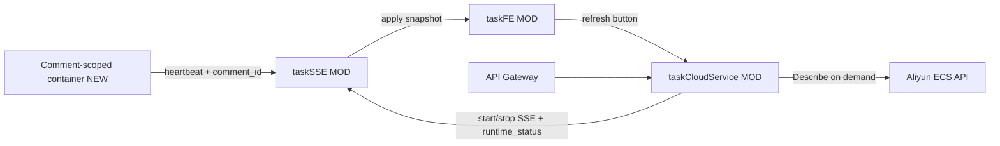

# v84 enterprise-landscape — comment-runtime-push-sync

应用层：taskFE 只接收 SSE 下发字段；taskCloudService 启动/停止推送 `runtime_status`；Describe 仅刷新按钮。  
技术层：评论容器主动 heartbeat。v82/v83 积压 target 与本迭代正交。

```mermaid
flowchart LR
  Ctr["Comment-scoped container NEW"] -->|heartbeat + comment_id| SSE["taskSSE MOD"]
  Cloud["taskCloudService MOD"] -->|start/stop SSE + runtime_status| SSE
  SSE -->|apply snapshot| FE["taskFE MOD"]
  FE -->|refresh button| Cloud
  Cloud -->|Describe on demand| Aliyun["Aliyun ECS API"]
  GW["API Gateway"] --> Cloud
```
