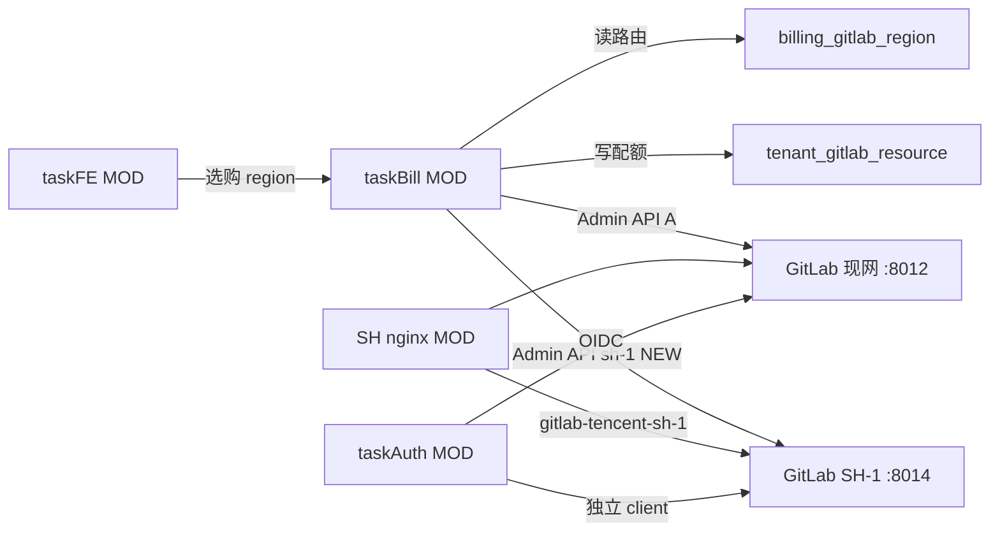

# v85 application-integration — pluggable-multi-region-gitservice

保留现网 GitLab CE（`gitlab.${baseDomain}` / `tencent-shanghai-5`）。  
上海机新增独立实例 `tencent-sh-1`（`gitlab-tencent-sh-1.${baseDomain}`，HTTP :8014，SSH :2223）。  
`billing_gitlab_region` 为可插拔注册表；租户无平台默认，须显式选购；开通按 region 调对应 Admin API。

