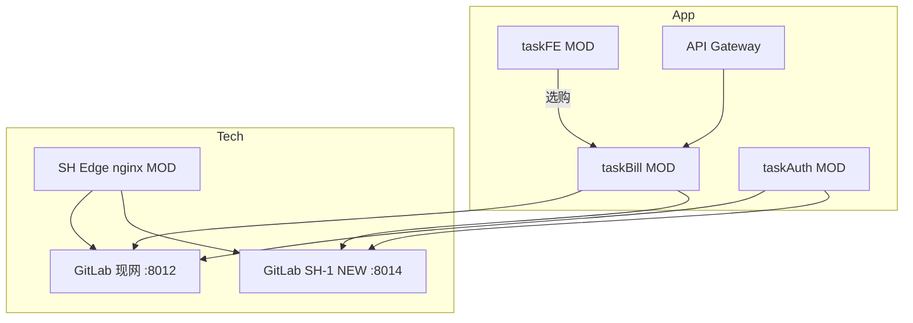

# v85 enterprise-landscape — pluggable-multi-region-gitservice

技术层新增上海独立 GitLab CE；边缘 nginx 增加 `gitlab-tencent-sh-1` 反代。  
应用层 taskBill 按 region 路由开通；taskFE 多区域选购；taskAuth 多 OIDC client。现网实例保留。

```mermaid
flowchart TB
  subgraph App
    FE["taskFE MOD"]
    Bill["taskBill MOD"]
    Auth["taskAuth MOD"]
    GW["API Gateway"]
  end
  subgraph Tech
    Edge["SH Edge nginx MOD"]
    GL1["GitLab 现网 :8012"]
    GL2["GitLab SH-1 NEW :8014"]
  end
  GW --> Bill
  FE -->|选购| Bill
  Bill --> GL1
  Bill --> GL2
  Edge --> GL1
  Edge --> GL2
  Auth --> GL1
  Auth --> GL2
```
