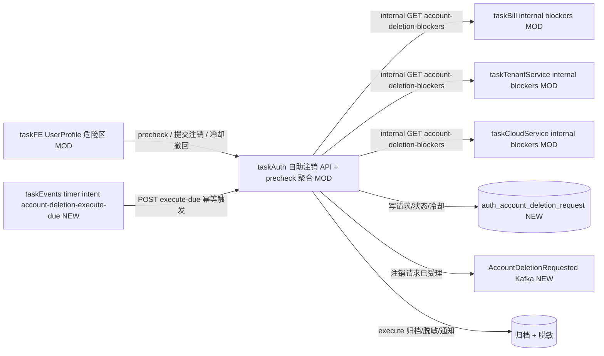

# v86 — Personal account deletion (PIPL)

- **Version:** v86 target
- **Iteration:** user-account-deletion-pipl-v86
- **Based on:** v85
- **Decisions:** 个人账号注销自助入口（PIPL）；冷却期可撤回；物理 DELETE 不做（归档+脱敏）；超管 archive 路径保留人工兜底
- **Events:** Kafka 五事件（AccountDeletionRequested / 各阶段状态）跨服务编排；execute-due 由 taskEvents timer worker 幂等触发
