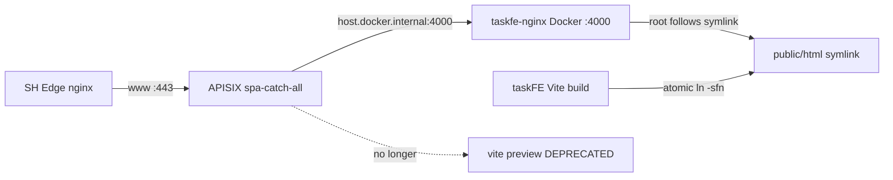
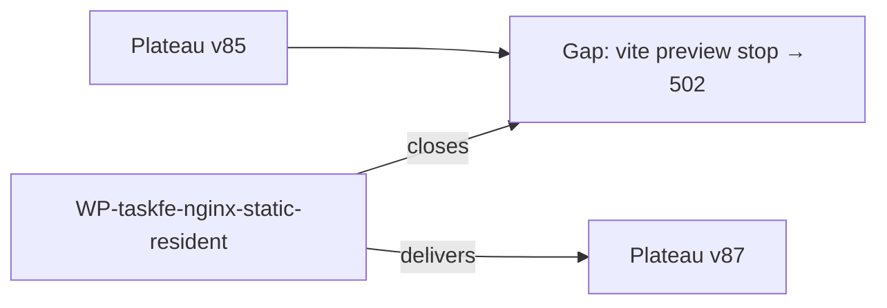

# v87 application-integration — taskFE Docker nginx 静态常驻

```mermaid
flowchart LR
  edge[SH Edge nginx]
  gw[APISIX spa-catch-all]
  ngx[taskfe-nginx Docker :4000]
  html["public/html symlink"]
  fe[taskFE Vite build]
  preview["vite preview DEPRECATED"]

  edge -->|www :443| gw
  gw -->|host.docker.internal:4000| ngx
  ngx -->|root follows symlink| html
  fe -->|atomic ln -sfn| html
  gw -.->|no longer| preview
```

```mermaid
flowchart LR
  p85[Plateau v85]
  gap[Gap: vite preview stop → 502]
  wp[WP-taskfe-nginx-static-resident]
  p87[Plateau v87]

  p85 --> gap
  wp -->|closes| gap
  wp -->|delivers| p87
```
