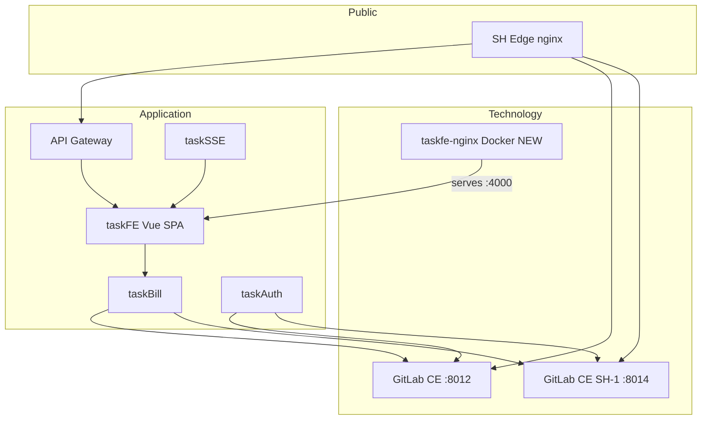
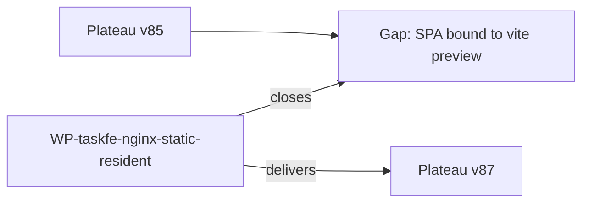

# v87 enterprise-landscape — taskFE Docker nginx 静态常驻

```mermaid
flowchart TB
  subgraph public [Public]
    edge[SH Edge nginx]
  end
  subgraph app [Application]
    gw[API Gateway]
    fe[taskFE Vue SPA]
    bill[taskBill]
    auth[taskAuth]
    sse[taskSSE]
  end
  subgraph tech [Technology]
    ngx[taskfe-nginx Docker NEW]
    glOld[GitLab CE :8012]
    glSh1[GitLab CE SH-1 :8014]
  end

  edge --> gw
  gw --> fe
  ngx -->|serves :4000| fe
  fe --> bill
  bill --> glOld
  bill --> glSh1
  edge --> glOld
  edge --> glSh1
  auth --> glOld
  auth --> glSh1
  sse --> fe
```

```mermaid
flowchart LR
  p85[Plateau v85]
  gap[Gap: SPA bound to vite preview]
  wp[WP-taskfe-nginx-static-resident]
  p87[Plateau v87]

  p85 --> gap
  wp -->|closes| gap
  wp -->|delivers| p87
```
