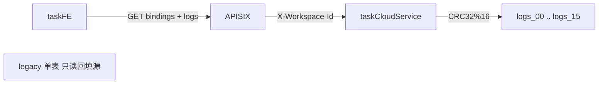
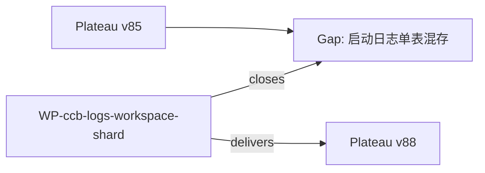

# v88 application-integration — CCB 启动日志 workspace 分表

```mermaid
flowchart LR
  fe[taskFE]
  gw[APISIX]
  cloud[taskCloudService]
  shards["logs_00 .. logs_15"]
  legacy["legacy 单表 只读回填源"]

  fe -->|GET bindings + logs| gw
  gw -->|X-Workspace-Id| cloud
  cloud -->|CRC32%16| shards
```

```mermaid
flowchart LR
  p85[Plateau v85]
  gap[Gap: 启动日志单表混存]
  wp[WP-ccb-logs-workspace-shard]
  p88[Plateau v88]

  p85 --> gap
  wp -->|closes| gap
  wp -->|delivers| p88
```
