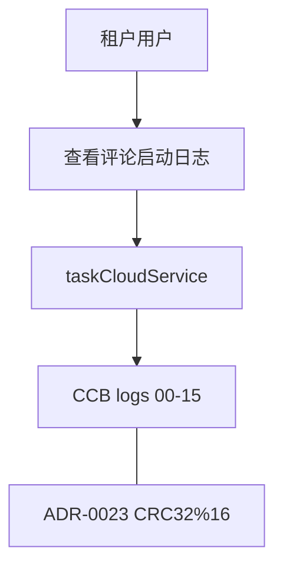
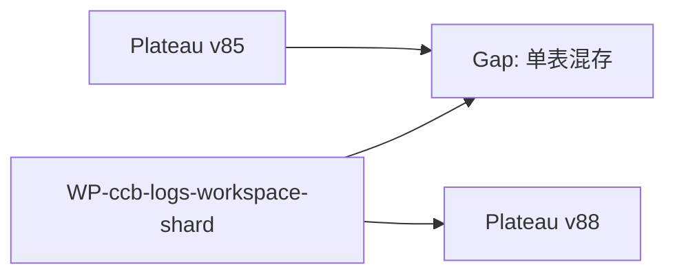

# v88 enterprise-landscape — 启动日志 workspace 分片

```mermaid
flowchart TB
  user[租户用户]
  view[查看评论启动日志]
  cloud[taskCloudService]
  shards[CCB logs 00-15]
  adr[ADR-0023 CRC32%16]

  user --> view
  view --> cloud
  cloud --> shards
  shards --- adr
```

```mermaid
flowchart LR
  p85[Plateau v85]
  gap[Gap: 单表混存]
  wp[WP-ccb-logs-workspace-shard]
  p88[Plateau v88]
  p85 --> gap
  wp --> gap
  wp --> p88
```
