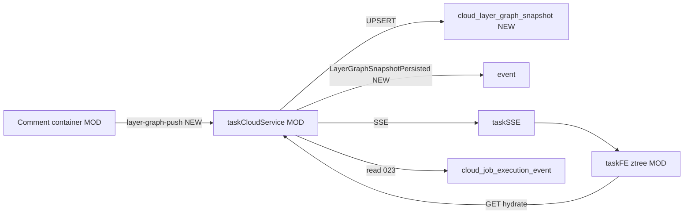

# v89 application-integration — ztree 执行日志服务端持久化

层图 `layer-graph-push` 在 taskCloudService UPSERT `cloud_layer_graph_snapshot`（JSON 列，键含 workspace_id/task_id/comment_id）。  
关容器后前端 GET hydrate 仍可读树与 job 步骤（023）。**不存克隆日志。** 不用宿主机 JSON 文件。

