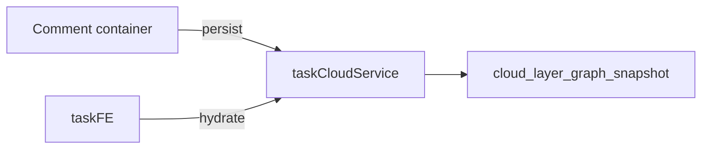

# v89 enterprise-landscape — ztree 执行日志服务端持久化

在 v88 current 全量拓扑上增加层图快照 DataObject：容器 push → Cloud 落库 → FE 关容器后仍 GET。克隆日志仍仅容器内存。

```mermaid
flowchart LR
  Ctr["Comment container"] -->|persist| Cloud["taskCloudService"]
  Cloud --> Snap["cloud_layer_graph_snapshot"]
  FE["taskFE"] -->|hydrate| Cloud
```
