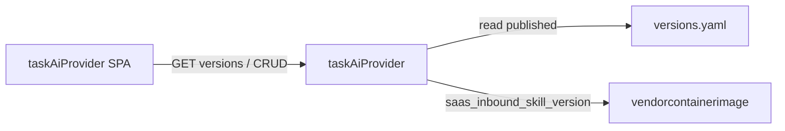
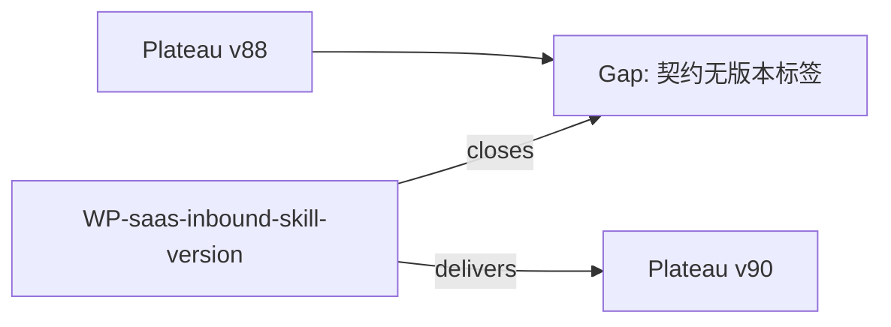

# v90 application-integration — 容器→SaaS 接口版本

```mermaid
flowchart LR
  portal[taskAiProvider SPA]
  aip[taskAiProvider]
  yaml[versions.yaml]
  img[vendorcontainerimage]

  portal -->|GET versions / CRUD| aip
  aip -->|read published| yaml
  aip -->|saas_inbound_skill_version| img
```

```mermaid
flowchart LR
  p88[Plateau v88]
  gap[Gap: 契约无版本标签]
  wp[WP-saas-inbound-skill-version]
  p90[Plateau v90]

  p88 --> gap
  wp -->|closes| gap
  wp -->|delivers| p90
```
