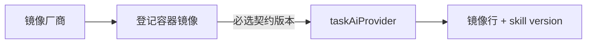
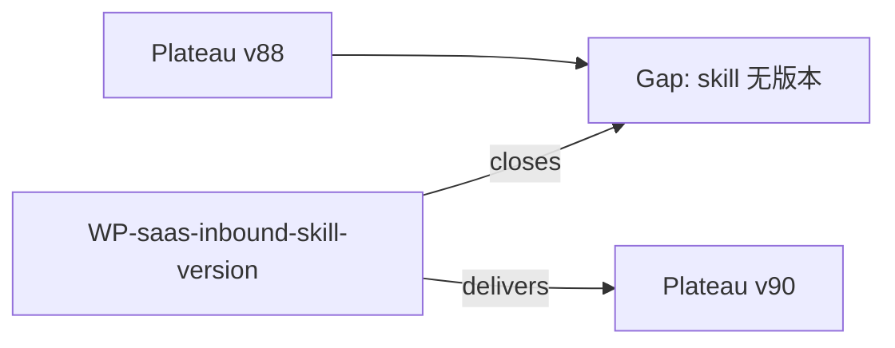

# v90 enterprise-landscape — inbound skill 版本

```mermaid
flowchart LR
  vendor[镜像厂商]
  publish[登记容器镜像]
  aip[taskAiProvider]
  img[镜像行 + skill version]

  vendor --> publish
  publish -->|必选契约版本| aip
  aip --> img
```

```mermaid
flowchart LR
  p88[Plateau v88]
  gap[Gap: skill 无版本]
  wp[WP-saas-inbound-skill-version]
  p90[Plateau v90]
  p88 --> gap
  wp -->|closes| gap
  wp -->|delivers| p90
```
