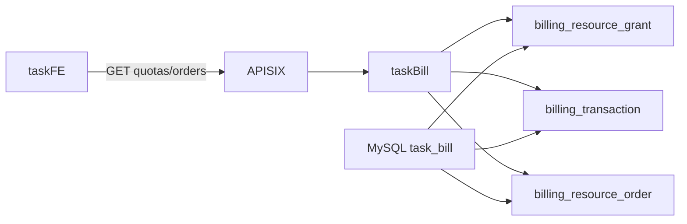

# v91 application-integration

```mermaid
flowchart LR
  FE[taskFE] -->|GET quotas/orders| GW[APISIX]
  GW --> BILL[taskBill]
  BILL --> GRANT[billing_resource_grant]
  BILL --> TXN[billing_transaction]
  BILL --> ORD[billing_resource_order]
  MYSQL[MySQL task_bill] --> GRANT
  MYSQL --> TXN
  MYSQL --> ORD
```
