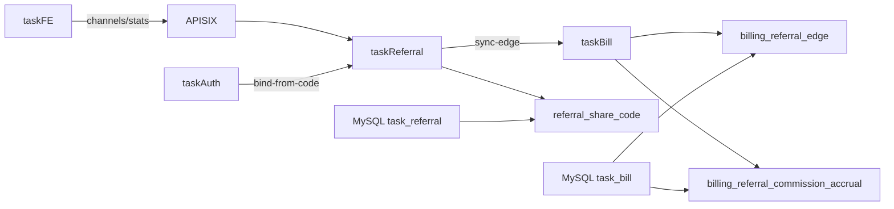

# v92 application-integration

```mermaid
flowchart LR
  FE[taskFE] -->|channels/stats| GW[APISIX]
  GW --> REF[taskReferral]
  AUTH[taskAuth] -->|bind-from-code| REF
  REF -->|sync-edge| BILL[taskBill]
  REF --> CODE[referral_share_code]
  BILL --> EDGE[billing_referral_edge]
  BILL --> ACC[billing_referral_commission_accrual]
  MYR[MySQL task_referral] --> CODE
  MYB[MySQL task_bill] --> EDGE
  MYB --> ACC
```
