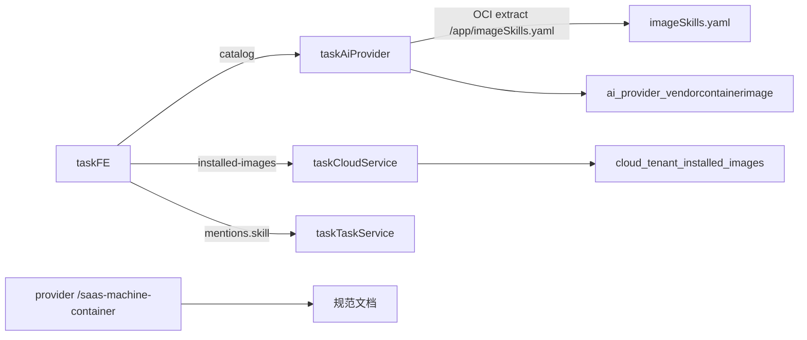

# v93 application-integration

```mermaid
flowchart LR
  FE[taskFE] -->|catalog| AP[taskAiProvider]
  FE -->|installed-images| CS[taskCloudService]
  FE -->|mentions.skill| TS[taskTaskService]
  AP -->|OCI extract /app/imageSkills.yaml| YAML[imageSkills.yaml]
  AP --> IMG[ai_provider_vendorcontainerimage]
  CS --> INST[cloud_tenant_installed_images]
  PORTAL[provider /saas-machine-container] --> DOC[规范文档]
```
