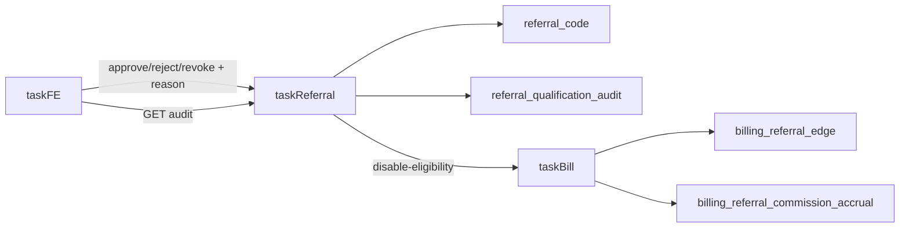

# v95 application-integration

```mermaid
flowchart LR
  FE[taskFE] -->|approve/reject/revoke + reason| REF[taskReferral]
  FE -->|GET audit| REF
  REF --> CODE[referral_code]
  REF --> AUD[referral_qualification_audit]
  REF -->|disable-eligibility| BILL[taskBill]
  BILL --> EDGE[billing_referral_edge]
  BILL --> ACC[billing_referral_commission_accrual]
```
