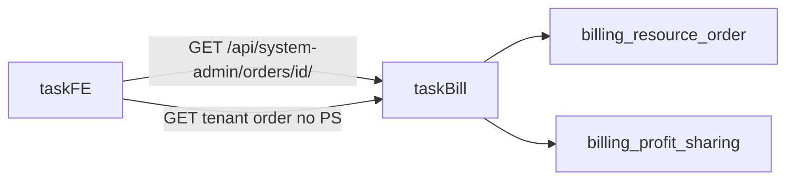

# v96 application-integration

```mermaid
flowchart LR
  FE[taskFE] -->|GET /api/system-admin/orders/id/| BILL[taskBill]
  FE -->|GET tenant order no PS| BILL
  BILL --> ORD[billing_resource_order]
  BILL --> PS[billing_profit_sharing]
```
