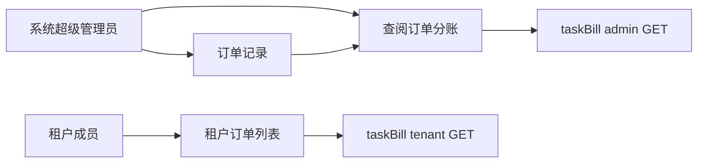

# v96 enterprise-landscape

```mermaid
flowchart LR
  Admin[系统超级管理员] --> Orders[订单记录]
  Admin --> PS[查阅订单分账]
  Tenant[租户成员] --> TOrders[租户订单列表]
  Orders --> PS
  PS --> BILL[taskBill admin GET]
  TOrders --> BILLT[taskBill tenant GET]
```
