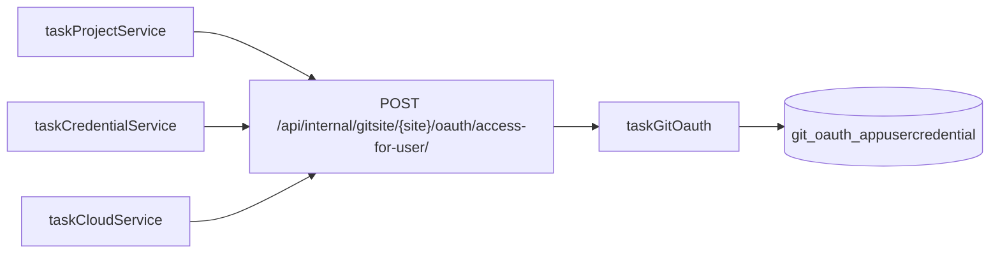

# v97 application-integration

```mermaid
flowchart LR
  PROJ[taskProjectService]
  CRED[taskCredentialService]
  CLOUD[taskCloudService]
  IFACE["POST /api/internal/gitsite/{site}/oauth/access-for-user/"]
  GO[taskGitOauth]
  DB[(git_oauth_appusercredential)]
  PROJ --> IFACE
  CRED --> IFACE
  CLOUD --> IFACE
  IFACE --> GO
  GO --> DB
```
