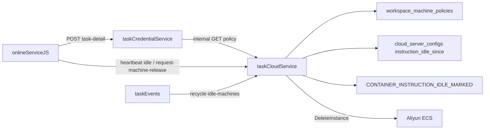

# v98 application-integration

```mermaid
flowchart LR
  OSJS[onlineServiceJS] -->|POST task-detail| CRED[taskCredentialService]
  CRED -->|internal GET policy| CLOUD[taskCloudService]
  OSJS -->|heartbeat idle / request-machine-release| CLOUD
  EV[taskEvents] -->|recycle-idle-machines| CLOUD
  CLOUD --> POL[workspace_machine_policies]
  CLOUD --> CSC[cloud_server_configs instruction_idle_since]
  CLOUD --> EVT[CONTAINER_INSTRUCTION_IDLE_MARKED]
  CLOUD -->|DeleteInstance| ECS[Aliyun ECS]
```
