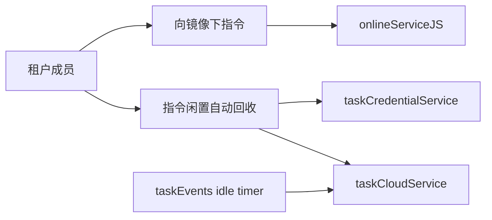

# v98 enterprise-landscape

```mermaid
flowchart LR
  M[租户成员] --> I[向镜像下指令]
  M --> R[指令闲置自动回收]
  I --> OSJS[onlineServiceJS]
  R --> CRED[taskCredentialService]
  R --> CLOUD[taskCloudService]
  EV[taskEvents idle timer] --> CLOUD
```
