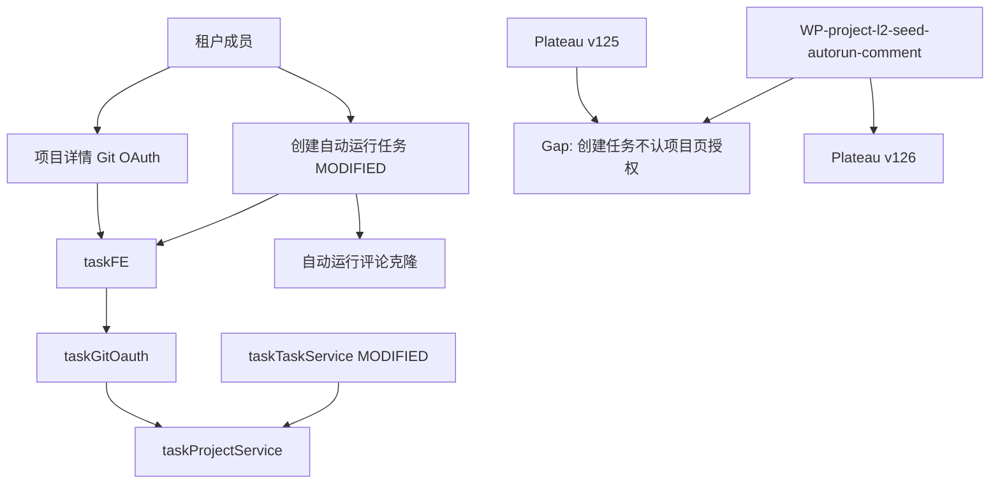

# v126 enterprise-landscape — 项目 L2 种下自动运行评论 (current)

```mermaid
graph TD;
  member["租户成员"];
  projOauth["项目详情 Git OAuth"];
  createTask["创建自动运行任务 MODIFIED"];
  autorun["自动运行评论克隆"];
  fe["taskFE"];
  gitoauth["taskGitOauth"];
  proj["taskProjectService"];
  task["taskTaskService MODIFIED"];
  p125["Plateau v125"];
  gap["Gap: 创建任务不认项目页授权"];
  wp["WP-project-l2-seed-autorun-comment"];
  p126["Plateau v126"];
  member --> projOauth;
  member --> createTask;
  projOauth --> fe;
  createTask --> fe;
  createTask --> autorun;
  fe --> gitoauth;
  gitoauth --> proj;
  task --> proj;
  p125 --> gap;
  wp --> gap;
  wp --> p126;
```
