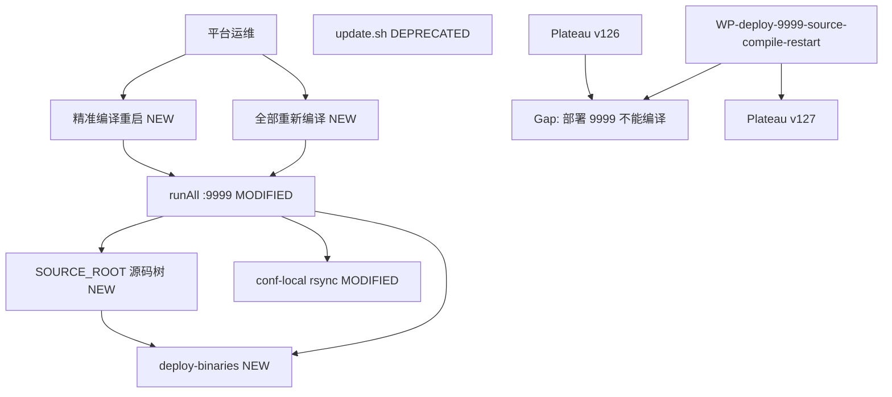

# v127 enterprise-landscape — 部署 9999 编排源码编译 (current)

```mermaid
graph TD;
  ops["平台运维"];
  precise["精准编译重启 NEW"];
  buildAll["全部重新编译 NEW"];
  runAll["runAll :9999 MODIFIED"];
  src["SOURCE_ROOT 源码树 NEW"];
  bins["deploy-binaries NEW"];
  cl["conf-local rsync MODIFIED"];
  upd["update.sh DEPRECATED"];
  p126["Plateau v126"];
  gap["Gap: 部署 9999 不能编译"];
  wp["WP-deploy-9999-source-compile-restart"];
  p127["Plateau v127"];
  ops --> precise;
  ops --> buildAll;
  precise --> runAll;
  buildAll --> runAll;
  runAll --> src;
  src --> bins;
  runAll --> bins;
  runAll --> cl;
  p126 --> gap;
  wp --> gap;
  wp --> p127;
```
