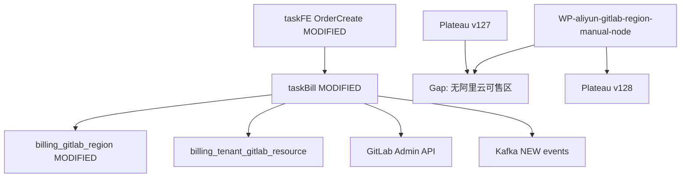

# v128 application-integration — 阿里云 GitLab pending_node (target)

```mermaid
graph TD;
  fe["taskFE OrderCreate MODIFIED"];
  bill["taskBill MODIFIED"];
  reg["billing_gitlab_region MODIFIED"];
  quota["billing_tenant_gitlab_resource"];
  gl["GitLab Admin API"];
  kfk["Kafka NEW events"];
  p127["Plateau v127"];
  gap["Gap: 无阿里云可售区"];
  wp["WP-aliyun-gitlab-region-manual-node"];
  p128["Plateau v128"];
  fe --> bill;
  bill --> reg;
  bill --> quota;
  bill --> gl;
  bill --> kfk;
  p127 --> gap;
  wp --> gap;
  wp --> p128;
```
