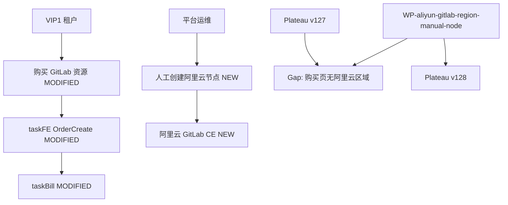

# v128 enterprise-landscape — 阿里云 GitLab pending_node (target)

```mermaid
graph TD;
  vip["VIP1 租户"];
  buy["购买 GitLab 资源 MODIFIED"];
  fe["taskFE OrderCreate MODIFIED"];
  bill["taskBill MODIFIED"];
  ops["平台运维"];
  node["人工创建阿里云节点 NEW"];
  ali["阿里云 GitLab CE NEW"];
  p127["Plateau v127"];
  gap["Gap: 购买页无阿里云区域"];
  wp["WP-aliyun-gitlab-region-manual-node"];
  p128["Plateau v128"];
  vip --> buy;
  buy --> fe;
  fe --> bill;
  ops --> node;
  node --> ali;
  p127 --> gap;
  wp --> gap;
  wp --> p128;
```
