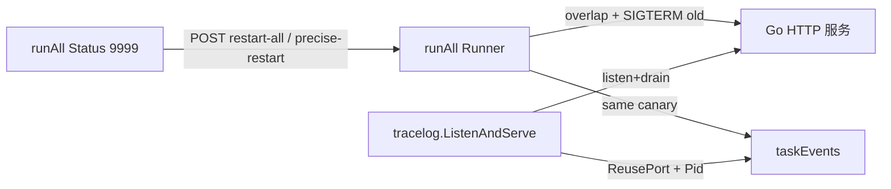

# v129 application-integration — 金丝雀平滑重启

```mermaid
flowchart LR
  UI[runAll Status 9999]
  ORCH[runAll Runner]
  TL[tracelog.ListenAndServe]
  SVC[Go HTTP 服务]
  EV[taskEvents]
  UI -->|POST restart-all / precise-restart| ORCH
  ORCH -->|overlap + SIGTERM old| SVC
  ORCH -->|same canary| EV
  TL -->|listen+drain| SVC
  TL -->|ReusePort + Pid| EV
```
