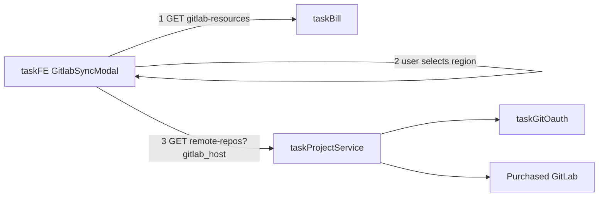

# GitLab 同步 — 已购区域选择（Mermaid）

```mermaid
flowchart LR
  FE[taskFE GitlabSyncModal]
  Bill[taskBill]
  Proj[taskProjectService]
  OAuth[taskGitOauth]
  GL[Purchased GitLab]

  FE -->|"1 GET gitlab-resources"| Bill
  FE -->|"2 user selects region"| FE
  FE -->|"3 GET remote-repos?gitlab_host"| Proj
  Proj --> OAuth
  Proj --> GL
```
