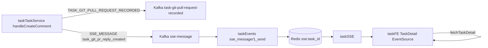

# v131 application-integration — Git PR 回复 SSE fanout

```mermaid
flowchart LR
  TTS[taskTaskService handleCreateComment]
  KPR[Kafka task-git-pull-request-recorded]
  KSSE[Kafka sse-message]
  EV[taskEvents sse_message/1_send]
  R[(Redis sse:task_id)]
  SSE[taskSSE]
  FE[taskFE TaskDetail EventSource]
  TTS -->|TASK_GIT_PULL_REQUEST_RECORDED| KPR
  TTS -->|SSE_MESSAGE task_git_pr_reply_created| KSSE
  KSSE --> EV --> R --> SSE --> FE
  FE -->|fetchTaskDetail| FE
```
