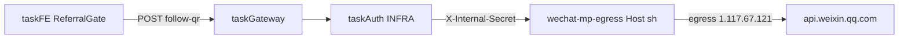

# v132 application-integration — WeChat MP egress via Host sh

```mermaid
flowchart LR
  FE[taskFE ReferralGate]
  GW[taskGateway]
  AUTH[taskAuth INFRA]
  EG[wechat-mp-egress Host sh]
  WX[api.weixin.qq.com]
  FE -->|POST follow-qr| GW --> AUTH
  AUTH -->|X-Internal-Secret| EG
  EG -->|egress 1.117.67.121| WX
```
