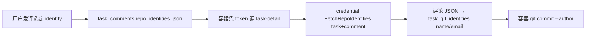

# 价值流：容器拉取评论级 Git 提交者身份

- **日期**: 2026-08-20
- **前置**: 设计 + 权限分析

```mermaid
flowchart LR
  A[用户发评选定 identity] --> B[task_comments.repo_identities_json]
  B --> C[容器凭 token 调 task-detail]
  C --> D[credential FetchRepoIdentities task+comment]
  D --> E[评论 JSON → task_git_identities name/email]
  E --> F[容器 git commit --author]
```

触发：容器启动拉 task-detail。  
价值：提交署名与该条评论 composer 所选身份一致。  
无新 Kafka 事件。
