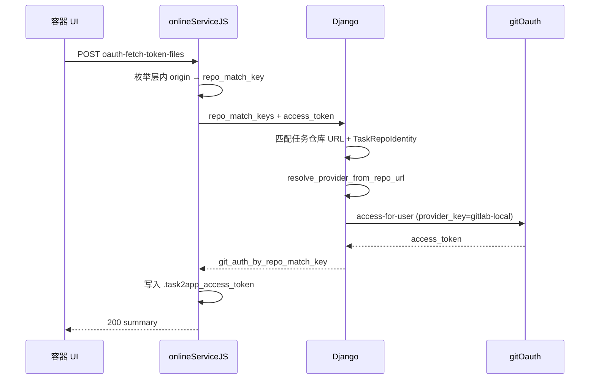

# 设计文档：容器层「拉取 AccessToken」多 Provider OAuth 支持

**日期：** 2026-05-27  
**状态：** 待实施  
**关联页面：** `http://127.0.0.1:8765/ui/{layer_id}`（层级工具栏「拉取 AccessToken」）

---

## 背景与动机

容器 UI「拉取 AccessToken」当前**仅识别 `github.com` 远程**，对本地 GitLab（`http://localhost:8012/ljy/somanyad`）等已在 `port_config.json` → `gitOauth` 中配置的 OAuth 站点直接失败：

```text
拉取AccessToken失败：层内未发现 github.com 远程仓库
```

同一任务在 **bootstrap 克隆**（`repo-clone-credentials`）与 **Django `resolve_provider_from_repo_url`** 路径上已支持 `localhost:8012` → `gitlab:gitlab-local`，但 `layerGitOauthFetchTokenFiles.mjs` 与 `layer_github_oauth_tokens.py` 仍走 GitHub 专用逻辑，形成能力分裂。

### 用户目标

对 `task2app/conf/port_config.json` 中 **`gitOauth` 各条目所覆盖的 Git 站点**（即 `target.website` / 配置键，如 `http://github.com`、`http://gitlab.daydaymoney.com`、`http://localhost:8012`）均支持「拉取 AccessToken → 写入 `.task2app_access_token`」。

> **术语澄清：** 用户表述中的 `service.allowedHost` 指 gitOauth **桥接服务**地址（如 `http://localhost:8002`），用于 Django → gitOauth 内部 API 路由（已在 2026-05-27 gitoauth-per-provider 设计中实施）。**层内 Git 远程匹配**应使用各条目的 **`target.website`（Git 站点 host）**，与 `resolve_provider_from_repo_url` 一致，而非 `service.allowedHost`。

---

## 现象（已验证）

| 层内 `remote.origin.url` | 当前「拉取 AccessToken」 | bootstrap 克隆 |
|--------------------------|--------------------------|----------------|
| `https://github.com/o/r.git` | ✅ | ✅ |
| `http://gitlab.daydaymoney.com/g/r.git` | ❌（GL 正则需 host 含 gitlab） | ✅ |
| `http://localhost:8012/ljy/somanyad` | ❌（仅认 github.com） | ✅（凭证路径已通） |

根因链路：

1. **onlineServiceJS** `collectGithubRepoWriteTargets` 仅调用 `parseGithubOwnerRepoFromRemoteUrl`（`GH_SLUG_RE = /github\.com/.../`）
2. **Django** `resolve_github_auth_by_repo_for_container_task` 仅 `collect_task_github_repos` + GitHub 绑定表
3. **`gitlab_repo_slug_from_url`** 要求 host 含 `gitlab`，`localhost:8012` 无法解析 slug

---

## 价值流影响

读取 `value-stream.yaml`，本变更影响：

| 流 | 步骤 | 影响 |
|----|------|------|
| `oauth-token-fetch-timeout-governance` | `oauth-github-uid-cache-thin-slice` 等 | 扩展为多 provider，测试需覆盖 GitLab local |
| `task-detail-oauth-binding-guidance` | OAuth 绑定引导 | 错误文案从「github.com」改为「OAuth 支持的 Git 远程」 |
| `project-detail-repo-oauth-provider-routing` | provider 路由 | 复用已有 `resolve_provider_from_repo_url` |
| 容器 bootstrap / relay | `repo-clone-credentials` | 无行为变更；拉取 token 与克隆凭证逻辑对齐 |

**Cross-stream：** 容器层 OAuth 拉 token 与 `repo-clone-credentials` 共享同一套 provider 解析 + `fetch_git_access_via_gitoauth_for_user`，减少重复实现。

---

## 领域概念清单（供 DDD 步骤输入）

| 概念 | 说明 |
|------|------|
| **Bounded Context: 容器运行时** | onlineServiceJS 层内 Git 操作、token 文件落盘 |
| **Bounded Context: 云平台 / 容器令牌** | `ContainerTokenContext`、layer oauth API |
| **Bounded Context: Git OAuth** | `GIT_OAUTH_PROVIDER_CONFIGS`、`resolve_provider_from_repo_url` |
| **Entity: Layer Git Workdir** | 层内 Git 工作区 + `remote.origin.url` |
| **Value Object: RepoMatchKey** | `host/path` 小写键，与 `repoMatchKeyFromUrl` 一致 |
| **Value Object: GitOAuthProviderKey** | `provider:service_provider`，如 `gitlab:gitlab-local` |
| **Domain Event: OauthTokenFetchFailed** | 已有；扩展 failed_stage 覆盖 gitlab provider |
| **Repository 接口** | 任务仓库列表、TaskRepoIdentity、TaskGithubRepoOauthBinding |

---

## 方案

### 原则

1. **单一事实来源：** OAuth 支持的 Git host 以 Django `GIT_OAUTH_PROVIDER_CONFIGS`（来自 `port_config.json` gitOauth）为准；容器不硬编码 host 列表。
2. **对齐已有模式：** token 换发逻辑复用 `_build_repo_clone_credentials`（`container_task_detail_views.py`）——`TaskRepoIdentity` + `fetch_git_access_via_gitoauth_for_user`。
3. **键语义统一：** 层内匹配使用 **`repo_match_key`**（`localhost:8012/ljy/somanyad`），与 `GET …/git/repo-identities`、bootstrap 凭证 host 别名一致。
4. **向后兼容：** 保留 `repo_slugs` / `github_auth_by_repo` 字段供 GitHub 旧客户端；新增字段不破坏现有 GitHub 流程。

### A. onlineServiceJS（trae-agent）

#### A1. 抽取共享 `repoMatchKeyFromUrl`

将 `server.mjs` 中现有实现提取到 `src/repoMatchKey.mjs`，供 fetch/push/refresh 共用。

#### A2. 替换 `collectGithubRepoWriteTargets`

新函数 `collectOauthRepoWriteTargets(layerId)`：

```javascript
// 对每个含 .git 的工作区：
//   origin_url = git config remote.origin.url
//   repo_match_key = repoMatchKeyFromUrl(origin_url)
// 跳过 repo_match_key 为空的条目
```

不再在容器侧过滤 provider；**所有有效 Git 远程**均提交后端，由 Django 判定是否在 gitOauth 配置内。

#### A3. 更新 API 请求体

`runLayerOauthFetchTokenFiles` / `runLayerOauthRefreshPush`：

```json
{
  "access_token": "...",
  "repo_match_keys": ["localhost:8012/ljy/somanyad"],
  "target_branch": "optional"
}
```

仍附带 `repo_slugs`（从 legacy GitHub 解析推导）供旧后端过渡，新后端优先 `repo_match_keys`。

#### A4. 响应映射与落盘

读取 `git_auth_by_repo_match_key`（新）或回退 `github_auth_by_repo`（旧），按 `repo_match_key` 写入各 workdir 的 `.task2app_access_token`。

#### A5. 错误文案

| 场景 | 文案 |
|------|------|
| 层内无 Git 远程 | `层内未发现 Git 远程仓库` |
| 有远程但后端无 OAuth 配置/绑定 | 透传 Django detail（如「任务仓库克隆身份未配置」） |
| 不再使用 | `层内未发现 github.com 远程仓库` |

#### A6. 同步 `layerGitOauthPush.mjs`

推送路径中 GitLab 识别扩展：对 `repo_match_key` 匹配的任务仓库 URL 使用 `resolveRepoCloneCredential` 式 host/path 别名；GitLab HTTP 用户名保持 `oauth2`。

### B. Django（task2app SaaS）

#### B1. 扩展容器 API（保持 URL 路径不变）

`POST …/server-container-token/layer-github-oauth-access-tokens/` 请求体新增：

- `repo_match_keys: string[]`（优先）

响应新增：

- `git_auth_by_repo_match_key: Record<string, string>`

保留 `github_auth_by_repo` 作为 GitHub slug 兼容别名。

#### B2. 新服务 `resolve_git_auth_by_repo_match_keys_for_container_task`

逻辑（镜像 `_build_repo_clone_credentials`）：

1. 校验 `ContainerTokenContext`（现有）
2. 收集任务关联仓库 URL 列表（`resolve_task_project_git_repos` / `ordered_repo_urls_for_project`）
3. 对每个请求的 `repo_match_key`：
   - 在任务仓库 URL 中查找匹配（**host 精确 + path 匹配**；支持 path-only 别名，与 bootstrap `resolveRepoCloneCredential` 一致）
   - `resolve_provider_from_repo_url(matched_url)` → 必须在 `GIT_OAUTH_PROVIDER_CONFIGS` 中存在
   - 从 `TaskRepoIdentity` 取 `git_identity.user_id`（GitHub 多账号场景仍可读 `TaskGithubRepoOauthBinding.github_user_id` 作为 `github_user_id` 参数）
   - `fetch_git_access_via_gitoauth_for_user(user_id, provider=…, provider_key=…)`
4. 返回 `{ repo_match_key: access_token }`；部分失败时 `partial_error`

**GitHub 多账号绑定：** 保留现有 `TaskGithubRepoOauthBinding` + `selected_github_user_id_for_repo` 行为；GitLab 单 identity 走 `TaskRepoIdentity`。

#### B3. 修复 `gitlab_repo_slug_from_url`

改为：若 host 不在 `gitlab*` 模式，则调用 `_infer_provider_from_configured_allowed_hosts`；对配置为 gitlab 的 `target.website`（含 `localhost:8012`）按 path 末两段解析 `owner/repo` slug。供任务详情 slug 展示与 GitHub 兼容字段使用。

#### B4. 新增辅助 `repo_match_key_from_url`（Python）

与 onlineServiceJS / `forward_container_layer_git_repo_identities_sync._repo_match_key_from_url` 语义一致，供匹配与测试共用。

#### B5. 列出 OAuth 支持的 Git host（可选薄切片）

新增只读内部辅助（可不暴露 HTTP）：`list_configured_git_oauth_website_hosts()` 从 `GIT_OAUTH_PROVIDER_CONFIGS` 读取全部 `target.website` netloc，供错误提示「当前支持的 OAuth Git 站点：…」。

### C. 不在本次范围

- 重命名 `TaskGithubRepoOauthBinding` 模型（历史命名，GitLab 仍用 `TaskRepoIdentity`）
- 更改 `service.allowedHost` / gitOauth 桥接路由（已实施）
- Bitbucket 等未在 `port_config.json` gitOauth 中配置的 provider
- UI 按钮 rename（仍叫「拉取 AccessToken」，tooltip 改为「OAuth 支持的 Git 站点」）

---

## 数据流（目标态）



---

## 测试计划

| 层级 | 文件 / 场景 |
|------|-------------|
| onlineServiceJS 单元 | `layerGitOauthFetchTokenFiles.test.mjs`：localhost:8012 origin 可收集并落盘 |
| onlineServiceJS 单元 | `layerGitOauthRefreshPush.test.mjs`：GitLab repo_match_keys 透传 |
| Django 单元 | `test_layer_git_oauth_tokens.py`（或新文件）：`repo_match_keys` + gitlab-local mock |
| Django 单元 | `test_git_oauth_providers.py`：`gitlab_repo_slug_from_url('http://localhost:8012/…')` |
| Django 集成 | `test_container_runtime_tokens.py`：容器 token + TaskRepoIdentity + layer oauth API |
| 回归 | 现有 GitHub `repo_slugs` 路径不变 |

---

## 验收标准

1. 层内 `remote.origin.url = http://localhost:8012/ljy/somanyad`，任务已在关联项目完成 OAuth 并保存账号 → 「拉取 AccessToken」成功写入 `.task2app_access_token`
2. GitHub 仓库行为与改前一致
3. 层内无 Git 仓库 → 明确错误「层内未发现 Git 远程仓库」（不含 github.com 误导）
4. 任务未配置 TaskRepoIdentity / OAuth 绑定 → Django 返回可行动的错误，非 400「未发现 github.com」
5. `port_config.json` 新增 gitOauth 条目（新 `target.website`）后，无需改 onlineServiceJS 硬编码即可由 Django 识别

---

## 风险与缓解

| 风险 | 缓解 |
|------|------|
| host 别名（gitlab.daydaymoney.com ↔ localhost:8012）匹配歧义 | 复用 bootstrap path-only 唯一性约束 |
| GitHub 多账号绑定与 GitLab TaskRepoIdentity 分支复杂 | 分 provider 分支，GitHub 保持现有 binding 逻辑 |
| 旧容器 + 新 Django / 反之 | 请求/响应双字段兼容期 |

---

## 实施切片建议（供价值流 / 计划步骤引用）

1. **Thin slice：** Django `repo_match_key` 解析 + API 扩展 + GitLab localhost 单测
2. **Thin slice：** onlineServiceJS fetch/refresh 改用 `repo_match_keys`
3. **Enhancement：** push 路径 GitLab localhost + 错误文案/UI tooltip
4. **Regression guard：** GitHub e2e 与现有 oauth 观测日志字段
