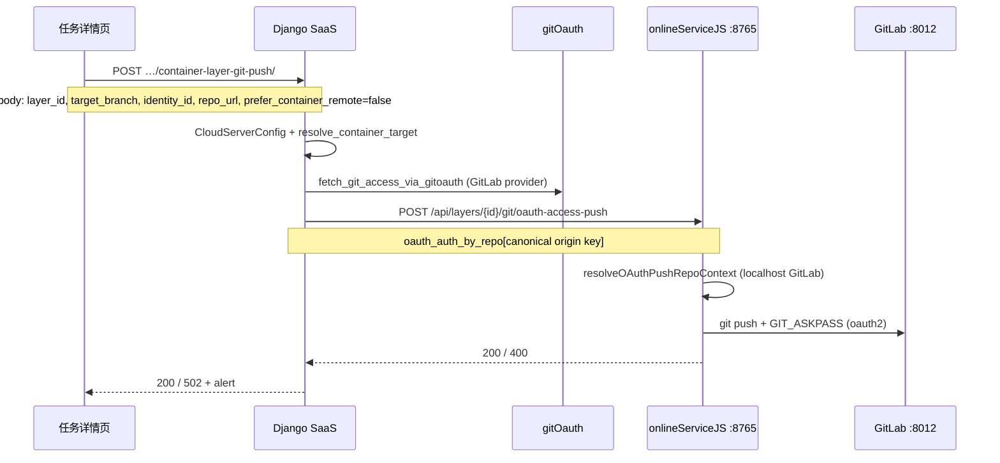

# 点击 zTree「推送」后的完整请求流（relay somanyad）

**任务：** `846269443533955072` · **仓库：** `http://localhost:8012/ljy/somanyad.git`

## 序列图

## 各层职责

| 步骤 | 端点 | 关键字段 |
|------|------|----------|
| 1 | `POST /api/tenant/…/container-layer-git-push/` | `identity_id`, `repo_url`, `container_page_url` |
| 2 | Django 换票 | `oauth_auth_by_repo["http://localhost:8012/ljy/somanyad"]` |
| 3 | `POST {container}/api/layers/{layer_id}/git/oauth-access-push` | 非 `git/push`（单仓 relay 走 OAuth） |
| 4 | 容器 `git push` | `originUrl` + askpass，**90s 超时** |

## 历史根因（已修）

- 容器仅匹配 hostname 含 `gitlab` 的 remote → `localhost:8012` 被 skip → 无推送或长时间 busy。
- 修复：`resolveOAuthPushRepoContext` + `GIT_PUSH_TIMEOUT_MS`。

## 验收

- Network：`container-layer-git-push` ≤120s 返回。
- 容器 `git-push.log`：无 `skip=unmatched_remote`，应有 `oauth … git_push ok` 或明确 `fail`。
