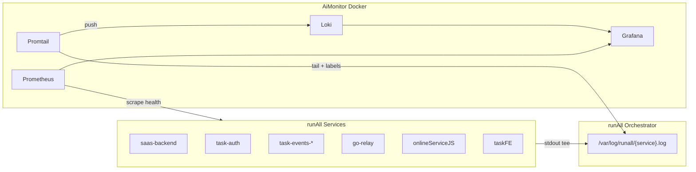

# 多服务日志集中收集与 Grafana traceId 查询设计

日期：2026-05-28  
状态：已批准  
范围：runAll 编排下的各业务服务日志 → 统一可观测栈 → Grafana 按 `traceId` 检索

---

## 1. 背景与目标

### 1.1 背景

当前 monorepo 存在三类日志形态，彼此割裂：

| 形态 | 位置 | 局限 |
|------|------|------|
| runAll 内存日志 | `runAll` stdout/stderr 缓冲，Web UI 按服务名查看 | 无跨服务关联、重启即丢、无法按 traceId 检索 |
| 文件日志 | 如 `onlineServiceJS/logs/*.log` | 分散在各子项目目录，无统一查询 |
| AiMonitor | Prometheus 健康探针 + Grafana 仪表盘 | **仅指标**，不含应用日志 |

与此同时，链路追踪 ID 已在部分路径落地：

- HTTP 头：`X-Trace-Id`（`task2app/Saas_project/core/http_trace.py`）
- Django：`TraceIdMiddleware` → `request.trace_id`
- 前端：`apiUtils.js` 自动附加 `X-Trace-Id`
- 容器内：`TRACE_ID` 环境变量 → `onlineServiceJS` 出站请求
- 部分 Django 日志已含 `[trace_id=...]` 字段

**缺口：** Go 服务（taskAuth、taskEvents、go_relayToTrae 等）尚未统一注入 traceId；日志格式不统一（纯文本 vs JSON）；无可集中检索的后端。

### 1.2 目标

1. **集中收集** runAll 编排的所有（或指定）服务的应用日志。
2. 在 **Grafana** 中按 **`traceId`** 一键检索跨服务日志（同一请求链路）。
3. 与现有 **AiMonitor**（Prometheus + Grafana）集成，不另起一套 UI。
4. 本地开发（runAll）为第一交付环境；架构可延伸至 staging/production。

### 1.3 非目标（本阶段不做）

- 完整分布式追踪（span 树、火焰图）—— 可作为后续 Tempo/Jaeger 增量。
- 将日志正文存入 Prometheus TSDB（见 §2 架构澄清）。
- 替换 runAll Web UI 的 per-service 日志面板（保留，Grafana 为增强层）。
- 日志长期归档与合规留存策略（>7d 保留另行设计）。

---

## 2. 架构澄清：Prometheus 存指标，Loki 存日志

用户表述为「日志收集到 Prometheus」。**Prometheus 是时序指标库，不适合存储与检索日志正文**（高基数 label 会拖垮 TSDB，且无 LogQL 级全文/字段检索）。

**推荐标准栈（Grafana LGTM 子集）：**

```
应用服务 ──stdout/json──▶ Promtail/Alloy ──push──▶ Loki ──query──▶ Grafana
                │                                              ▲
                └── metrics ──scrape──▶ Prometheus ────────────┘
                                              (已有 AiMonitor)
```

| 组件 | 职责 | 与现有 AiMonitor 关系 |
|------|------|----------------------|
| **Prometheus** | 指标、健康探针 | 已存在，保持不变 |
| **Loki** | 日志聚合与索引 | **新增**，docker-compose 同网段 |
| **Promtail**（或 Grafana Alloy） | 采集 stdout/文件日志，打 label | **新增** |
| **Grafana** | 统一查询 UI | 已存在，新增 Loki 数据源 + Dashboard |

下文「集中可观测栈」指 **AiMonitor 扩展为 Prometheus + Loki + Grafana**，日志进 Loki，指标仍进 Prometheus。

---

## 3. 方案对比

### 方案 A：Loki + Promtail（推荐）

在 `AiMonitor/docker-compose.yaml` 增加 Loki 与 Promtail；runAll 将各服务 stdout 写入统一目录或 pipe，Promtail tail 后 push 到 Loki。

| 优点 | 缺点 |
|------|------|
| 与 Grafana 原生集成，LogQL 支持 `{trace_id="..."}` | 需统一日志格式（JSON）才能稳定提取 traceId |
| 与现有 AiMonitor 同 compose，runAll 已托管 `ai-monitor` | Promtail 需知悉日志路径/label 规则 |
| 社区成熟、资源占用低于 ELK | 本地 dev 需多 2 个容器 |

### 方案 B：OpenTelemetry Collector → Loki (+ 可选 Tempo)

各服务集成 OTel SDK，Collector 统一接收 logs/traces/metrics。

| 优点 | 缺点 |
|------|------|
| 一次接入可同时输出 trace span | **改动面大**：Go/Python/Node 均需 SDK |
| 标准化，利于未来上云 | 本地 dev 复杂度高，超本需求 MVP |

### 方案 C：Prometheus + Loki 混合指标化（不推荐）

仅将「日志行数/错误计数」做成 Prometheus metric，正文仍放文件。

| 优点 | 缺点 |
|------|------|
| 满足「Prometheus 里有日志相关数字」 | **无法按 traceId 查日志正文**，不满足核心目标 |

**推荐：方案 A。** 最小改动、复用 AiMonitor、满足 traceId 检索；方案 B 作为 Increment 3+ 的可选演进。

---

## 4. 推荐架构

### 4.1 总体数据流



### 4.2 日志目录约定

runAll 启动子进程时，除现有内存缓冲外，**追加 tee 到统一目录**：

```
${RUNALL_LOG_ROOT:-/tmp/runall-logs}/
  saas-backend.log
  task-auth.log
  task-events-accounts.log
  go-relay.log
  ...
```

- 路径可通过 `runAll.yaml` 或环境变量 `RUNALL_LOG_ROOT` 配置。
- Promtail 挂载该目录（bind mount 进容器）。
- 与现有 in-memory `LogRepository` **并存**，不破坏 runAll UI。

### 4.3 Promtail 配置要点

```yaml
# 概念示例 — 实际文件：AiMonitor/promtail/promtail.yaml
server:
  http_listen_port: 9080
clients:
  - url: http://loki:3100/loki/api/v1/push
scrape_configs:
  - job_name: runall-services
    static_configs:
      - targets: [localhost]
        labels:
          job: runall
          __path__: /var/log/runall/*.log
    pipeline_stages:
      - json:
          expressions:
            trace_id: trace_id
            level: level
            service: service
      - labels:
          trace_id:
          level:
          service:
      - labeldrop:
          - filename  # 可选：避免高基数
```

**traceId 提取策略（按优先级）：**

1. JSON 字段 `trace_id`（推荐，统一后）
2. JSON 字段 `traceId`（前端/Node 兼容）
3. regex：`\[trace_id=([^\]]+)\]`（兼容现有 Django 文本格式）
4. regex：`X-Trace-Id[:=]\s*(\S+)`（HTTP debug 日志）

提取成功后 Promtail 将 `trace_id` 设为 **Loki label**（仅当值符合 `[A-Za-z0-9._:-]{8,256}`，与 `http_trace.py` 一致），Grafana 查询：

```logql
{job="runall"} |= "" | trace_id="abc123xyz"
# 或
{trace_id="abc123xyz"}
```

### 4.4 统一日志格式（Structured Logging Contract）

**目标 JSON 行（每行一条）：**

```json
{
  "ts": "2026-05-28T10:15:30.123Z",
  "level": "info",
  "service": "saas-backend",
  "trace_id": "xK9p2mNqR8vL3wHj5nT0aB",
  "msg": "收到启动虚拟机请求",
  "task_id": "12345",
  "logger": "cloud.start_vm"
}
```

| 字段 | 必填 | 说明 |
|------|------|------|
| `ts` | 是 | ISO8601 |
| `level` | 是 | debug/info/warn/error |
| `service` | 是 | runAll 服务名，与 `runAll.yaml` 一致 |
| `trace_id` | 请求上下文内必填 | 无 HTTP 上下文可为空或省略 |
| `msg` | 是 | 人类可读消息 |
| 其他 | 否 | 业务字段（task_id、user_id 等）作 JSON 字段，**不做 Loki label** |

**各语言落地方式：**

| 服务类型 | 机制 |
|----------|------|
| Django (saas-backend, ai-provider) | `TraceIdMiddleware` + JSON `logging.Formatter` 或 `python-json-logger`；Filter 从 `request.trace_id` / `contextvars` 注入 |
| Go (taskAuth, taskEvents, go_relay, go_run_container) | 中间件读 `X-Trace-Id` 写入 `context.Context`；`slog` JSON handler 输出 `trace_id` |
| Node (task-sse, onlineServiceJS) | 读 `TRACE_ID` env 或请求头；`pino` / 自研 JSON line logger |
| Python 其他 (gitOauth 等) | 同上 Django 模式或 WSGI 中间件 |

**兼容期：** Promtail pipeline 同时支持旧文本格式 regex 提取，逐服务迁移到新 JSON。

### 4.5 Grafana 体验

1. **数据源：** provisioning 增加 Loki（`http://loki:3100`）。
2. **Explore 预设：** 变量 `$trace_id`，查询 `{trace_id="$trace_id"}`，按 `ts` 排序。
3. **Dashboard「Trace Log Journey」：**
   - Panel 1：按 `service` 分组的 log volume（Loki metric query）
   - Panel 2：同一 traceId 下所有服务日志流（logs panel）
   - Panel 3（可选）：链接到 Prometheus 上该时段 error rate
4. **与响应头联动：** 前端/API 返回的 `X-Trace-Id` 可复制到 Grafana Explore（后续可做 deep link）。

### 4.6 AiMonitor docker-compose 增量

新增服务（版本号实施时 pin 与现有 Prometheus/Grafana 兼容）：

```yaml
  loki:
    image: grafana/loki:3.x
    ports: ["3100:3100"]
    volumes: [loki_data:/loki]
    command: -config.file=/etc/loki/local-config.yaml

  promtail:
    image: grafana/promtail:3.x
    volumes:
      - ./promtail/promtail.yaml:/etc/promtail/config.yml:ro
      - ${RUNALL_LOG_ROOT:-/tmp/runall-logs}:/var/log/runall:ro
    depends_on: [loki]
```

`run.sh` 启动前检查 `RUNALL_LOG_ROOT` 目录存在；文档说明与 runAll 的启动顺序（先 runAll tee，后 Promtail tail）。

---

## 5. runAll 改造要点

### 5.1 子进程 stdout/stderr tee

在 `runAll/src/runner.go` 启动服务处，Writer 改为 `io.MultiWriter`：

- 现有 memory log repository（不变）
- 可选 file：`${RUNALL_LOG_ROOT}/{service}.log`（追加写、按启动 rotate 或 truncate）

配置项（`runAll.yaml` 顶层或 env）：

```yaml
logging:
  file_root: /tmp/runall-logs   # 空则禁用文件 tee
  json_envelope: false          # Phase 1 原样 tee；Phase 2 可由 runAll 包一层 service/timestamp
```

Phase 1 **不强制** runAll 改格式，只 tee 原始行；traceId 靠 Promtail regex + 应用侧逐步 JSON 化。

### 5.2 服务清单（runAll.yaml platform + domain-events + container-stack）

首批纳入（高 trace 价值）：

- `saas-backend`, `ai-provider`, `task-auth`, `git-oauth`
- `task-events-*`（5 个 consumer）
- `go-relay`, `go-run-container`, `task-sse`
- `onlineServiceJS`（容器内日志若挂载到 RUNALL_LOG_ROOT 同级目录可一并采集）

可延后：`taskFE`（浏览器侧）、`git-service`（Rails 日志格式另议）、`value-stream`。

---

## 6. 分阶段交付

### Increment 1 — 基础设施（MVP 可查）

- AiMonitor 增加 Loki + Promtail + Grafana Loki datasource
- runAll tee 日志到 `RUNALL_LOG_ROOT`
- Promtail regex 从现有 Django `[trace_id=...]` 文本提取
- Grafana Explore：手动输入 traceId 可查 saas-backend 日志

**验收：** 发起带 `X-Trace-Id` 的 API 请求，Grafana 能查到对应 Django 日志行。

### Increment 2 — 跨服务 JSON 契约

- Django / Go relay / taskEvents 统一 JSON stdout
- Go 服务增加 `X-Trace-Id` 中间件
- Promtail JSON pipeline + `trace_id` label
- Dashboard「Trace Log Journey」

**验收：** 一次 relay 启动流程，Grafana 同一 traceId 下可见 saas-backend + go-relay + onlineServiceJS 多条日志。

### Increment 3 — 体验、Tempo 与运维（2026-05-29 已落地）

- Grafana 变量模板、runAll UI「在 Grafana 中打开」深链（`trace_id` + `tempo_trace_id`）
- Loki 保留策略（本地 7d）
- **Tempo 2.10.4** + OTLP 直连；**Distributed Trace View** 仪表盘
- Django / task-auth / go-relay **OTel** 埋点（`OTEL_EXPORTER_OTLP_ENDPOINT`）
- 运行手册：`docs/superpowers/specs/2026-05-29-grafana-distributed-tracing-runbook.md`
- 验收脚本：`AiMonitor/scripts/verify_trace_stack.py`
- **待办：** OTel Collector 统一接入、taskEvents / Node 埋点、Loki→Prometheus recording rule、Alloy 评估

---

## 7. 价值流影响

| 现有流 | 影响 |
|--------|------|
| `relay-token-audit-observability` | 增强：audit 除 DB 外可在 Loki 按 `trace_id` 查应用日志 |
| `task-detail-relay-debug-agent-observability` | 增强：DEBUG_AGENT 详细日志可进 Loki（注意体积与敏感字段） |
| `runall-log-copy-gitoauth-port-conflict-recovery` | 并存：runAll UI 复制仍可用；Grafana 为跨服务视图 |
| **新流（建议）** | `platform-centralized-logging` @ 域「平台可观测性」 |

**字段影响：** 无 DB schema 变更；新增运行时字段为日志 JSON 的 `trace_id`（非持久化表字段）。

**测试影响：**

- 单元：各服务 JSON logger 输出含 trace_id
- 集成：Promtail config snapshot test（label 提取）
- E2E（可选）：Playwright 取响应头 traceId → Loki API 断言有日志

---

## 8. 领域概念清单（供 DDD 步骤使用）

| 类型 | 候选 |
|------|------|
| **Bounded Context** | `platform-observability`（日志采集）、`request-tracing`（traceId 传播，已有） |
| **Entity** | `LogStream`（per-service 日志流）、`TraceCorrelation`（traceId → 多行日志） |
| **Value Object** | `TraceId`, `LogEntry`, `ServiceName` |
| **Domain Event** | `LogLineEmitted`（应用侧，可选，非必须） |
| **Repository** | `LogQueryPort`（Grafana/Loki 为基础设施适配器） |

---

## 9. 非功能需求（摘要，详化在 NFR 步骤）

| 类别 | 目标级别 |
|------|----------|
| 可用性 | 本地 dev：Loki 不可用不影响业务服务启动（Promtail 背压丢弃可接受） |
| 性能 | Promtail CPU 可忽略；Loki 本地单副本，QPS 按 dev 量级 |
| 安全 | 日志可能含 token；**禁止**将 `access_token` 等设为 Loki label |
| 可维护性 | 配置集中在 `AiMonitor/`；runAll 仅 tee 路径 |
| 兼容 | 旧文本日志 regex 提取至少保留一个版本周期 |

---

## 10. 风险与缓解

| 风险 | 缓解 |
|------|------|
| trace_id 作为 Loki label 高基数 | 仅索引符合规范的 traceId；不设 task_id/user_id 为 label |
| 日志量爆炸（DEBUG_AGENT） | 与常规日志同等进入 Loki；依赖 7d 保留与本地 dev 使用约束 |
| 多服务未传 X-Trace-Id | Increment 2 统一 Go 中间件；Kafka 消费继承 header/metadata |
| Docker 挂载路径不一致 | 文档 + runAll 启动时打印 `RUNALL_LOG_ROOT` |

---

## 11. 待确认项

1. **部署范围：** 是否仅本地 runAll，还是包含云主机/容器生产环境？（设计默认 **本地优先**，生产复用同一 compose 模板 + 外部 Loki。）
2. ~~**DEBUG_AGENT 全量 HTTP body 是否进入 Loki？**~~ 已决定：与常规日志一并采集（无 Promtail 隔离）。
3. **是否接受「日志进 Loki 而非 Prometheus」？** 若必须坚持 Prometheus 存日志，只能退化为方案 C，**无法满足 traceId 全文检索**。

---

## 12. 结论

在现有 **AiMonitor（Prometheus + Grafana）** 上 **增量部署 Loki + Promtail**，runAll **tee 各服务 stdout 到统一目录**，应用层 **逐步统一 JSON 日志并携带 trace_id**，Grafana 通过 **LogQL `{trace_id="..."}`** 实现跨服务日志检索。Prometheus 继续负责指标与健康；日志检索由 Loki 负责。该方案改动面可控、与现有 `X-Trace-Id` 体系一致，可分 2 个增量交付 MVP。
