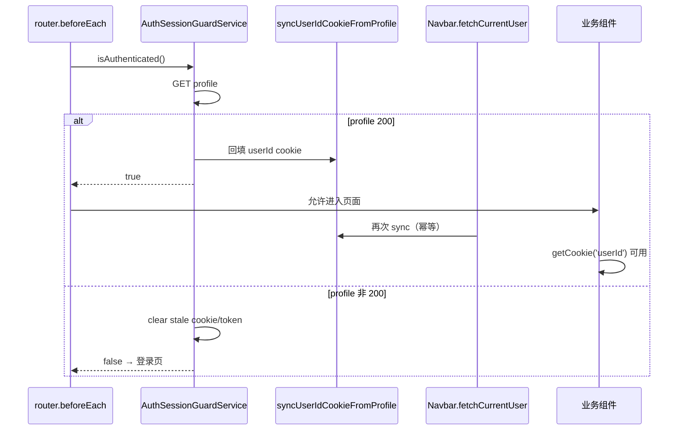

# 设计文档：Session 有效但 userId Cookie 缺失时的业务韧性

**日期：** 2026-05-28  
**状态：** 待审批  
**触发：** `/goal` 与 `/0-auto-flow` — `http://localhost:4000` 业务因 `userId` cookie 缺失不可用

---

## 现象

用户 Django session 仍有效（`GET /api/accounts/users/profile/` → 200），但 `userId` cookie 缺失或过期时，多处前端逻辑直接 `getCookie('userId')`，导致：

| 场景 | 表现 |
|------|------|
| 任务详情 Git 身份 | 「缺少 userId，无法获取 Git 身份」→ 克隆身份下拉为空，层级推送可能卡住 |
| 任务详情 OAuth 绑定 | 「缺少 userId，无法检查 OAuth 绑定状态」 |
| Git 网站授权设置 | 误报「仅登录用户本人可在账号中心管理…」 |
| Navbar / 账号中心链接 | 个人资料链接退化为 `/profile/` 而非 `/user/{id}/profile/` |

**典型复现：** 登录后手动清除 `userId` cookie（保留 `sessionid`），刷新受保护页面。

---

## 根因

1. **双轨认证源：** 路由守卫与 Navbar 以 profile 为真源；大量业务组件仍以 cookie 为唯一 user id 来源。
2. **Cookie 生命周期短于 session：** 后端 login 写 cookie `max_age=1天`，前端 Login 写 30 天；session 可能仍有效而 cookie 已过期。
3. **AuthSessionGuard 清 cookie：** profile 失败时清除 stale `userId`，合法；但成功路径此前不回填，放大「有 session、无 cookie」窗口。
4. **同步 computed 读 cookie：** `UserGitIdentities`、`Navbar.ui` 等在 setup 阶段同步读 cookie，可能在 guard 回填前渲染错误 UI。

---

## 价值流影响

| 流 | 步骤 | 影响 |
|----|------|------|
| `user-auth` | `frontend-auth-guard-redirect` | 扩展：profile 成功时 sync cookie |
| `task-detail-oauth-binding-guidance` | `session-user-id-resolver-thin-slice` | 已有 resolver；需与 cookie sync 对齐 |
| `task-detail-oauth-binding-guidance` | `repo-row-oauth-regression-guard` | 增加「无 cookie + session 有效」Playwright 回归 |
| `task-detail-runtime-relay` | 层级 Git 身份 / 推送 | `fetchLayerGitIdentityOptions` 须不依赖裸 cookie |

不涉及数据库 schema 变更。

---

## 领域概念（轻量）

| 概念 | 上下文 | 说明 |
|------|--------|------|
| **AuthenticatedSession** | 用户与认证 | Django session + 可选 userId cookie 提示 |
| **SessionUserIdResolver** | 前端 auth 工具 | cookie 优先，profile API 回退，inflight 去重 |
| **UserIdCookieSync** | 前端 auth 工具 | profile 200 时回填 cookie，与 guard 清 stale 语义正交 |
| **UserScopedApiPath** | 任务协作 / Git | `/api/user/{id}/…` 依赖 numeric user id |

---

## 方案对比

| 方案 | 描述 | 优点 | 缺点 |
|------|------|------|------|
| **A（推荐）** | 认证边界回填 cookie + 高风险路径用 `resolveAuthenticatedUserId` | 最小 diff、覆盖 guard 后全部 `getCookie` 调用点 | 极早期渲染仍可能短暂缺 cookie |
| B | 批量替换所有 `getCookie('userId')` 为 async resolver | 彻底 | 改动面大、大量组件变 async |
| C | 仅延长后端 login cookie TTL | 减少发生频率 | 不解决手动清 cookie / guard 清除后场景 |

**选定方案 A**，分三层交付。

---

## 架构（方案 A）

**高风险 async 路径**（guard 后仍可能 race 或 bypass guard）直接调用 `resolveAuthenticatedUserId()`：

- `useTaskDetail.fetchLayerGitIdentityOptions`
- `UserGitIdentities.vue` 的 fetch/create/setDefault
- `UserGitSiteOAuthSettings.vue`（已接入）

**Navbar 增强：** `Navbar.logic` 将 `userId` 写入 `userData`；`Navbar.ui` 的 `profilePath` 优先 `currentUser.userId`，降级 cookie。

---

## 实现状态（截至 2026-05-28）

| 项 | 状态 |
|----|------|
| `sessionUserIdUtils.js` — resolver + sync + inflight | ✅ 已实现 |
| `AuthSessionGuardService` — profile 成功 sync cookie | ✅ 已实现 |
| `Navbar.logic` — profile 成功 sync cookie | ✅ 已实现 |
| `useTaskDetail.fetchLayerGitIdentityOptions` — resolver | ✅ 已实现 |
| `TaskDetailLinkedProjectsPanel` — OAuth resolver | ✅ 已有 |
| `UserGitSiteOAuthSettings` — resolver | ✅ 已有 |
| Vitest — sessionUserIdUtils + auth guard | ✅ 已通过 |
| `UserGitIdentities.vue` — 仍 sync getCookie | ⏳ 待做 |
| `Navbar.ui` — profilePath 仍仅 getCookie | ⏳ 待做 |
| Playwright — 清 cookie 后 task-detail / git-oauth 回归 | ⏳ 待做（已有 failing 诊断测试待变绿） |

---

## 非目标

- 不改造 `WorkPanel`、`Projects`、`CreateTaskModal` 等低风险只读 cookie 点（guard 回填后足够）。
- 不改后端 URL 结构。
- 不引入 profile 长期缓存或全局 Pinia auth store（V2 可选）。

---

## 验收标准

1. 清除 `userId` cookie、保持 session → 访问 task-detail（含 `relayToTrae=true`）可加载 Git 身份，层级推送不长期 pending。
2. 同上 → Git 网站授权页不显示「非本人」误报。
3. Navbar 个人资料链接指向 `/user/{id}/profile/`。
4. Vitest：`sessionUserIdUtils`、`auth_domain_model`、`UserGitIdentities`（新增）全绿。
5. Playwright：`GitSiteOAuth.missing-userId-cookie` 断言通过。

---

## 风险

| 风险 | 缓解 |
|------|------|
| 回填 cookie 与 guard 清 cookie 冲突 | 仅 profile 200 时回填；失败仍清除 |
| 重复 profile 请求 | resolver inflight 去重；guard 与 Navbar 各一次可接受 |
| stale cookie 与 profile user_id 不一致 | sync 仅在值不同时 overwrite |

---

## 与既有文档关系

- 扩展并 supersede `2026-05-28-task-detail-oauth-session-user-id-design.md` 中的「不回填 cookie」非目标。
- 与 `2026-05-28-task-detail-relay-unauth-access-hardening-design.md` 正交（未登录仍跳登录页）。
