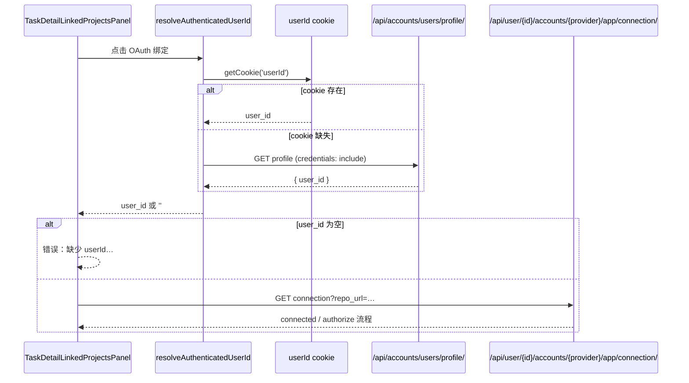

# 设计文档：任务详情 OAuth 绑定 session userId 解析

**日期：** 2026-05-28  
**状态：** 待审批  
**触发页面：**  
`/tenant/{tenant}/workspace/{workspace}/task-detail/{task}/?relayToTrae=true`  
关联项目 → 点击「OAuth 绑定」

---

## 现象

已登录用户（Django session 有效）在任务详情页点击「OAuth 绑定」时，弹出：

```
缺少 userId，无法检查 OAuth 绑定状态
```

Network 未发出 `GET /api/user/{id}/accounts/{provider}/app/connection/`。

---

## 根因

| 层级 | 行为 | 问题 |
|------|------|------|
| 登录 | `Login.vue` 成功时 `setCookie('userId', …)` | 唯一写入点 |
| Navbar | profile API 200 时用 `profile.user_id`，cookie 仅作降级 | ✅ 正确 |
| 任务详情 OAuth | `TaskDetailLinkedProjectsPanel` 仅 `getCookie('userId')` | ❌ session 登录但 cookie 缺失时失败 |

user-scoped connection API 路径为 `/api/user/{user_id}/accounts/{provider}/app/connection/`，前端必须先解析 numeric `user_id`。cookie 是提示而非唯一真源；`AuthSessionGuardService` 在 profile 失败时会清除 stale cookie，进一步放大「有 session、无 cookie」场景。

---

## 目标与非目标

**目标**

1. 任务详情「OAuth 绑定」在 session 有效、cookie 缺失时仍可检查 connection 并跳转授权。
2. 解析逻辑与 Navbar 一致：cookie 优先，profile API 回退。
3. 回归测试覆盖「无 cookie + profile 返回 user_id」路径。

**非目标（本增量）**

- 不批量改造 `UserGitSiteOAuthSettings`、`useTaskDetail` 等其它 `getCookie('userId')` 调用点。
- 不在 profile 成功时自动 backfill cookie（避免与 Navbar / AuthSessionGuard 语义冲突）。
- 不改后端 URL 结构或 gitOauth 服务。

---

## 方案对比

| 方案 | 描述 | 优点 | 缺点 |
|------|------|------|------|
| **A（推荐）** | 抽取 `resolveAuthenticatedUserId()`，任务详情 OAuth 路径专用 | 最小 diff、可测、与 Navbar 对齐 | 其它页面仍可能踩坑 |
| B | Login / Navbar 统一 backfill cookie | 一次修复多处 | 与 guard 清 cookie 语义纠缠 |
| C | connection API 改为非 user-scoped | 前端无需 userId | 破坏现有路由与测试契约 |

**选定方案 A。**

---

## 架构与数据流



**并发：** 同一 tick 内多次调用共享 `inflightResolve`，避免重复 profile 请求。

---

## 实现要点

### 新增

- `task2app/front_project/app/src/utils/sessionUserIdUtils.js`
  - `resolveAuthenticatedUserId(): Promise<string>`

### 修改

- `TaskDetailLinkedProjectsPanel.vue`
  - `resolveOauthConnectionApiBase` 改为 async，调用 `resolveAuthenticatedUserId()`

### 测试

- `sessionUserIdUtils.test.js`：cookie 命中 / profile 回退
- `TaskDetailLinkedProjectsPanel.test.js`：无 cookie 时 profile → connection → start 链路

---

## 错误处理

| 条件 | 用户可见 |
|------|----------|
| cookie 与 profile 均无 user_id | 保持现有文案「缺少 userId，无法检查 OAuth 绑定状态」 |
| profile 401/网络失败 | 同上（未登录应被路由守卫拦截） |
| connection API 失败 | 沿用现有 `detail` 或超时文案 |

---

## 价值流影响

| 流 | 影响 |
|----|------|
| `task-detail-oauth-binding-guidance` | 行级 OAuth 预检恢复可用 |
| `task-detail-oauth-repo-url-row-action` | repo-url connection 检查依赖 user_id 解析 |
| `gitoauth-binding-state-persistence` | 无 schema 变更；只读 connection GET |

建议在 step `repo-row-oauth-regression-guard`（planned）中增加「session 无 cookie」回归用例。

---

## 领域概念（轻量）

| 概念 | 上下文 | 说明 |
|------|--------|------|
| **AuthenticatedSession** | 用户与认证 | Django session + 可选 userId cookie 提示 |
| **SessionUserIdResolver** | 前端 auth 工具 | 从 cookie 或 profile 解析 numeric user id |
| **TaskOauthBindingReadiness** | 任务协作 | 依赖 user-scoped connection API（已有） |

---

## 验收标准

1. 清除 `userId` cookie、保持 session 登录 → 任务详情点击「OAuth 绑定」不再报「缺少 userId」。
2. Network 可见 profile（若 cookie 缺失）及 connection GET。
3. Vitest：`sessionUserIdUtils` + `TaskDetailLinkedProjectsPanel` 相关用例通过。

---

## 风险

- **低**：纯前端工具 + 单组件接入；与 `2026-05-27-github-connection-get-user-id-design` 后端修复正交。
