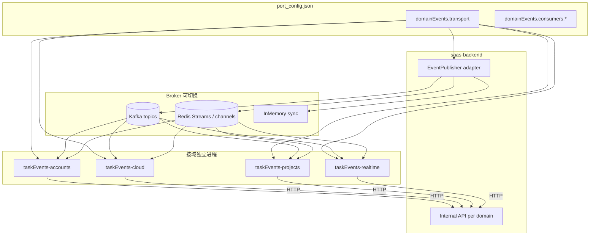

# 设计：领域事件消费者 — 按域多进程 + 可切换消息传输（Kafka / Redis）

**日期**：2026-05-28（修订 v2）  
**状态**：已批准（auto-flow Increment 1 实施中）  

| 驱动力 | 说明 |
|--------|------|
| **A — 部署/进程隔离** | Django 重启不影响消费；各域消费者可独立重启、扩缩 |
| **C — 按域多进程** | 按限界上下文拆分消费者，只处理本域领域事件 |
| **传输抽象** | 底层 `kafka` / `redis` / `memory` 由 `port_config.json` 切换，对齐 `email_queue` 先例 |

---

## 1. 背景与问题

### 1.1 现状

- **单一消费者进程**：`manage.py start_kafka_consumer`，消费组 `saas-project-group`，订阅 **全部** `KAFKA_TOPICS`。
- **Handler 按事件目录组织**，但运行时混在同一进程、同一 group，无法按域独立部署。
- **Producer**：Django `KafkaEventPublisher`；dev 下 `django.messageQueue.memory=true` → `InMemoryEventPublisher` 同步派发。
- **先例**：
  - `Saas_email`：`email_queue.type` = `kafka` | `redis`，独立进程 + handler。
  - `core/services/abstract.py`：`IEventPublisher` / `IPubSubClient` 抽象（Django 侧已有接口，未统一到「可切换 broker」）。

### 1.2 痛点

| 现象 | 问题 |
|------|------|
| 14 类 active handler 共用一个 consumer 进程 | cloud 长任务阻塞或拖垮 accounts 事件；无法按域滚动发布 |
| 传输绑死 Kafka | 本地/CI 强依赖 docker-infra；与已存在的 Redis、memory 路径割裂 |
| `run.sh` 管理 Kafka PID 与 Django 绑定 | 违背进程隔离目标 |

---

## 2. 目标与非目标

### 2.1 目标

1. **按限界上下文** 部署多个消费者进程，每个进程只注册本域 `event_type` → handler 路由。
2. **领域事件** 为稳定契约：`{ "event_type": "USER_CREATED", "data": { ... } }`（与现 Kafka payload 一致），传输层可替换。
3. **Broker 抽象**：配置切换 `kafka` | `redis` | `memory`（开发/测试），Producer 与 Consumer 对称选型。
4. **进程隔离**：Django 只负责 HTTP + 发布事件；各域 consumer 由 runAll 独立拉起。
5. 业务处理仍可通过 **Django Internal API** 委托（避免重写 ORM），Go 负责 broker 适配与域内路由。

### 2.2 非目标

- 首期 Producer 迁出 Django（可 Phase 2 增加 `RedisEventPublisher` 对称实现）
- 合并 `Saas_email`（邮件域保持独立 `email_queue`）
- 一次性删除 Python monolithic consumer（分期切换）

---

## 3. 推荐架构（方案 C + 传输抽象）

### 3.1 分层



| 层 | 职责 |
|----|------|
| **领域事件契约** | `event_type` + `data` + 可选 `key`；topic/channel 由注册表映射 |
| **Broker 端口（Go / Django）** | `Publish` / `Subscribe` / `Ack`（kafka offset / redis stream id / memory noop） |
| **域消费者进程** | 只订阅本域事件列表；解析后调 Internal API 或基础设施侧效应（如 Redis SSE） |
| **Django** | ORM 与领域服务真源；`IEventPublisher` 实现随 transport 切换 |

### 3.2 域划分与消费者进程

与第 4 节限界上下文对齐，建议 **4 个首期进程**（可再拆细）：

| 进程名 | 限界上下文 | 领域事件（event_type） | 说明 |
|--------|------------|------------------------|------|
| **taskEvents-accounts** | 用户与认证、组织初始化 | `USER_CREATED`, `COMPANY_CREATED`, `USER_ACTIVATED`（若启用） | 注册链；独立 group / channel 前缀 |
| **taskEvents-cloud** | 云平台 | `CLOUD_SERVER_STARTED`, `CLOUD_SERVER_STOPPED`, `CLOUD_SERVER_START_AUTO`, `CLOUD_PLATFORM_AUTHORIZATION_CREATED` | 长耗时、宜隔离 |
| **taskEvents-projects** | 项目协作 | `WORKSPACE_CREATED`, `PROJECT_UPDATED`, `TASK_COMPLETED`, `AI_ASSISTANT_REPLY_COMPLETED` | |
| **taskEvents-realtime** | 实时推送 | `SSE_MESSAGE` | 与 `taskSSE` 规划合并；可直写 Redis pub/sub |
| **taskEvents-billing** | 计费（可选独立） | `BILLING_TRANSACTION_CREATED` | 体量小，可并入 accounts 或单独进程便于与 taskBill 对齐 |

**不包含**：`EMAIL_SENT`, `INVITATION_CREATED` → 仍由 `Saas_email` + `email_queue` 处理。

每个进程：

- 独立 **consumer group**（Kafka）或 **consumer group name**（Redis Stream）
- 独立 **health** 端口（`port_config.domainEvents.consumers.<name>.port`）
- 独立 **runAll** 服务项 → 满足「按域重启不影响其他域」

### 3.3 代码仓库布局

推荐 **单 repo `taskEvents/`、多 main**（对齐 runAll 多服务），而非 4 个独立仓库：

```
taskEvents/
  src/
    broker/          # kafka.go, redis.go, memory.go
    domain/          # 路由表：event_type -> handler client
    consumer/        # 各域 ConsumerApp 配置
  cmd/
    accounts/main.go
    cloud/main.go
    projects/main.go
    realtime/main.go
  run.sh             # start|stop|status 按域
```

---

## 4. 领域概念清单（输入 `/5-ddd`）

| 限界上下文 | 聚合根（候选） | 领域事件 | 消费者进程 |
|------------|----------------|----------|------------|
| 用户与认证 | User | USER_CREATED, USER_ACTIVATED | taskEvents-accounts |
| 组织 | Company, Workspace | COMPANY_CREATED, WORKSPACE_CREATED | accounts / projects |
| 云平台 | CloudServerEvent | CLOUD_SERVER_* | taskEvents-cloud |
| 项目协作 | Task | TASK_COMPLETED, PROJECT_UPDATED, AI_ASSISTANT_REPLY_COMPLETED | taskEvents-projects |
| 计费 | — | BILLING_TRANSACTION_CREATED | taskEvents-billing |
| 实时推送 | — | SSE_MESSAGE | taskEvents-realtime |

**原则**：进程边界 = 限界上下文（允许少量跨上下文事件链通过 **后续事件** 解耦，而非在同一进程堆 handler）。

---

## 5. 传输抽象设计

### 5.1 配置（`port_config.json`）

新增顶层 **`domainEvents`**（命名可最终实现时微调）：

```json
{
  "domainEvents": {
    "transport": "kafka",
    "kafka": {
      "bootstrapServers": "localhost:9093"
    },
    "redis": {
      "host": "127.0.0.1",
      "port": 6379,
      "db": 0,
      "streamKeyPrefix": "domain-events:",
      "maxLenApprox": 10000
    },
    "consumers": {
      "accounts": {
        "enabled": true,
        "host": "127.0.0.1",
        "port": 8005,
        "groupId": "task-events-accounts",
        "events": ["USER_CREATED", "COMPANY_CREATED"]
      },
      "cloud": {
        "enabled": true,
        "port": 8006,
        "groupId": "task-events-cloud",
        "events": ["CLOUD_SERVER_STARTED", "CLOUD_SERVER_STOPPED", "CLOUD_SERVER_START_AUTO", "CLOUD_PLATFORM_AUTHORIZATION_CREATED"]
      }
    }
  },
  "django": {
    "messageQueue": {
      "memory": true,
      "kafka": false
    }
  }
}
```

**切换规则**（与 `email_queue` 一致）：

| `domainEvents.transport` | Producer（Django） | 域消费者 |
|--------------------------|-------------------|----------|
| `memory` | `InMemoryEventPublisher` + sync handler（现状） | **不启动** 各 taskEvents 进程；pytest 沿用 |
| `kafka` | `KafkaEventPublisher` | 各域进程 `KafkaBroker` |
| `redis` | `RedisStreamEventPublisher`（待实现） | 各域进程 `RedisStreamBroker` |

`django.messageQueue.memory=true` 时，**强制** `domainEvents.transport=memory`（或忽略 consumers），与现 dev 行为一致。

### 5.2 Go Broker 接口（示意）

```go
type DomainMessage struct {
    EventType string
    Data      json.RawMessage
    Key       string
    TransportMeta map[string]string // partition/offset or stream id
}

type Broker interface {
    Subscribe(ctx context.Context, bindings []EventBinding) (<-chan DomainMessage, error)
    Ack(ctx context.Context, msg DomainMessage) error
    Close() error
}
```

- **Kafka**：topic = 现有 `KAFKA_TOPICS[event_type]`；`group.id` =  per-domain `groupId`
- **Redis**：推荐 **Redis Streams**（`XREADGROUP`）而非纯 Pub/Sub，以支持持久化、消费组、ACK；stream key 例：`domain-events:user-created` 或单流 `domain-events:all` + 按 `event_type` 过滤（实现期二选一，单流更简单、多流更易隔离）

### 5.3 Django Producer 对称扩展

在 `core/services/registry.get_event_publisher()` 中：

```
memory → InMemoryEventPublisher
kafka  → KafkaEventPublisher
redis  → RedisStreamEventPublisher（新）
```

由 `domainEvents.transport` 驱动（`django.messageQueue` 仅保留 memory 快捷开关或合并进 `domainEvents` 避免双源真相）。

**Redis 发布**：写入与 Kafka 相同的 JSON envelope，保证域消费者解析逻辑 **传输无关**。

### 5.4 与 `email_queue` 的关系

| 项目 | email_queue | domainEvents |
|------|-------------|--------------|
| 用途 | 邮件发送 | 业务领域事件 |
| 切换 | `type: kafka\|redis` | `transport: kafka\|redis\|memory` |
| 消费者 | Saas_email 单进程 | **按域多进程** |
| 配置段 | `email_queue` | `domainEvents` |

复用同一 Redis/Kafka 基础设施，**不共用 consumer group**。

---

## 6. 域内处理：Internal API

路径按域划分，便于 ACL 与监控：

| 域 | Internal 前缀 |
|----|----------------|
| accounts | `/api/internal/task-events/accounts/` |
| cloud | `/api/internal/task-events/cloud/` |
| projects | `/api/internal/task-events/projects/` |
| realtime | `/api/internal/task-events/realtime/` 或直写 Redis |

统一请求体：`{ "event_type", "data", "key" }`；认证头：`X-TaskEvents-Internal-Secret`。

Go 侧 **DomainRouter**：`event_type` → HTTP endpoint；未知事件打日志并 Ack（或可配置 DLQ）。

---

## 7. 价值流影响

| 价值流 | 影响 |
|--------|------|
| `user-auth` | 由 taskEvents-accounts 消费；Django 重启不中断 |
| `project-workspace` | taskEvents-projects；`workspace-creation-handler` 测试需指定启用的 consumer |
| 云 / relay / token | taskEvents-cloud + taskEvents-realtime |
| 计费 | taskEvents-billing 或 accounts；与 taskBill emit 契约不变 |

---

## 8. 编排（runAll.yaml）

```yaml
# platform 组 — 仅 transport != memory 时启动
- name: task-events-accounts
  working_dir: taskEvents
  command: "./run.sh start accounts"
  depends_on: [docker-infra, saas-backend]
  health_check:
    url: "http://127.0.0.1:8005/api/health/"

- name: task-events-cloud
  command: "./run.sh start cloud"
  depends_on: [docker-infra, saas-backend]
  health_check:
    url: "http://127.0.0.1:8006/api/health/"
# ... projects, realtime, billing
```

- **memory 模式**：runAll 跳过全部 `task-events-*`（与跳过 Kafka 容器逻辑一致）。
- **redis 模式**：`depends_on: docker-infra` 仍只需 Redis；Kafka 容器可不启（需在 runAll 文档标明）。
- `task2app/run.sh`：移除 monolithic `start_kafka_consumer`（P4）。

---

## 9. 迁移与 Handler 矩阵

| 阶段 | 内容 |
|------|------|
| **P0** | `taskEvents` broker 抽象 + accounts 空消费 + health；`port_config.domainEvents` |
| **P1** | accounts：`USER_CREATED` + `COMPANY_CREATED`；billing 事件；transport 切换 kafka/redis 集成测 |
| **P2** | projects + realtime（SSE Redis 化） |
| **P3** | cloud 域 + 下线 Python 单进程 consumer |
| **P4** | Django `RedisStreamEventPublisher`；run.sh / value-stream 更新 |

| 原 handler 目录 | 目标进程 |
|-----------------|----------|
| user_created, company_created/* | accounts |
| workspace_created, task_completed, project_updated, ai_assistant_reply_completed | projects |
| cloud_server_* , cloud_platform_authorization_created | cloud |
| sse_message | realtime |
| billing_transaction_created | billing |

---

## 10. 测试策略

| 层级 | 内容 |
|------|------|
| Broker 契约 | kafka/redis 双实现：发布 → 消费 → Ack 相同 envelope |
| 域路由 | 仅本域 `events` 列表收到消息；其他域进程收不到 |
| transport 切换 | `port_config` fixture：`memory` / `redis` / `kafka` 三条 pytest 标记 |
| 隔离 | 重启 Django，accounts consumer 仍处理积压 |
| 回归 | 原 handler pytest → 直调 Internal API 或 E2E with taskEvents |

---

## 11. 风险与缓解

| 风险 | 缓解 |
|------|------|
| Redis Pub/Sub 丢消息 | 采用 **Redis Streams** + consumer group |
| 双 transport 双消费者 | 切换期禁止 Kafka group 与 Redis group 同时消费同一逻辑事件 |
| 配置双源（messageQueue vs domainEvents） | 合并文档；`memory` 时以 `domainEvents.transport=memory` 为准 |
| 事件链跨域（USER_CREATED → COMPANY_CREATED） | 仍用 Kafka/Redis **发布后续事件**；由 accounts 发布、accounts 或 projects 消费，保持异步边界 |
| 进程数增多 | runAll 分组启动；本地 dev 可只启 `accounts` + `memory` |

---

## 12. 决策记录（修订）

| 决策 | 选择 | 理由 |
|------|------|------|
| 主驱动力 | A — 进程隔离 | 用户确认 |
| 拓扑 | **C — 按域多进程** | 用户修订；按领域事件处理 |
| 传输 | **kafka / redis / memory 可配置** | 用户修订；对齐 email_queue |
| 实现语言 | Go（broker + 薄路由） | 与 taskAuth/taskBill 一致；Python 仅保留 Django 业务 |
| Monolithic group | **废弃** `saas-project-group` | 改为 per-domain `groupId` |
| SSE | taskEvents-realtime | 与 taskSSE 合并规划 |

---

## 13. 待决问题

1. Redis：**单流 + event_type 过滤** vs **每事件一流**（影响监控与 XTRIM）。
2. `COMPANY_CREATED` 归 accounts 还是 projects（建议 **accounts**，因触发源自用户注册链）。
3. `domainEvents` 与 `django.messageQueue` 是否合并为单一配置树（建议逐步合并，避免 breaking port_config 读取方）。
4. billing 是否独立进程或附在 accounts（建议独立 **taskEvents-billing**，便于 taskBill 联调）。

---

## 14. 批准后下一步

1. 审阅本 spec（v2）并确认域划分与 redis 单流/多流选型  
2. `/3-value-stream`：为每个 `taskEvents-*` 服务增加步骤与测试映射  
3. `/6-plans`：P0 从 broker 接口 + accounts 进程 + port_config 开始  

**禁止**：同一 `event_type` 上 Kafka 旧 consumer 与新域进程并行消费。
