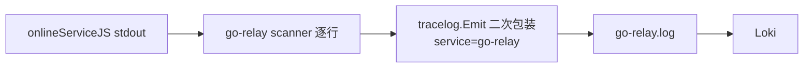
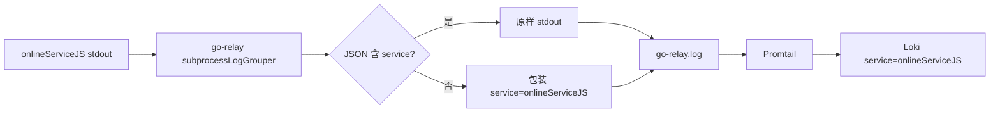

# onlineServiceJS Grafana 日志转发设计

日期：2026-05-29  
状态：已批准  
范围：go-relay 子进程日志 → runAll tee → Promtail → Loki → Grafana  
关联：`docs/superpowers/specs/2026-05-28-centralized-logs-grafana-traceid-design.md`、`docs/superpowers/specs/2026-05-29-grafana-distributed-tracing-runbook.md`

---

## 1. 背景与问题

### 1.1 现象

| 现象 | 说明 |
|------|------|
| Grafana 无 `onlineServiceJS` 服务流 | Loki `service` label 仅有 `go-relay`、`saas-backend` 等 |
| 错误堆栈被切成多行 | 同一 `console.error(err)` 在面板中显示为 4～6 条独立日志 |
| Increment 2 验收未闭环 | 设计文档要求「relay 启动流程下同 traceId 可见 onlineServiceJS」，当前未满足 |

### 1.2 根因（已验证）



1. **架构缺口**：onlineServiceJS 由 go-relay 动态拉起，不是 runAll 直管服务，无 `onlineServiceJS.log`。
2. **二次包装**：子进程 JSON 行（`logJson`）被包进 `msg` 字符串，Promtail 只能解析外层 `service: go-relay`。
3. **逐行拆分**：Node.js `console.error('...', err)` 输出多行堆栈，每行单独转发 → Grafana 切碎。

### 1.3 目标

1. Grafana / Loki 能按 **`service=onlineServiceJS`** 检索子进程日志。
2. **多行错误**（含 stack trace）在 Grafana 显示为**单条**日志。
3. 结构化 `logJson` 行（含 `trace_id`）可被 Promtail 提取 label，支持 Trace Log Journey 面板。
4. 不破坏 go-relay 自身日志（`service=go-relay`）与 `/v1/status` 内存缓冲。

### 1.4 非目标

- 为 onlineServiceJS 新增独立 `onlineServiceJS.log` tee 文件（可选后续，本阶段用 go-relay 透传即可）。
- 修复 `register-reachability` HTTP 500 导致进程 exit 1（属 `relay-to-trae-startup-reliability` 范畴）。
- Promtail / Grafana 仪表盘大改。

---

## 2. 价值流影响

关联 `value-stream.yaml` → **`centralized-logs-grafana-traceid`**：

| 步骤 | 影响 |
|------|------|
| `increment2-json-log-contract` | 需补全 go-relay **子进程** JSON 契约，不仅 relay 自身 slog |
| `increment2-grafana-trace-dashboard` | 验收需含 `service=onlineServiceJS` |
| `task-detail-relay-debug-agent-observability` | 间接受益：DEBUG_AGENT 日志在 Grafana 可按服务过滤 |

新增 value stream 步骤（Step 3 细化）：

- `increment2-relay-child-log-forwarding`：go-relay 子进程日志透传 + 多行合并

---

## 3. 领域概念（轻量，供 DDD 参考）

| 概念 | 说明 |
|------|------|
| **Bounded Context** | 可观测性 / Relay 运行时 |
| **SubprocessLogForwarder** | 领域服务：子进程 stdout → 集中日志契约 |
| **StructuredLogLine** | 值对象：含 `service`、`trace_id`、`msg` 的 JSON 行 |
| **LogBlock** | 值对象：合并后的多行纯文本块 |
| **领域事件** | `ChildLogForwarded`（可选，本阶段不持久化） |

---

## 4. 方案对比

### 方案 A：go-relay 透传 + 多行合并（推荐）

在 go-relay 读取子进程 stdout 时：

- 已有 `service` 字段的 JSON → **原样写 stdout**（不二次包装）
- 纯文本行 → 包装为 `service: onlineServiceJS` 的 JSON
- 堆栈续行 → `subprocessLogGrouper` 合并为单条 `\n` 分隔的 `msg`

| 优点 | 缺点 |
|------|------|
| 改动面小（仅 go-relay） | 日志仍物理落在 `go-relay.log` |
| 复用现有 Promtail JSON pipeline | filename label 仍为 go-relay（JSON service 覆盖） |
| 与 Increment 2 契约一致 | — |

### 方案 B：runAll 为 onlineServiceJS 单独 tee 文件

go-relay 将子进程输出写入 `RUNALL_LOG_ROOT/onlineServiceJS.log`。

| 优点 | 缺点 |
|------|------|
| 文件名与 service 一致 | 需 runAll 感知动态子服务 |
| — | 改动面大，超本需求 |

### 方案 C：OTel Logs SDK 直推 Collector

| 优点 | 缺点 |
|------|------|
| 标准化 | Node OTel logs 未落地，改动面最大 |

**推荐方案 A。** 部分代码已在工作区实现，本 pipeline 负责补齐测试、验收与文档。

---

## 5. 详细设计

### 5.1 数据流（目标态）



### 5.2 组件变更

| 文件 | 职责 |
|------|------|
| `go_relayToTrae/src/tracelog/tracelog.go` | `ForwardChildLine`：结构化透传 / 纯文本包装 |
| `go_relayToTrae/src/state.go` | `appendSubprocessLog` 与 relay 自身 `appendLog` 分离 |
| `go_relayToTrae/src/process.go` | scanner + grouper 合并后转发 |
| `go_relayToTrae/src/subprocess_log_grouper.go` | 堆栈续行识别与合并 |

### 5.3 多行合并规则

续行判定（`isSubprocessLogContinuation`）：

- 行首空白（缩进 `at ...`、错误对象属性）
- `at ` / `at async ` 前缀
- 独立 `{` / `}`
- **排除**：以 `{"service":...}` 开头的结构化 JSON（新日志起点）

### 5.4 Promtail / Grafana（无变更）

现有 `promtail.yaml` JSON pipeline 已从 payload 提取 `service`、`trace_id`。透传后即可生效。

### 5.5 错误级别（可选增强）

纯文本含 `失败` / `Error:` / `error` 时 `level: error`——**本阶段不做**，保持 `info` 与现有行为一致，避免面板级别过滤意外变化。

---

## 6. 验收标准

| # | 场景 | 预期 |
|---|------|------|
| 1 | 重建 go-relay，拉起 onlineServiceJS | Loki `label/service/values` 含 `onlineServiceJS` |
| 2 | 触发 `console.error('...', err)` | Grafana **单条**日志含完整 stack |
| 3 | HTTP 请求产生 `logJson('http_request')` | Loki 可按 `trace_id` 检索 |
| 4 | go-relay 自身 `/health` | 仍为 `service=go-relay`，无回归 |
| 5 | 单元测试 | `subprocess_log_grouper_test`、`tracelog_test` 全绿 |

验收命令：

```bash
cd go_relayToTrae && go test ./...
cd AiMonitor && python3 scripts/verify_trace_stack.py
# 手动：docker exec aimonitor-loki wget -qO- 'http://localhost:3100/loki/api/v1/label/service/values'
```

---

## 7. 风险与缓解

| 风险 | 缓解 |
|------|------|
| 超长堆栈超 Scanner 默认 64KB | 暂接受；必要时 `scanner.Buffer` 扩容 |
| Docker 模式子进程日志缓冲 | run.sh 已 merge stderr→stdout，与 Node 模式一致 |
| onlineServiceJS 快速 exit 无 http_request | 与 reachability 可靠性分开跟踪 |

---

## 8. 实施范围摘要

- **已完成（工作区）**：`ForwardChildLine`、`appendSubprocessLog`、`subprocessLogGrouper`、单元测试
- **待完成（pipeline Step 7）**：集成测试、value-stream 登记、runbook 补充、`verify_trace_stack` 扩展（可选）、PR
