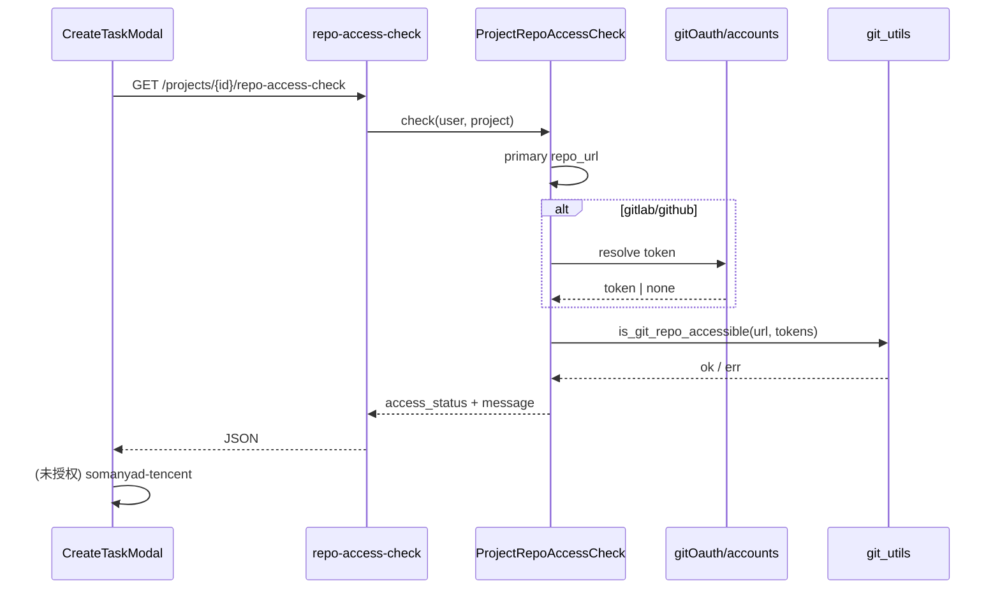

# 设计文档：创建任务 — 项目仓库可访问性标签（Provider 无关）

**日期**：2026-05-30  
**状态**：已实现  
**关联页面**：`/tenant/{tenantId}/work-panel` → 创建任务 → 项目下拉列表  
**关联问题**：`somanyad-tencent` 等项目显示 `(无GitHub)`，用户期望看到「能否访问 / 有无授权」而非 GitHub/GitLab 类型标签。

---

## 1. 背景与问题

### 1.1 现象

在 work-panel 创建任务时，项目下拉项格式为 `(状态)  项目名`。例如：

- `(无GitHub)  somanyad-tencent`
- `(可访问)  somanyad-github`

用户反馈：**状态不应与 GitHub / GitLab 挂钩**，而应回答「当前用户能否访问该项目的 Git 仓库、是否已完成 OAuth 授权」。

### 1.2 根因（已验证）

| 层级 | 现状 | 问题 |
|------|------|------|
| 前端 `CreateTaskModal.vue` | 调用 `GET .../github/repo/access-check/{projectId}/` | 路径与语义均为 GitHub 专用 |
| 后端 `github_repo_access_check_view` | 若首个 `repo_url` 的 netloc 不含 `github.com`，直接返回 `无 GitHub 仓库` | GitLab / 自托管 Git 一律被判为「无 GitHub」，**未做可访问性检查** |
| 前端映射 | `message.includes('无 GitHub 仓库')` → 显示 `无GitHub` | 把 **provider 类型** 误当作 **访问状态** |

实测：`somanyad-tencent`（`http://1.117.67.121:8012/ruandao/somanyad`）接口返回：

```json
{"is_accessible": false, "message": "无 GitHub 仓库"}
```

### 1.3 已有可复用能力

系统内**已有** provider 无关的仓库校验逻辑，但未接入创建任务弹窗：

| 能力 | 位置 | 说明 |
|------|------|------|
| `is_git_repo_accessible()` | `projects/git_utils.py` | 支持 GitHub / GitLab / Bitbucket / generic |
| `validate_git_repo_view` | `utility_views.py` | 创建**项目**页按 URL 校验；含 OAuth 换票 |
| `ProjectViewSet.get_branches` | `project_views.py` | 项目详情分支预览；**配置感知 GitLab** + 未授权中文提示 |
| `infer_git_provider_from_repo_url` | `accounts/git_oauth_providers.py` | 匹配 `port_config.json` 的 `gitOauth` |

**结论**：不是缺少 GitLab 支持，而是创建任务路径仍走 GitHub 专用捷径；且前端把 provider 信息暴露给了用户。

---

## 2. 目标与非目标

### 2.1 目标

1. 创建任务项目下拉前缀**仅表达访问/授权状态**，不出现 `GitHub`、`GitLab`、`无GitHub` 等 provider 字样。
2. 对 GitHub、配置内 GitLab（含 IP 自托管）、Bitbucket 等，**统一**走 OAuth + `is_git_repo_accessible` 判定。
3. 与项目详情页分支预览、创建项目页 `validate-git-repo` **共用同一套判定逻辑**（避免再次分叉）。
4. 保持现有「并行预检、不阻塞选项目」交互（打开弹窗时批量请求，显示「检查中」）。

### 2.2 非目标

- 不在下拉前缀中展示 provider 名称或图标（GitHub / GitLab / tencent-gitlab 等）。
- 不改造 gitOauth 服务或 OAuth 回调契约。
- 不在本轮实现「选项目后 inline OAuth 授权」（可后续 enhancement；本轮仅正确标注 `未授权`）。
- 不为 generic / SSH 仓库实现完整分支列举（SSH 见下文「无法检查」语义）。

---

## 3. 用户可见状态模型（Provider 无关）

下拉前缀只使用以下**固定词表**（括号内为展示文案）：

| `access_status` | 展示 | 含义 |
|-----------------|------|------|
| `checking` | `(检查中)` | 前端请求进行中 |
| `accessible` | `(可访问)` | 当前用户凭据（或公开仓库）下 API/HEAD 检查通过 |
| `needs_auth` | `(未授权)` | 需要 OAuth/绑定，但用户尚未完成或 token 不可用 |
| `not_accessible` | `(不可访问)` | 已尝试鉴权仍失败（404、无权限、限流等） |
| `not_configured` | `(未设置)` | 项目未配置 Git 仓库 |
| `uncheckable` | `(无法检查)` | SSH URL 等无法在创建任务前自动验证的场景 |

**移除**：`无GitHub`、`无GitLab` 及一切 provider 相关前缀。

### 3.1 判定规则（后端）

对项目**首个** `project_repos[0].repo_url`（与现行为一致）：

```
无 repo_url
  → not_configured

repo_url 以 git@ 开头（SSH）
  → uncheckable（message：SSH 仓库无法在创建任务前自动验证）

解析 provider（infer_git_provider_from_repo_url / is_gitlab_repo_url）
  → github：resolve_user_github_app_access_token
  → gitlab：fetch_git_access_via_gitoauth_for_user(provider_key=gitlab:{service_provider})
  → 其他：按 is_git_repo_accessible 现有分支

换票失败 / 未绑定 / gitoauth 返回无凭据
  → needs_auth（message 保留技术细节供 tooltip，不下沉到前缀）

有 token 或无 token 调用 is_git_repo_accessible：
  ok → accessible
  401/403 且无 token → needs_auth
  404/403 且有 token → not_accessible
  其他错误 → not_accessible
```

GitLab localhost 特例：与 `get_branches` 对齐，**创建任务预检不依赖** `_gitlab_session` cookie（弹窗打开时用户未必在同域 GitLab 页面）；无 OAuth token 即 `needs_auth`。

---

## 4. API 设计

### 4.1 新端点（推荐）

```
GET /api/tenant/{tenant_id}/projects/{project_id}/repo-access-check/
```

**响应**（向后兼容字段 + 结构化状态）：

```json
{
  "is_accessible": true,
  "access_status": "accessible",
  "message": ""
}
```

| 字段 | 类型 | 说明 |
|------|------|------|
| `is_accessible` | bool | 与 `access_status === 'accessible'` 一致；保留给旧前端 |
| `access_status` | enum | 见 §3 词表（不含 `checking`） |
| `message` | string | 可选详情；**不得**在前缀中直接拼接 provider 名 |

### 4.2 旧端点处理

`GET .../github/repo/access-check/{project_id}/`：

- **行为**：委托同一 handler（不再 early-return「无 GitHub 仓库」）。
- **路径**：保留 1 个版本周期，避免外部脚本 404；前端改为新路径。
- **文档/注释**：标记 deprecated。

### 4.3 共享领域服务

新增（建议路径）：

`projects/services/project_repo_access_check.py`

```python
@dataclass
class ProjectRepoAccessResult:
    is_accessible: bool
    access_status: str  # accessible | needs_auth | ...
    message: str
    primary_repo_url: str | None

def check_project_primary_repo_access(*, user, project) -> ProjectRepoAccessResult: ...
```

**复用方**（逐步收敛，本轮至少前两项）：

1. `github_repo_access_check_view` → 薄包装
2. `validate_git_repo_view` → 抽取 `_resolve_tokens_for_repo_url(user, repo_url)` 共用换票逻辑
3. （后续）任务详情预检、work-panel 其他入口

**顺带修复**：`validate_git_repo_view` 当前用 `"gitlab" in netloc` 识别 GitLab，对 IP 自托管无效；统一改为 `is_gitlab_repo_url` + `resolve_provider_from_repo_url`（与 `get_branches` 一致）。

---

## 5. 前端变更

### 5.1 `CreateTaskModal.vue`

| 变更 | 说明 |
|------|------|
| API 路径 | 改为 `.../projects/{id}/repo-access-check/` |
| 状态映射 | 优先读 `access_status`；fallback 解析 `message`（兼容过渡期） |
| 展示 | `getProjectDisplayLabel` 仅使用 §3 词表 |
| 删除 | `无GitHub` 分支及一切 provider 字符串匹配 |

可选 enhancement（非必须）：hover tooltip 展示 `message`（如「请先在个人资料完成 GitLab 绑定」），**前缀仍保持 `(未授权)`**。

### 5.2 预期效果（somanyad-tencent）

| 用户 OAuth 状态 | 新前缀 |
|---------------|--------|
| 未绑定 tencent-gitlab | `(未授权)` |
| 已绑定且 API 200 | `(可访问)` |
| 已绑定但仓库 404 | `(不可访问)` |

---

## 6. 价值流影响

读取 `value-stream.yaml`，本变更影响：

| 现有 Stream | 影响 |
|-------------|------|
| `task-management` | 新增 step：`create-task-project-repo-access-label`（创建任务项目可访问性预检） |
| `project-detail-repo-oauth-row-action` | 复用同一 `GitProviderDetection` + OAuth 换票链；不新增配置源 |
| `gitoauth-binding-state-persistence` | `needs_auth` 依赖 bind_status / 换票结果（只读） |

**字段影响**：无 DB schema 变更；只读：

- `saas-backend.projects_projectrepo.repo_url`
- `git-oauth.api_githubappusercredential.bind_status`
- `git-oauth.api_githubappusercredential.provider`

**测试影响**：

| 类型 | 文件 |
|------|------|
| 后端单测 | `tests/test_project_repo_access_check_api.py`（新建） |
| 后端单测 | 扩展 `tests/test_validate_git_repo_api.py`（IP GitLab 换票路径） |
| 前端单测 | `CreateTaskModal.test.js`（新建或扩展）— status 映射 |
| Playwright | `CreateTask.work-panel-project-access-label.playwright.test.js` — somanyad-tencent 不为 `无GitHub` |

完整 value stream 切片在 `/3-value-stream-价值流` 步骤完成。

---

## 7. 领域概念清单（供 DDD 输入）

| 概念 | 类型 | 说明 |
|------|------|------|
| **ProjectRepoAccessCheck** | 领域服务 | 给定 User + Project，输出 provider 无关的访问结论 |
| **RepoAccessStatus** | 值对象 / 枚举 | `accessible \| needs_auth \| not_accessible \| not_configured \| uncheckable` |
| **Project** | 实体 | 含 `project_repos` 聚合 |
| **ProjectRepo** | 实体 | `repo_url` 为检查输入 |
| **GitProviderDetection** | 领域服务 | 已有；配置驱动识别 |
| **OAuthCredential** | 外部上下文实体 | gitOauth 侧凭据；accounts 上下文换票 |
| **Bounded Context: projects** | 上下文 | API + `git_utils` |
| **Bounded Context: accounts** | 上下文 | OAuth provider 配置与 token |
| **领域事件** | 无新增 | 只读预检，无持久化 |

---

## 8. 架构示意



---

## 9. 验收标准

1. `somanyad-tencent` 在创建任务下拉中**不再出现** `无GitHub` / `GitHub` / `GitLab` 字样。
2. 未绑定 OAuth 时显示 `(未授权)`；绑定且仓库可达时显示 `(可访问)`。
3. GitHub 项目行为与改前 `(可访问)` / `(不可访问)` 一致，无回归。
4. `GET .../github/repo/access-check/...` 旧路径仍可用且返回与新路径一致的语义（deprecated）。
5. 单测 + Playwright 覆盖至少：GitHub 可访问、GitLab IP 未授权、无 repo 未设置。

---

## 10. 实施顺序建议

1. **RED**：`test_project_repo_access_check_api.py` — GitLab IP 项目返回 `needs_auth` 而非「无 GitHub 仓库」。
2. **GREEN**：实现 `ProjectRepoAccessCheck` + 新 API；旧 view 委托。
3. **REFACTOR**：`validate_git_repo_view` 共用换票 helper；修复 IP GitLab 识别。
4. 前端切换 API + 状态映射；删除 `无GitHub`。
5. Playwright 回归 work-panel。

---

## 11. 开放问题（请确认）

1. **SSH 仓库**：前缀用 `(无法检查)` 是否可接受？还是允许选项目但不显示状态（空前缀）？
2. **多仓库项目**：本轮仍只检查**首个** repo（与现行为一致）是否 OK？
3. **Tooltip**：是否在 `(未授权)` 上 hover 显示 `message` 引导去个人资料 OAuth？（推荐：是）

---

**请确认本设计方向。批准后进入价值流映射或 Worktree 隔离实施。**
