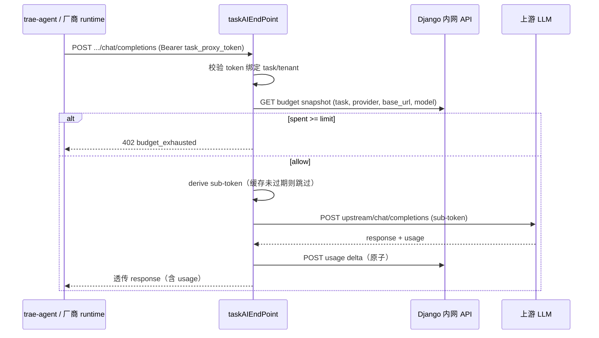

# taskAIEndPoint：派生子 Key 与 LLM 预算权威网关设计

**日期：** 2026-05-30  
**状态：** 已批准（Goal 2026-05-30 — 五项决策已锁定）  
**前置文档：**
- `docs/superpowers/specs/2026-05-30-task-llm-budget-limit-design.md`（预算语义、数据模型）
- `docs/superpowers/specs/2026-05-30-llm-budget-endpoint-level-design.md`（端点级 `budget_enabled`）
- `docs/superpowers/specs/2026-05-30-task-agent-support-internal-dispatch-request-fix-design.md`（taskAgentSupport 容器入站模式，可复用鉴权思路）

---

## 1. 问题陈述

### 1.1 用户关切

当前 LLM 预算方案采用 **混合 enforcement**：

1. **配置与账本**在 `task2app` Django（工作空间默认、任务覆盖、usage 累计）
2. **运行时预检**在 `trae-agent` 容器内（读 `TASK_LLM_BUDGET_POLICY` env，本地 `spent < limit`）
3. **onlineServiceJS** 作为任务侧车，负责 Git OAuth、作业调度、部分 LLM 出站（如 diff 摘要），并将 `use_sub_token` 写入 agent YAML

用户计划 **将 onlineServiceJS 开放给其他厂商注册**（类似 `Saas_Ai_Provider` 镜像市场）。若预算门禁仍依赖各厂商 runtime（onlineServiceJS 分支 / agent 插件）自行实现：

| 风险 | 后果 |
|------|------|
| 厂商未实现或实现错误 | 预算门禁 **形同虚设**，租户可超额调用 |
| 厂商绕过 proxy 直连上游 | Master Key 或派生 Key 泄漏路径不可控 |
| 各厂商重复实现 derive + budget | 集成成本高、行为不一致 |
| 本地 env policy 可被篡改 | 容器内预检 **不可作为唯一权威** |

**结论：** 预算的 **权威拦截点** 必须在 **平台可控、与厂商 runtime 解耦** 的服务上，而不能放在 onlineServiceJS 或其插件体系里。

### 1.2 现状对照

| 能力 | 当前位置 | 问题 |
|------|----------|------|
| 派生子 Key 供应商注册 | Django `SubTokenProvider` + 系统管理 UI | 派生 **执行** 未集中 |
| 租户端点配置 | Django `TenantFeatureParams.providers[]` | 容器仍可能拿到 master `api_key` |
| 预算配置 CRUD | Django + 功能参数页 | ✅ 可保留 |
| 预算账本 | Django `TaskModelBudgetUsage` | ✅ 可保留为 source of truth |
| 运行时拦截 | trae-agent 读 env | ❌ 非权威；厂商可跳过 |
| LLM 出站 | agent → 上游 `base_url` 直连 | ❌ 绕过平台 |

---

## 2. 目标与非目标

### 2.1 目标

1. 新建独立服务 **`taskAIEndPoint`**（平台侧），作为 **派生子 Key + LLM API 端点** 的唯一权威执行面。
2. 对 `use_sub_token=true` 且 `budget_enabled=true` 的端点：**所有 LLM 请求必须经 taskAIEndPoint 转发**，平台在转发前完成预算校验与用量记账。
3. **容器/agent/onlineServiceJS 不再持有上游 master Key**（budget 路径）；仅持有 **task 级 proxy 凭证** 或 **指向 taskAIEndPoint 的 base_url**。
4. onlineServiceJS 开放给第三方厂商时，**不要求** 厂商实现预算逻辑；厂商只消费平台提供的 LLM 接入契约。
5. 与现有 Django 预算配置 UI（功能参数、工作空间默认、任务详情、people/manage）**兼容**；配置仍由 task2app 管理，taskAIEndPoint 读配置并执行。

### 2.2 非目标（Phase 1）

- 改造 **master Key**（非 sub-token）路径的 LLM 代理（仍不参与预算）
- 替换 `Saas_Ai_Provider` 镜像市场本身
- 在 taskAIEndPoint 内重做完整租户管理 UI（配置页留 task2app）
- 多区域 / 多活部署（单实例 + Django 内网 API 即可启动）

---

## 3. 价值流影响（`value-stream.yaml`）

### 3.1 受影响流

| Stream | 影响 |
|--------|------|
| **`task-llm-budget-governance`** | **架构修订**：运行时 enforcement 从 `trae-agent` 本地预检 → **taskAIEndPoint 网关权威拦截**；`task-model-budget-usage-report` 改为网关同步记账为主、容器上报为辅/废弃 |
| **`tenant-feature-params`** | 容器 bootstrap 下发的 `TASK_LLM_PROVIDERS_JSON` 中，budget 端点 **不再含 master api_key**，改为 `proxy_base_url` + `task_credential` 引用 |
| **`task-detail-runtime-relay`** | bootstrap env 契约变更；onlineServiceJS 仅透传平台 LLM 端点，不执行 budget |
| **`task-agent-support`** | 可复用「容器 → 平台内网 API」转发模式；**不合并**进 taskAIEndPoint（职责不同） |

### 3.2 建议新增流

```yaml
- name: task-ai-endpoint-gateway
  domain: 任务协作
  description: 派生子 Key 派生 + LLM OpenAI-compatible 代理 + 预算权威门禁
  steps:
    - name: sub-token-derive
      status: planned
    - name: llm-proxy-budget-gate
      status: planned
    - name: container-proxy-bootstrap
      status: planned
```

### 3.3 字段影响

| 字段 | 变更 |
|------|------|
| `saas-backend.projects_sub_token_provider.*` | 派生逻辑 **迁移执行** 至 taskAIEndPoint；Django 仍为注册表 |
| `saas-backend.projects_tenant_feature_params.providers[]` | 新增 `proxy_mode: "task_ai_endpoint"`（budget 端点强制） |
| `saas-backend.projects_task_model_budget_usage.*` | 写入方改为 **taskAIEndPoint**（原子 check-and-add） |
| 容器 env | 新增 `TASK_AI_ENDPOINT_BASE_URL`；移除 budget 端点 master key |

**测试影响：** 新增 `taskAIEndPoint` 服务测试；扩展 `test_task_model_budget_usage_api.py` 为网关集成测试；trae-agent 本地预检测试降级为「无 proxy 时的 fallback」或删除。

---

## 4. 领域概念清单（供 `/5-ddd`）

| 概念 | 限界上下文 | 说明 |
|------|------------|------|
| **`TaskAiEndpointRoute`** | task-ai-endpoint | 平台侧路由：`(tenant, provider, upstream_base_url) → proxy_path` |
| **`SubTokenDerivePolicy`** | task-ai-endpoint | 来自 `SubTokenProvider` 的派生规则（endpoint、method、字段映射） |
| **`TaskLlmProxyCredential`** | task-ai-endpoint | 任务级短期凭证，仅可用于 taskAIEndPoint，不可直连上游 |
| **`BudgetGateDecision`** | task-llm-budget | allow / deny + reason + snapshot(spent, limit) |
| **`LlmProxyInvocation`** | task-ai-endpoint | 单次转发记录（request_id、tokens、cost_delta） |
| **`TenantLlmEndpointConfig`** | tenant-llm-config | 已有 `LlmProviderEntry`；扩展 proxy 字段 |

**聚合根建议：**

- `TaskLlmBudgetLedger`（task + model key）— 账本一致性边界，**仅 taskAIEndPoint 写**
- `TaskAiProxySession`（task + route）— 派生 token 缓存与过期

**领域事件（跨上下文）：**

- `LlmBudgetThresholdReached` — 网关拒绝时发布，供任务详情 SSE/banner
- `SubTokenDerived` / `SubTokenDeriveFailed` — 审计

---

## 5. 方案对比

### 方案 A：taskAIEndPoint 权威网关（推荐）

```
Agent / onlineServiceJS ──► taskAIEndPoint ──► 上游 LLM (DeepSeek/OpenAI/…)
                              │
                              ├─ 预算 check-and-add（Django 内网 API 或 co-located DB）
                              ├─ 派生子 Key（按 SubTokenProvider 规则）
                              └─ 拒绝超额（402/429 + budget_exhausted）
```

**优点：** 厂商零预算实现；平台单一可信点；master Key 不出平台。  
**缺点：** 多一跳延迟；需高可用与流式响应转发。

### 方案 B：仅派生集中，预算仍靠 agent 本地

taskAIEndPoint 只负责 derive，LLM 仍直连上游 sub-token。

**缺点：** 厂商仍可跳过；**不满足**用户「开放 onlineServiceJS 不失效」诉求。**不推荐。**

### 方案 C：Django 内嵌代理（不新建服务）

在 `task2app` 增加 OpenAI-compatible proxy 路由。

**优点：** 部署简单。  
**缺点：** runserver/WSGI 不适合长连接流式 LLM；与 SaaS 主 API 耦合；**不推荐** 作为长期形态（可作 Phase 0 spike）。

### 推荐：**方案 A**，实现语言优先 **Go**（与 `taskAgentSupport` / `go_relayToTrae` 一致），预算状态通过 **Django 内网 API** 读写（与现有模型复用）。

---

## 6. 详细设计（方案 A）

### 6.1 服务边界

| 组件 | 职责 |
|------|------|
| **task2app Django** | 预算/端点 **配置** CRUD、权限、任务 seed、people/manage；**不**做 LLM 转发 |
| **taskAIEndPoint** | 派生 sub-token、OpenAI-compatible **代理**、预算 **权威 gate**、用量 **原子记账** |
| **trae-agent** | 调用 `TASK_AI_ENDPOINT_BASE_URL/{tenant}/{workspace}/{task}/v1/...`；**删除** 或降级本地 budget 预检 |
| **onlineServiceJS** | Git/作业/可观测；**不**持有 budget 逻辑；厂商插件 **不得** 直连上游 master Key（budget 路径） |

**与现有服务关系：**

| 服务 | 端口（建议） | 关系 |
|------|-------------|------|
| saas-backend | 8001 | taskAIEndPoint 内网读写的配置/账本 API |
| taskAgentSupport | 8011 | 无关；继续处理 container-token / relay |
| Saas_Ai_Provider | 8010 | 镜像市场；厂商注册 runtime，**不**注册 budget |
| **taskAIEndPoint** | **8013**（新增 `port_config.json`） | 新服务 |

### 6.2 请求路径（OpenAI-compatible）

**容器内 agent 配置的 base_url 示例：**

```text
https://{task_ai_endpoint_host}/api/tenant/{tenant_id}/workspace/{workspace_id}/task/{task_id}/llm/openai/v1
```

**转发流程：**



### 6.3 鉴权

| 凭证 | 用途 | 签发 |
|------|------|------|
| **Task Llm Proxy Token** | 容器 → taskAIEndPoint | Django bootstrap 或 taskAgentSupport 换票；绑定 `(tenant, workspace, task, exp)` |
| **Internal Service Secret** | taskAIEndPoint → Django 内网 API | `port_config.json` 与 taskAgentSupport 同模式 |

**约束：**

- Proxy Token **不能** 换取上游 master Key
- 无 Token 或 task 不匹配 → 401/403
- budget 端点 **不接受** 请求体或 Header 中的上游 api_key

### 6.4 派生子 Key（迁入 taskAIEndPoint）

**配置源：** Django `SubTokenProvider`（已有 `derive_endpoint`、`derive_method`、`derive_params`、`response_token_field`）。

**执行：**

1. bootstrap 时 Django 告知 taskAIEndPoint：该 task 需要哪些 `(provider, upstream_base_url)` 路由
2. 首次请求或 token 将过期时，taskAIEndPoint 用 **平台保管的 master Key**（仅存 Django/密钥库，**不下发容器**）调用 derive API
3. 派生结果缓存在 taskAIEndPoint 内存/Redis，key=`task_id+provider+base_url`

**master Key 存储（Phase 1）：**

- 仍存 `TenantFeatureParams.providers[].api_key`（Django DB）
- taskAIEndPoint 通过内网 API `GET /internal/task-ai-endpoint/upstream-credentials/` 按 task 路由拉取（**仅服务端**）

### 6.5 预算门禁（权威）

**原则：** **check-and-add 在 taskAIEndPoint 转发前同步完成**；Django 提供 transactional API：

```http
POST /internal/task-ai-endpoint/budget/reserve-or-deny/
{
  "task_id", "provider", "base_url", "model",
  "estimated_cost": "0"   // 可选预扣；流式完成后 final delta
}
→ { "allowed": true, "spent": "12.30", "limit": "50.00" }
→ { "allowed": false, "code": "budget_exhausted", ... }
```

```http
POST /internal/task-ai-endpoint/budget/commit-usage/
{
  "request_id", "task_id", "provider", "base_url", "model",
  "input_tokens", "output_tokens", "cost_delta"
}
```

**与现有模型对齐：**

- 读：`TaskModelBudget` + `TaskModelBudgetUsage` + 租户单价
- 写：仅通过上述 internal API；**废弃** 容器侧 `POST .../model-budget-usage/` 作为权威路径（可保留兼容期只读审计）

**超额响应（对 agent）：**

```json
HTTP 402
{
  "error": {
    "code": "budget_exhausted",
    "message": "模型 gpt-4.1 预算已用尽",
    "spent_amount": "50.00",
    "budget_limit": "50.00",
    "currency": "CNY"
  }
}
```

### 6.6 容器 Bootstrap 契约变更

**现有（budget 端点）：**

```json
{
  "provider": "deepseek",
  "api_key": "sk-master-xxx",
  "base_url": "https://api.deepseek.com/v1",
  "use_sub_token": true,
  "budget_enabled": true
}
```

**目标（budget 端点）：**

```json
{
  "provider": "deepseek",
  "use_sub_token": true,
  "budget_enabled": true,
  "proxy_mode": "task_ai_endpoint",
  "base_url": "http://127.0.0.1:8013/api/tenant/{tenant}/workspace/{ws}/task/{task}/llm/deepseek/v1",
  "api_key": "<TASK_LLM_PROXY_TOKEN>"
}
```

**环境变量：**

| 变量 | 说明 |
|------|------|
| `TASK_AI_ENDPOINT_BASE_URL` | 平台网关根 URL |
| `TASK_LLM_PROXY_TOKEN` | 任务级代理凭证 |
| ~~`TASK_LLM_BUDGET_POLICY`~~ | **Phase 2 移除**（enforcement 不在容器） |

onlineServiceJS / `featureParamsEnvToYaml`：**不再** 把 master key 写入 budget provider 的 YAML。

### 6.7 配置 UI 归属

| UI | 位置 | 说明 |
|----|------|------|
| 端点 `use_sub_token` / `budget_enabled` | task2app 功能参数页 | **不变** |
| 工作空间默认预算 | task2app 功能参数页 | **不变** |
| 任务预算覆盖 / 上调 | task2app 任务详情 | **不变** |
| people/manage 权限 | task2app | **不变** |
| SubTokenProvider 注册 | task2app 系统管理 | **不变**（taskAIEndPoint 消费） |
| 网关运行态 / 派生失败 / 拒绝审计 | **taskAIEndPoint 运维页（Phase 2）** | 可选；Phase 1 用日志 + Django admin |

用户所述「预算门禁**操作**在 taskAIEndPoint 执行」指 **运行时 gate**，不是把租户配置 UI 迁走。

### 6.8 onlineServiceJS 开放厂商的契约

厂商注册 runtime 时，平台保证：

1. 镜像内 agent 仅使用 `TASK_*` env 中的 **proxy base_url**
2. 平台 CI 校验：budget 路径不得出现 `https://api.openai.com` 等直连 upstream 配置
3. 厂商 **无需** 实现 budget；合规即 **只调 taskAIEndPoint**

### 6.9 迁移分期

| 阶段 | 内容 |
|------|------|
| **Phase 0（当前）** | Django 配置 + agent 本地预检 + 容器 usage 上报（已实现） |
| **Phase 1** | 上线 taskAIEndPoint；双写：网关 authoritative + 旧路径只读对比 |
| **Phase 2** | bootstrap 改 proxy 契约；移除容器 master key；移除 `TASK_LLM_BUDGET_POLICY` |
| **Phase 3** | onlineServiceJS 厂商开放；文档 + 合规扫描 |

**Phase 1 不阻塞** 已合并的端点级 budget UI；仅新增网关与 internal API。

---

## 7. API  sketch（taskAIEndPoint 对外）

| 方法 | 路径 | 说明 |
|------|------|------|
| GET | `/api/health/` | 健康检查 |
| POST | `.../llm/{provider}/v1/chat/completions` | OpenAI-compatible 代理 |
| POST | `.../llm/{provider}/v1/embeddings` | 可选，同 gate |
| * | `.../llm/{provider}/v1/*` | 透传子路径（需 allowlist） |

**Django 新增 internal（仅 taskAIEndPoint）：**

| 方法 | 路径 |
|------|------|
| GET | `/internal/task-ai-endpoint/routes/{task_id}/` |
| GET | `/internal/task-ai-endpoint/upstream-credentials/` |
| POST | `/internal/task-ai-endpoint/budget/reserve-or-deny/` |
| POST | `/internal/task-ai-endpoint/budget/commit-usage/` |

---

## 8. 非功能要求（摘要）

| 类别 | 要求 |
|------|------|
| 安全性 | master Key 不出 Django/taskAIEndPoint；Proxy Token scoped to task |
| 可靠性 | 上游失败不重复 commit usage；request_id 幂等 |
| 性能 | 预算 check P95 < 50ms（内网）；派生 token 缓存 |
| 可观测 | 每次 deny/derive/upstream_error 结构化日志 + trace_id |
| 兼容性 | OpenAI-compatible streaming（SSE chunk 转发） |

---

## 9. 已锁定决策（2026-05-30 Goal）

| # | 决策项 | 结论 |
|---|--------|------|
| 1 | 服务实现语言 | **Go**（与 taskAgentSupport 同模式） |
| 2 | Phase 1 强制范围 | **所有 `use_sub_token=true` 端点** 必须走 taskAIEndPoint；`budget_enabled=true` 时执行预算 gate |
| 3 | master Key 存储 | **继续 Django DB 明文**（现状，Phase 1 不引入密钥服务） |
| 4 | 流式响应 | **Phase 1 必须支持 `stream=true`**（SSE chunk 透传） |
| 5 | 部署拓扑 | **与 saas-backend 同机**；`runAll.yaml` 新增 `task-ai-endpoint`；端口 **8013** |

---

## 9b. 原待确认项（已关闭）

~~1. 服务实现语言~~ → Go  
~~2. Phase 1 强制范围~~ → 全部 sub-token  
~~3. master Key 存储~~ → Django DB  
~~4. 流式响应~~ → Phase 1 必须  
~~5. 部署拓扑~~ → runAll 同机

---

## 10. 验收标准

1. `budget_enabled=true` 的任务，agent **无法** 在绕过 taskAIEndPoint 的情况下调用上游 LLM（容器 env 无 master key）。
2. 超额请求在 **taskAIEndPoint** 返回 `402 budget_exhausted`，Django 账本与拒绝原因一致。
3. 第三方 onlineServiceJS 镜像 **无需** 实现 budget 代码即可通过平台合规校验。
4. 现有 task2app 预算配置 UI 无需搬迁即可生效。
5. `SubTokenProvider` 配置的 derive 流程在 taskAIEndPoint 内可观测、可测试。

---

## 11. 与已落地代码的关系

| 已落地 | 本设计下的处置 |
|--------|----------------|
| Django 预算 CRUD / migration | **保留**，作为配置与账本 source of truth |
| trae-agent `task_llm_budget.py` 本地预检 | Phase 2 **删除** 或 noop |
| 容器 `model-budget-usage` API | Phase 2 降为辅助/废弃 |
| 功能参数页 / people/manage | **保留** |
| `SubTokenProvider` 模型 | **保留**配置，执行迁至 taskAIEndPoint |

---

## 12. 推荐决策（供评审默认项）

| 项 | 结论 |
|----|------|
| 方案 | **A — taskAIEndPoint 权威网关** |
| 强制范围 | Phase 1：**全部 `use_sub_token=true` 端点** |
| 语言 | **Go** + Django internal API |
| 端口 | **8013**，runAll 新增 `task-ai-endpoint` |
| 流式 | Phase 1 **必须** |
| UI | 配置留 task2app；gate 在 taskAIEndPoint |
