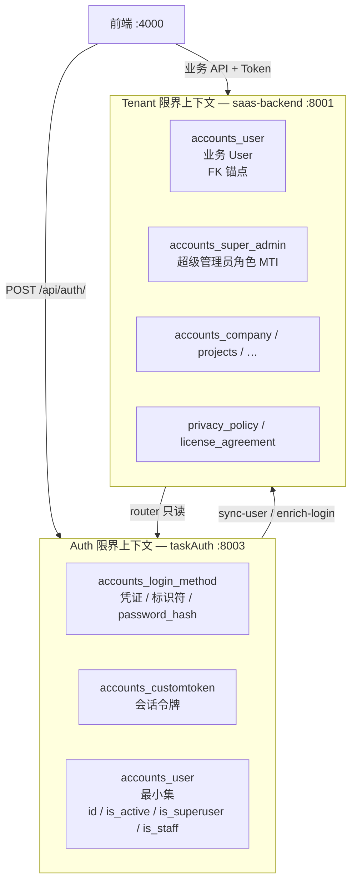
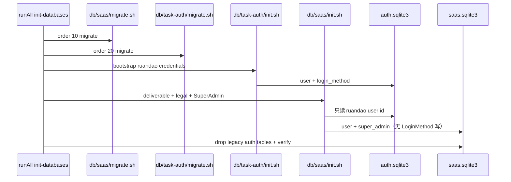

# 账号初始化与 taskAuth / saas 双库架构设计

> 日期：2026-05-31  
> 状态：已批准 — 方案 A 实施中（2026-05-31 auto-flow）  
> 触发：开发环境「初始化全部数据库」后 `author@example.com` 无法登录；用户提出账号种子是否应归属 taskAuth，以及三张表是否都应迁入 auth 库；**迁移完成后 saas 库不应再保留 auth 旧表**。

---

## 1. 问题陈述

### 1.1 现象

| 检查项 | `db/saas/saas.sqlite3` | `db/task-auth/auth.sqlite3` |
|--------|------------------------|-----------------------------|
| `accounts_login_method`（author@example.com） | ✅ 有（**过渡态，应删除表**） | ❌ 无 |
| `accounts_customtoken` | ✅ 表存在（**过渡态，应删除表**） | ✅ 表存在 |
| `accounts_user` | ✅ 有 | ❌ 无（或空） |
| `accounts_super_admin` | ✅ 有 | N/A（表不在 auth 库） |

> **As-Is 问题**：两库同时存在 `accounts_login_method` / `accounts_customtoken` 物理表，属于迁移未完成状态。  
> **To-Be 约束**：迁移完成后 **saas 库不得再存在** 这两张表；它们只存在于 auth 库。

登录请求 `POST /api/auth/` 由 **taskAuth Go** 处理，只查 **auth.sqlite3** → 返回「邮箱或密码错误」。

### 1.2 根因（两层）

1. **流水线缺口**：`db/task-auth/init.sh` 当前为 `exit 0`，无任何 admin 种子。
2. **写库目标错误**：`db/saas/init.sh` 调用 `create_admin_ruandao.py`，在 **离线 init 环境**下 `TASKAUTH_ENABLED=False`、`TASKAUTH_USE_SEPARATE_DB=False`，Django router 不生效，`LoginMethod` 被写入 saas 库而非 auth 库。

```python
# settings.py（init 脚本默认环境）
TASKAUTH_ENABLED = False          # 无 env 时
TASKAUTH_USE_SEPARATE_DB = False  # 无 env 时 → router 不写 taskauth
```

### 1.3 用户假设 vs 目标架构

| 表 | 用户理解 | 目标架构（Increment 6/7） | 结论 |
|----|----------|---------------------------|------|
| `accounts_login_method` | 应在 taskAuth | **auth.db 独占写** | ✅ 一致 |
| `accounts_customtoken` | （未提及） | **auth.db 独占写** | 同上 |
| `accounts_user` | 应在 taskAuth | **双库共存，职责分裂** | ⚠️ 需澄清 |
| `accounts_super_admin` | 应在 taskAuth | **saas default 独占** | ❌ 不应迁入 auth |

---

## 2. 业务架构关系（As-Is → To-Be）

### 2.1 限界上下文



### 2.2 表归属矩阵（To-Be）

| 表 | 写真源 | 读路径 | 说明 |
|----|--------|--------|------|
| `accounts_login_method` | **taskAuth auth.db** | taskAuth 登录；Django router 只读 | 凭证与登录标识 |
| `accounts_customtoken` | **taskAuth auth.db** | taskAuth 签发；Django `CustomTokenAuthentication` | 会话 |
| `accounts_user`（auth 副本） | **taskAuth** 创建 → `sync-user` | taskAuth 校验 `is_active` | 仅认证所需字段 |
| `accounts_user`（default 副本） | **Django sync-user** 维护 | 全业务 FK、序列化、Kafka | 项目/公司/任务等外键锚点 |
| `accounts_super_admin` | **Django default** | 管理端权限、ORM `SuperAdmin` | User 的 MTI 子表，**非凭证** |
| `accounts_sms_verification_code` | Django default | 验证码服务 | 非 auth 表（Increment 7 明确保留） |

**关键结论**：不是「三张表都搬到 taskAuth」，而是：

- **凭证层**（login_method、token、auth 侧 user 最小行）→ taskAuth  
- **身份/角色/业务层**（default user、super_admin、company…）→ saas  

这与 `2026-05-28-taskauth-increment7-auth-table-cleanup-design.md` §5、§6 一致。

### 2.4 迁移后各库的物理表清单（To-Be 硬约束）

**用户确认原则：迁移完成后，旧库（saas default）不应再保留 auth 凭证表。**

| 物理表 | `auth.sqlite3` | `saas.sqlite3` | 说明 |
|--------|:--------------:|:--------------:|------|
| `accounts_login_method` | ✅ 有 | ❌ **无** | 凭证真源仅在 auth |
| `accounts_customtoken` | ✅ 有 | ❌ **无** | Token 真源仅在 auth |
| `accounts_user` | ✅ 有（最小集） | ✅ 有（业务 FK） | 双库各一份，职责不同 |
| `accounts_super_admin` | ❌ 无 | ✅ 有 | 业务角色 MTI |
| `accounts_sms_verification_code` | ❌ 无 | ✅ 有 | 验证码仍属 saas |
| `django_content_type` | ✅ 有（auth 侧） | ✅ 有（全站） | 各自 migrate 维护 |

**验证命令（纳入 init/migrate 流水线）：**

```bash
bash taskAuth/scripts/verify_auth_tables_dropped.sh
# 期望：OK: shared DB has accounts_user only (no login_method/customtoken)
```

**清理命令（幂等，已有脚本）：**

```bash
bash taskAuth/scripts/drop_shared_auth_tables.sh
# DROP accounts_login_method、accounts_customtoken；保留 accounts_user
```

### 2.5 为何当前 saas 仍有旧表

1. **`db/saas/migrate.sh` 未带 `TASKAUTH_USE_SEPARATE_DB=1`** → Django `allow_migrate` 未阻止，migrate 在 saas 库**建出** auth 表。  
2. **dev reset 流水线未调用 `drop_shared_auth_tables.sh`** → 表建出后从未删除。  
3. **`create_admin_ruandao.py` 离线写入 saas** → 在 auth 表仍存在时继续向 saas 侧灌数据，加剧双写错觉。

To-Be 流水线必须在 **migrate 或 init 末尾** 保证 saas 侧旧表被删除且验证通过。

### 2.3 运行时数据流

**注册 / 登录（正常路径）**

```
用户 → Django delegate → taskAuth 写 auth.db
                      → Django internal sync-user → default accounts_user
                      → internal 邮件/Kafka/隐私条款
```

**当前 init（错误路径）**

```
runAll init-databases
  → db/saas/init.sh → create_admin_ruandao.py → 全写 saas（router 未启用）
  → db/task-auth/init.sh → exit 0
登录 → taskAuth 查 auth.db → 空
```

---

## 3. 账号初始化脚本应放在哪里？

### 3.1 原则

| 原则 | 说明 |
|------|------|
| **写跟随真源** | 谁独占写，谁负责种子 |
| **init 可离线** | `init-databases` 不依赖 runAll 已启动 taskAuth 进程（与 migrate 同级） |
| **幂等** | 空库 + migrate 后重复 init 安全 |
| **registry 顺序** | saas order=10，task-auth order=20 — 需显式协调跨库 bootstrap |

### 3.2 职责拆分（推荐）

| 步骤 | 负责方 | 脚本 / 机制 | 写入目标 |
|------|--------|-------------|----------|
| A. 凭证 bootstrap | **task-auth** | `db/task-auth/init.sh` → Go `bootstrap-admin` CLI 或 SQL 种子 | auth.db：`accounts_user` + `accounts_login_method` |
| B. 业务 User 同步 | **saas**（internal） | `POST /api/internal/taskauth/sync-user/` 或 init 内 Django 直连 taskauth 读 id 后 upsert default user | saas：`accounts_user` |
| C. 超管角色 | **saas** | `create_admin_ruandao.py` **重构**为仅创建 `SuperAdmin` MTI（不再写 LoginMethod） | saas：`accounts_super_admin` + default user 补字段 |
| D. 法律文档 / 交付物 | **saas** | 现有 `init_deliverable_system` + `create_default_legal_documents` | saas 业务表 |

**答案**：  
- **凭证类初始化 → 应放到 taskAuth**（`db/task-auth/init.sh`）  
- **角色/业务类初始化 → 留在 saas**（`db/saas/init.sh`），但须删除对 `LoginMethod` 的直接写入  

### 3.3 不推荐

- 继续在 saas init 里用 Django ORM 写 `LoginMethod`（router 依赖运行时 env，离线 init 不可靠）  
- 把 `accounts_super_admin` 迁入 auth.db（破坏 MTI、管理端 ORM、与 Increment 7 设计冲突）  
- init 阶段强依赖 taskAuth HTTP 服务已启动（增加 reset 流水线脆弱性）  

---

## 4. 方案对比

### 方案 A — taskAuth CLI 种子 + saas 补 SuperAdmin（**推荐**）

```
registry order:
  10 saas migrate（export TASKAUTH_USE_SEPARATE_DB=1，阻止 default 建 auth 表）
  20 task-auth migrate
  20 task-auth init          ← bootstrap author@example.com 至 auth.db
  10 saas init               ← SuperAdmin + 交付物 + 法律文档（不写 LoginMethod）
  10 saas post-migrate       ← drop_shared_auth_tables + verify（兜底删除 saas 残留旧表）
```

| 维度 | 评价 |
|------|------|
| 与 Increment 7 | ✅ 完全一致 |
| 离线 init | ✅ Go CLI / SQL 不依赖 HTTP |
| saas 无旧表 | ✅ migrate 阻止 + drop 兜底 + verify 门禁 |
| 复杂度 | 中 — 需 Go bootstrap + 重构 create_admin_ruandao + migrate env 调整 |
| 双库一致 | 显式：auth 先写，saas 按固定 email 查 auth.db 或约定 snowflake id |

**实现要点**：

- `taskAuth/cmd/bootstrap/main.go` 或 `taskAuth run.sh bootstrap-admin`：幂等插入 ruandao + 前端 PBKDF2 哈希  
- saas `create_admin_ruandao.py`：读 auth.db 中 ruandao 的 `object_id`，`get_or_create` SuperAdmin + default User  
- `db/saas/migrate.sh` 末尾或独立 `db/saas/drop-legacy-auth-tables.sh`：调用已有 `drop_shared_auth_tables.sh` + `verify_auth_tables_dropped.sh`  
- 文档密码仍为 `rgNodkdq8677!ci`（与 Playwright / 项目规则一致）

### 方案 B — Django init 强制 `TASKAUTH_USE_SEPARATE_DB=1`

在 `db/saas/init.sh` 开头 `export TASKAUTH_USE_SEPARATE_DB=1`，继续用 `create_admin_ruandao.py` 写 ORM。

| 维度 | 评价 |
|------|------|
| 改动量 | 小 |
| 问题 | LoginMethod 进 auth.db，但 **User/SuperAdmin 仍在 saas**；taskAuth 登录仍可能因 auth.db 无 user 行失败；**写路径仍绕开 taskAuth Go**，与 Increment 7「写仅经 taskAuth API」精神不符 |

### 方案 C — saas init 调 taskAuth internal HTTP bootstrap

`create_admin_ruandao.py` 改为 `curl taskAuth/internal/bootstrap-admin`。

| 维度 | 评价 |
|------|------|
| 问题 | init-databases 要求服务停止 → **HTTP 不可用**；与 dev reset 设计冲突 |

**推荐：方案 A。**

---

## 5. 领域概念清单（→ Step 5 DDD）

| 类型 | 候选 |
|------|------|
| **Bounded Context** | Auth（taskAuth）、Identity/Role（saas SuperAdmin）、Tenant（company/project FK on User） |
| **Entity** | `LoginMethod`（Auth）、`User`（双副本）、`SuperAdmin`（Role）、`CustomToken`（Session） |
| **Aggregate** | Auth：`LoginMethod` + auth `User` + `CustomToken`；Tenant：`User` + 业务关联 |
| **Domain Event** | `USER_CREATED`（仍由 Django internal 发出，不变） |
| **Domain Service** | `bootstrap-admin`（init）、`sync-user`（运行时） |

---

## 6. 价值流影响（value-stream.yaml）

### 6.1 受影响 stream

| Stream | 影响 |
|--------|------|
| **user-auth** | `email-register`、`login` 字段源已为 `task-auth.*`；需新增/激活 **`dev-bootstrap-admin`** 步骤 |
| **platform-dev-database-reset** | `db/task-auth/init.sh` 从 noop → 含 admin bootstrap；验收标准增加「ruandao 可登录」 |
| **runall-task-auth-orchestration** | 不变（运行时编排） |

### 6.2 建议新增 step（草案）

```yaml
- name: dev-bootstrap-admin
  status: planned
  test_file: taskAuth/bootstrap_admin_test.go  # 或 playwright LoginTest
  fields:
    - name: task-auth.accounts_login_method.identifier
      description: init 后 author@example.com 存在于 auth.db
    - name: task-auth.accounts_user.is_superuser
      description: auth 侧超管标记
    - name: saas-backend.accounts_super_admin.id
      description: default 侧 SuperAdmin MTI 与 auth user id 对齐
  # saas 侧 accounts_login_method / accounts_customtoken 物理表不得存在 — 由 verify_auth_tables_dropped.sh 断言，不登记为 field
```

### 6.3 应删除的 stale 假设

- 「`create_admin_ruandao` 写 saas 即完成 admin 初始化」— 在双库模式下不成立  
- 「`accounts_user` 完全归属 taskAuth」— 与 FK 设计冲突  

---

## 7. 开发环境 init 流水线（To-Be）



**验收标准（SMART）**

1. 清空 + 初始化后，不启动任何服务，`sqlite3 auth.db` 可见 ruandao login_method。  
2. 启动 platform 组后，`POST /api/auth/`（前端哈希密码）返回 200 + token。  
3. saas default 存在同 id 的 `accounts_user` + `accounts_super_admin`。  
4. **`verify_auth_tables_dropped.sh` 通过**：saas 库 **不存在** `accounts_login_method`、`accounts_customtoken` 物理表；auth 库 **存在** 这两张表。  
5. Playwright `LoginTest` / `verify-login-privacy-policy` 全绿。

---

## 8. 非目标

- 不迁移 `accounts_super_admin` 至 auth.db  
- 不迁移 `VerificationCode` / 短信表  
- 不在本增量删除 Django UserViewSet fallback 代码（Increment 7.2 另开切片；但 **saas 物理删表 + verify 门禁纳入本设计**）

---

## 9. 实施切片预览（→ Step 6 Plan）

| 切片 | 内容 | 依赖 |
|------|------|------|
| **9.1** | `db/saas/migrate.sh` 带 `TASKAUTH_USE_SEPARATE_DB=1` + drop/verify 兜底 | — |
| **9.2** | `taskAuth` bootstrap CLI + `db/task-auth/init.sh` | 9.1 |
| **9.3** | 重构 `create_admin_ruandao.py`（仅 SuperAdmin + sync user，不写 LoginMethod） | 9.2 |
| **9.4** | registry 顺序 / dev-database-reset 验收 / value-stream 更新 | 9.1–9.3 |
| **9.5** | 测试：verify 脚本 + Go unit + Playwright 登录 | 9.4 |

---

## 10. 决策摘要

| 问题 | 决策 |
|------|------|
| 账号初始化脚本是否应放到 taskAuth？ | **凭证部分是的**（login_method + auth user）；**角色/业务部分留在 saas** |
| 三张表是否都应在 taskAuth？ | **否**。仅凭证相关表在 auth.db；`accounts_user` 双库；`accounts_super_admin` 留 saas |
| 迁移后 saas 是否保留旧 auth 表？ | **否**。`accounts_login_method`、`accounts_customtoken` 必须从 saas 删除；仅 auth.db 保留 |
| 当前 create_admin_ruandao 问题 | 在离线 init 下写错库；应拆分为 taskAuth bootstrap + saas SuperAdmin |

---

## 11. 待确认

请确认以下设计方向是否认可：

1. **表归属**：login_method/token → taskAuth only；user 双写；super_admin → saas only  
2. **旧表清理**：migrate/init 流水线末尾 **强制** `drop_shared_auth_tables` + `verify_auth_tables_dropped`  
3. **init 方案**：采用 **方案 A**（taskAuth CLI bootstrap + saas 补 SuperAdmin）  
4. **registry 顺序**：task-auth init 先于 saas init（auth 凭证先于 saas 角色）  

确认后进入 `/3-value-stream-价值流` 或 `/6-plans-实施计划` 编写可执行计划。
