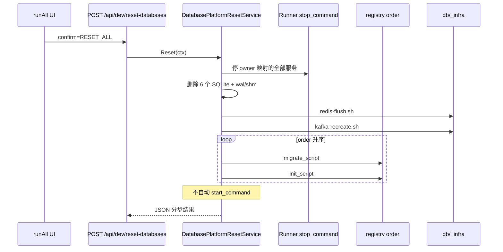

# 开发环境一键清空数据并重新初始化数据库

**日期：** 2026-05-31  
**状态：** 已实施（双按钮：清空 / 初始化；已删除合并「重置」入口；不自动启服）  
**关联：**

- `2026-05-31-centralized-db-directory-design.md`（`db/registry.yaml` 六库真源）
- `2026-05-31-runall-explicit-lifecycle-commands-design.md`（停服须走 `stop_command`）
- `2026-05-31-runall-grafana-clear-all-logs-design.md`（可复用的 runAll 编排 + 分步 JSON 模式；与本功能独立）
- `task2app/Saas_project/scripts/init/manage_init.py`（种子逻辑迁移来源）

---

## 1. 背景与目标

### 1.1 问题

本地开发中，6 个 SQLite 库、Redis 缓存、Kafka topics 会积累用户/租户/任务/计费/OAuth 等数据。缺少**单一、可复现**的「回到全新开发者机器」入口；手动删 `db/**/*.sqlite3`、再分别 migrate/seed 易漏库、漏 WAL 文件、或忘记 FLUSHALL Redis。

现有 `manage_init.py` 任务组面向「增量初始化」，**不**包含停服、删库、清 Redis/Kafka。

### 1.2 目标

1. runAll Web UI 提供两个按钮：
   - **「清空全部数据库（开发）」** → `POST /api/dev/clear-databases`
   - **「初始化全部数据库（开发）」** → `POST /api/dev/init-databases`
2. **清空**：停服 → 删 6 库 SQLite+wals → Redis FLUSHALL → Kafka topics 重建（**不含** migrate/init）。
3. **初始化**：按 `registry.order` 执行全部 `migrate_script` 与 `init.sh`（**不删库**）；有 owner 服务仍在运行则拒绝（409）。
4. 操作结果 JSON 分步回报（含逐库 migrate/init 状态）。
5. **不自动启动任何服务**（用户手动在 runAll 再启组）。
6. **已删除** 原合并按钮/API `reset-databases`。

### 1.3 非目标

- 生产 / 预发 / 共享环境。
- PostgreSQL 或其它非本仓库 SQLite 部署。
- 自动清空 Grafana/Loki/Tempo/Prometheus（沿用现有 `POST /api/observability/clear-all`）。
- 默认执行 `init-tenant`（会临时启停 `run.sh`，与「先停服再重置」冲突）。
- `dockerInfra` compose data volume 整栈 `down -v`（仅 Redis 逻辑库 + Kafka topic 级）。

---

## 2. 用户决策摘要

| 维度 | 选择 |
|------|------|
| 场景 | 本地开发 · 全量重置 |
| 入口 | runAll Web UI + API（脚本为实现细节，非第二入口） |
| 基础设施 | 默认 SQLite 六库 + Redis FLUSHALL + Kafka topics 重建 |
| 种子 | 各 `db/<app>/init.sh`（migrate 与 init 分离） |
| 重置后启服 | **A — 不自动启动** |

---

## 3. 价值流影响

| 问题 | 结论 |
|------|------|
| 影响的流 | 几乎所有 **active** 且读写 DB 的流（如 `user-auth`、`company-management`、`task-management`、`task-llm-budget-governance` 等）在重置后数据归零；测试须用独立夹具或重置后重跑 init |
| 新流 | 建议新增 **`platform-dev-database-reset`**（domain: 平台与本地开发） |
| 字段 | 无新持久字段；各 `<service>.<table>.<column>` 回到 init 脚本写入的初始态 |
| 测试 | `runAll/src/domain/database_platform_reset_test.go`；各 `db/<key>/init.sh` smoke；禁止对生产路径执行 |
| 状态 | 无既有 step 废弃；新 step `runall-dev-reset-databases` 登记为 `planned` → 实施后 `active` |

**跨流依赖：** `task-auth` migrate/init 依赖 `saas` 已 migrate（`contenttypes` / User 相关）；registry `order` 必须体现。

完整切片与 YAML 登记由 `/3-value-stream-价值流` 负责。

---

## 4. 领域概念清单（供 /5-ddd）

| 概念 | 边界 | 说明 |
|------|------|------|
| **DatabasePlatformReset** | runAll 开发工具 | 一次重置的聚合根 |
| **RegisteredDatabase** | db/registry | registry 一项：path、migrate_script、init_script、order |
| **InfrastructureFlush** | db/_infra | Redis / Kafka 非 SQLite 步骤 |
| **DatabaseResetStepResult** | 值对象 | 单步 ok/skipped/failed + message |

**领域事件：**

- `AllDatabasesReset`
- `DatabaseResetPartialFailure`

**Bounded Context：** `platform-dev-tooling`（runAll UI/API）↔ `centralized-database`（`db/` + registry）

---

## 5. 方案对比

| 方案 | 描述 | 优点 | 缺点 |
|------|------|------|------|
| **A. 单脚本** | `db/reset-all.sh`，runAll 仅 exec | 实现快 | 与 registry 重复；难单测 |
| **B. manage_init 扩展** | Python 清库 + 任务组 | 复用 init 代码 | 难覆盖 Go 库/Redis；不符合 `db/<app>/init` |
| **C. Registry 驱动（推荐）** | `registry.yaml` 增 migrate/init；runAll domain 编排 | 与 `db/` 真源一致；与 observability clear-all 同模式 | 需补 6 个 init 脚本与 owner→停服映射 |

**推荐方案 C。**

---

## 6. 目录与配置

### 6.1 布局

```
db/
├── registry.yaml              # 扩展 migrate_script、init_script、order
├── README.md                  # 补充「开发重置」章节
├── saas/
│   ├── saas.sqlite3
│   └── init.sh
├── task-auth/
│   └── init.sh
├── task-bill/
│   └── init.sh
├── git-oauth/
│   └── init.sh
├── email/
│   └── init.sh
├── ai-provider/
│   └── init.sh
└── _infra/
    ├── redis-flush.sh
    └── kafka-recreate.sh
```

### 6.2 `registry.yaml` 扩展

在现有 `path` / `owner` / `description` 上增加：

| 字段 | 必填 | 说明 |
|------|------|------|
| `migrate_script` | 是 | 相对 monorepo 根的可执行脚本；负责 schema（Django migrate 或 Go SQL migrations） |
| `init_script` | 是 | 相对 monorepo 根；**仅**种子数据，`set -euo pipefail` |
| `order` | 是 | 整数，升序执行；saas=10，task-auth/task-bill=20，其余=30+ |

示例：

```yaml
databases:
  saas:
    path: db/saas/saas.sqlite3
    owner: saas-backend
    order: 10
    migrate_script: db/saas/migrate.sh
    init_script: db/saas/init.sh
  task-auth:
    path: db/task-auth/auth.sqlite3
    owner: task-auth
    order: 20
    migrate_script: db/task-auth/migrate.sh
    init_script: db/task-auth/init.sh
  # ...
```

**路径解析：** 沿用 `db/load` loader（与 `SAAS_DATABASE_PATH` 等 env 覆盖一致）；删库时使用解析后的绝对路径。

### 6.3 建议 `order` 与 migrate/init 职责

| key | order | migrate_script 职责 | init_script 职责 |
|-----|-------|---------------------|------------------|
| saas | 10 | Django `manage.py migrate`（与 manage_init 相同安全顺序） | `init_deliverable_system` + `create_admin_ruandao` |
| task-auth | 20 | 调用 `taskAuth` 迁移（`go run` 子命令或 `taskAuth migrate` 二进制模式） | noop 或 `echo skip` |
| task-bill | 20 | 同 task-auth 模式 | noop |
| git-oauth | 30 | `manage.py migrate`（gitOauth 项目根） | 按需最小种子 |
| email | 30 | Saas_email migrate | 按需 |
| ai-provider | 30 | Saas_Ai_Provider migrate | 按需 |

`manage_init.py` 中的 `install-deps` **不**纳入重置流水线（与 DB 无关）；长期可让 `run init-*` 委托调用 `db/<key>/init.sh`。

---

## 7. 重置流水线

### 7.1 顺序



### 7.2 停服范围（清空阶段）

对 `runAll.yaml` 中**所有非 Stopped 状态**的编排服务，按 **depends_on 拓扑**（下游先停）执行 **`stop_command`**。

**开发清空专用：** 跳过 `CanStop` / 下游依赖策略（避免「先停 task-auth 被 saas-backend 挡住」）；多轮扫描直至全部停下或回报 `services_still_running` 并**中止删库**。

**纳入停服：** platform、domain-events、container-stack、value-stream、**ai-monitor** 等全部应用（含 taskFE、task-events-*、go-relay 等）。

**排除（保持运行）：** 仅 `docker-redis`、`docker-kafka`（供 FLUSHALL 与 Kafka topic 重建）。

已停服的服务跳过；`services_stopped[]` 返回完整列表。

**初始化阶段：** 若任一非排除服务仍在运行 → `409 blocked`（与清空使用同一排除列表）。

### 7.3 清 SQLite

对每个 registry 项：

1. `loader.resolve(path)` → 绝对路径
2. 删除主文件、`${path}-wal`、`${path}-shm`
3. `mkdir -p` 父目录（为空库 migrate 做准备）

### 7.4 Redis / Kafka

| 脚本 | 行为 | 依赖 |
|------|------|------|
| `db/_infra/redis-flush.sh` | `redis-cli -h 127.0.0.1 -p <dockerInfra.redisPort> FLUSHALL` | `docker-redis` 健康；失败 → `redis_reset: failed` |
| `db/_infra/kafka-recreate.sh` | 列出并删除业务 topics；调用 `create_kafka_topics.py` 或等价 Admin API | `docker-kafka` 健康；失败 → `kafka_reset: failed` |

端口从 `task2app/conf/port_config.json` 读取（与 observability 脚本读配置方式一致）。

### 7.5 重置后启服

**明确：不自动执行任何 `start_command`。** UI 成功提示末尾附加：「请在 runAll 手动启动 infrastructure / platform 组。」

可选后续增量：query `restart_groups=platform`（本阶段 **不做**）。

---

## 8. runAll API / UI

### 8.1 安全闸

| 条件 | 行为 |
|------|------|
| `confirm` 错误 | 清空须 `CLEAR_ALL`；初始化须 `INIT_ALL` → 否则 `400` |
| 非本地开发 | 默认拒绝：`RUNALL_ALLOW_DEV_DB_RESET` 未设置且 Host 非 localhost → `403` |
| 并发操作 | 进程内 mutex；重复请求 `409` |
| 初始化时服务仍运行 | `409` + `blocked_services` |

### 8.2 API

```
POST /api/dev/clear-databases?confirm=CLEAR_ALL
POST /api/dev/init-databases?confirm=INIT_ALL
```

**清空 Response 示例：**

```json
{
  "status": "ok",
  "services_stopped": ["saas-backend", "task-auth"],
  "sqlite_removed": ["saas", "task-auth", "task-bill", "git-oauth", "email", "ai-provider"],
  "redis_reset": "ok",
  "kafka_reset": "ok"
}
```

**初始化 Response 示例：**

```json
{
  "status": "ok",
  "migrations": [{"database": "saas", "status": "ok"}],
  "inits": [{"database": "saas", "status": "ok"}]
}
```

### 8.3 UI

- **清空全部数据库（开发）** — 红色危险按钮
- **初始化全部数据库（开发）** — 蓝色按钮（右对齐）
- 已删除原「重置全部数据库」合并按钮
- 清空成功后提示：「下一步请点击初始化」

### 8.4 实现结构（Go）

| 层 | 类型 |
|----|------|
| domain | `DatabasePlatformClearService`、`DatabasePlatformInitService` |
| application | `runner.ClearAllDatabases`、`runner.InitAllDatabases` |
| delivery | `/api/dev/clear-databases`、`/api/dev/init-databases` |

单测：`database_platform_reset_test.go`

---

## 9. `db/<key>/init.sh` 规范

1. `#!/usr/bin/env bash`，`set -euo pipefail`。
2. 工作目录：脚本内 `cd` 到 monorepo 根或明确 `PROJECT_ROOT`（可用 `db/load` 的 root 探测逻辑）。
3. **禁止**在 init 内启动长期运行服务（无 `run.sh start`、无 `init-tenant`）。
4. 退出码非 0 → 流水线 `partial`，后续库 **不**执行（fail-fast）。
5. 幂等：在空库 + migrate 后重复执行应安全（`get_or_create` 风格）。

**saas `init.sh` 最小内容（示意）：**

```bash
cd task2app/Saas_project
python scripts/init/init_deliverable_system.py
python scripts/init/create_admin_ruandao.py
```

**task-auth / task-bill：** 可为 `exit 0`（schema 由 migrate 负责，无种子）。

---

## 10. 与 manage_init 的关系

| manage_init 任务 | 重置流水线 |
|------------------|------------|
| install-deps | 不包含 |
| migrate | → 各 `db/<key>/migrate.sh` |
| init-deliverable-system, create-admin-ruandao | → `db/saas/init.sh` |
| init-system, create-kafka-topics | init-system 可拆入 saas init 或 saas migrate 后；Kafka → `db/_infra/kafka-recreate.sh` |
| init-tenant | **不包含**；开发者手动 `init_project.sh --tenant-only` |

后续重构：`manage_init.py run-group project-bootstrap` 可改为按 registry 调用 migrate+init，避免双份逻辑。

---

## 11. 错误处理

| 失败点 | 行为 |
|--------|------|
| 某服务 stop 失败 | 记录 warning；若仍占用 DB 锁，删库/migrate 可能失败 → partial |
| 删库时文件被占用 | 该库标记 failed，fail-fast |
| migrate 失败 | 不执行该库 init；后续库不执行 |
| Redis/Kafka 不可用 | 对应字段 `skipped` 或 `failed`；SQLite 部分仍可继续（或整体 abort — **实现时选 fail-fast**：Redis/Kafka 为默认全量，任一 failed 则 `partial` 且不再 migrate） |

**推荐：** Redis/Kafka 在 migrate **之前**执行；若 `redis_reset` 或 `kafka_reset` 为 `failed`，中止后续 migrate（避免种子写入后缓存仍脏）。

---

## 12. 验收标准

1. 设置 `RUNALL_ALLOW_DEV_DB_RESET=1`，runAll 运行中，platform 组有运行服务。
2. 点击「重置全部数据库（开发）」并确认后：
   - 相关服务已停；
   - `db/**/*.sqlite3` 重建且表存在；
   - `redis-cli DBSIZE` 为 0（或 FLUSHALL 后无业务 key）；
   - Kafka topics 与 handlers 目录一致。
3. `db/saas/init.sh` 跑完后，默认 admin 可登录（与 `create_admin_ruandao` 一致）。
4. 各服务 health `database.ok`（**手动启动后**验证）。
5. 未带 `confirm=RESET_ALL` 返回 400；未开 env 且非 localhost 返回 403。
6. 重置完成后进程列表无自动新起的 saas-backend/task-auth（验证 **A**）。

---

## 13. 价值流登记建议（step 3 输入）

```yaml
# 建议追加至 value-stream.yaml（由 /3 正式合入）
- name: platform-dev-database-reset
  domain: 平台与本地开发
  description: runAll 一键清空六库 + Redis + Kafka 并按 db/<app> 脚本重新 migrate/init
  steps:
    - name: runall-dev-reset-databases
      status: planned
      test_file: ../../runAll/src/domain/database_platform_reset_test.go
      fields:
        - name: runall.runtime.dev_db_reset_status
          description: POST /api/dev/reset-databases 聚合 status ok/partial
        - name: saas-backend.registry.sqlite_removed
          description: registry 六库文件已删除并重建
        - name: docker-redis.runtime.flushed
          description: FLUSHALL 完成
        - name: docker-kafka.runtime.topics_recreated
          description: 业务 topics 与 handlers 一致
```

---

## 14. 实施顺序建议（供 /6-plans）

1. 扩展 `registry.yaml` + loader 解析 `migrate_script`/`init_script`/`order`
2. 添加 `db/<key>/migrate.sh`、`init.sh`、`db/_infra/*.sh`（saas 先落地）
3. `DatabasePlatformResetService` + infrastructure 脚本执行器
4. runAll API/UI + 安全闸
5. 单测 + README
6. value-stream 登记（/3）

---

## 15. 开放问题（已关闭）

| 问题 | 决议 |
|------|------|
| 重置后是否自动启服 | **否（A）** |
| 入口 | runAll API/UI |
| 种子位置 | `db/<app>/init.sh` |

## 16. 清库后残留浏览器 cookie 的行为（OPT-20260807-006）

清库重建后，浏览器仍持有 taskAuth activate-session 落下的 30 天 HttpOnly
`userId`/`token` cookie（前端 JS 无法删除）。服务端已拒绝其认证（活 token 行校验，
OPT-20260807-002；userId cookie 签名校验，OPT-20260807-004），但 cookie 会残留到
自然过期。处理：

1. `GET /api/accounts/users/profile/` 401 → `clearResidualAuthCookies`（既有）
2. `GET /api/accounts/users/me/` 401/404 → 同样 `clearResidualAuthCookies`（2026-08-11：
   Navbar 优先打 `/me/`，不再默认打 profile，须双端对齐）
3. 前端 `Navbar.fetchCurrentUser`：`localStorage.currentUserId` 残留且 `/me/` 返回
   401/403/404 时必须 `setLoggedOutUser` + `clearStoredUserId`，并再请求一次 profile
   触发清 cookie；**禁止**用残留 id 将 `isAuthenticated` 设为 true（否则登录页仍显示
   账号切换器「未设置昵称」）。详见
   `docs/superpowers/specs/2026-08-11-db-reset-stale-login-ui-design.md`。

**预期行为**：清库重建后，用户首次打开站点自动回到登录页重新登录，Navbar 仅显示
登录/注册，无需手动清除浏览器 cookie/localStorage；这是前后端强制的预期行为，不是故障。
