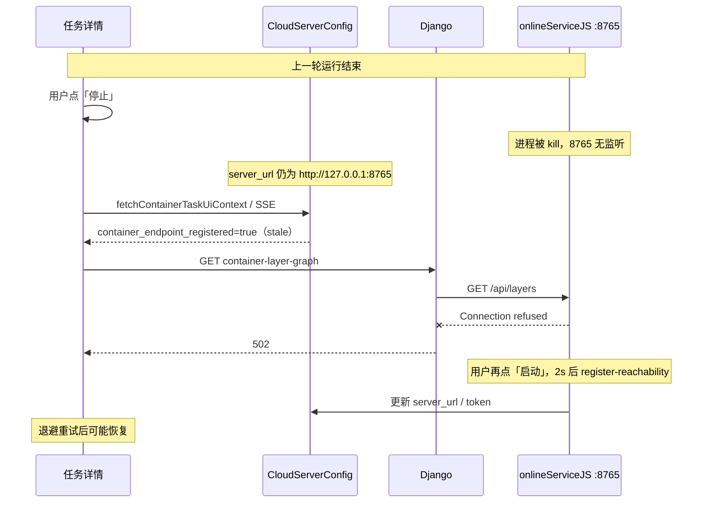
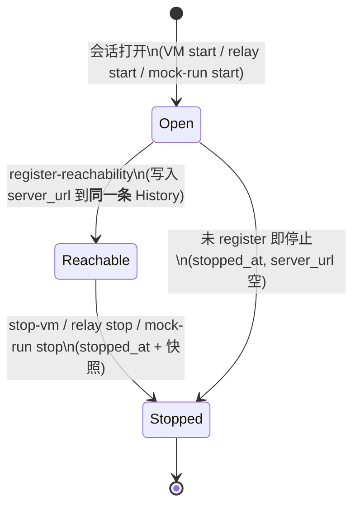

# 设计文档：容器停止时作废 stale 端点（relay / mock-run / 云 VM）

**日期**：2026-05-31  
**状态**：草案（头脑风暴，已扩展 mock-run / stop-vm 对比）  
**关联现象**：任务详情 `?relayToTrae=true` 停止后再启动，`GET container-layer-graph` 返回 502，`Connection refused` 到 `127.0.0.1:8765`  
**关联排查**：2026-05-30 现场 — 请求 17:38:01，`CloudServerConfig.updated_at` 17:38:03（新 register 晚 2s）

---

## 1. 问题陈述与用户假设

**用户假设**：任务详情页点击 relay「停止」时，**没有作废旧的路径**（`server_url` / 业务端点注册态），导致后续层图转发仍指向已下线的 `:8765`。

**结论：假设成立。** 停止链路只杀进程、不清理 DB 与前端「已注册端点」语义，与 502 时间线一致。

**扩展结论（mock-run / 云 VM）**：三条停止路径**均未**在 DB 层作废 `server_url`；云 VM 停止后还会**主动 SSE 推送仍含 stale `container_endpoint_registered=true` 的上下文**。

---

## 2. 已验证根因

### 2.1 停止时实际做了什么（relayToTrae）

| 层级 | 行为 | 是否清理 `server_url` |
|------|------|----------------------|
| 前端 `stopRelayToTrae` | POST `relay-to-trae/stop/`；重置 relay UI 状态；`pauseContainerHeartbeatForRelayStop()` | **否** — 未改 `containerEndpointRegistered`、未清 `layerGraphSnapshot` |
| Django `relay_to_trae_stop` | 异步 POST go_relay `/v1/stop` | **否** — 不触达 `CloudServerConfig` |
| go_relay `handleStop` | reset + kill `:8765` 监听进程 | **否** — 不回写 SaaS |
| DB `CloudServerConfig` | — | **保留** 上一轮 `server_url`、`business_api_endpoint`、`container_access_token` |

### 2.2 mock-run「停止容器」对比

| 层级 | 行为 | 是否清理 `server_url` |
|------|------|----------------------|
| 前端 `stopMockRunContainer` | POST `mock-run-container/stop/`；`isMockContainerRunning=false`；清 `currentMockRunJobId` | **否** — 不触达 `containerEndpointRegistered` / `layerGraphSnapshot` |
| Django `stop_mock_run_container` | 转发 worker `POST /v1/jobs/{id}/stop` 或 `/v1/tasks/{id}/container/stop`；SSE 日志 | **否** — 不修改 `CloudServerConfig` |
| DB | 容器进程退出后 `register-reachability` 写入的 `server_url` **仍保留** | **否** |

**与 relay 相同 stale 机制**：mock-run 启动后同样经 `exchange-refresh` + `register-reachability` 写入 `server_url`（通常 `127.0.0.1:8765` 或映射口）。停止只杀 Docker/ worker 容器，DB 仍认为端点已注册 → 再启或刷新页会提前拉 `container-layer-graph` → Connection refused / 502。

**额外因素**：mock 路由下 `shouldBypassServerRuntimeLayerGraphGate()` 在「端点已注册 + 心跳曾连通」时可**绕过** `server-runtime-status` 门控，使 stale 问题更易暴露（与 relay 直启一致）。

### 2.3 云 VM「停止虚拟机」对比

| 层级 | 行为 | 是否清理 `server_url` |
|------|------|----------------------|
| 前端 `stopServer` | POST `stop-vm/`；依赖 SSE `停止虚拟机成功` | **否** — 本地 `serverUrl=''` 仅 UI 变量，非 `containerEndpointRegistered` |
| Django `stop_vm` | 调云厂商 `provider.stop_vm`；SSE success；**`publish_container_task_ui_context_sse`** | **否** — **未**先清 `server_url` 就发 SSE |
| `CLOUD_SERVER_STOPPED` handler | `ProcessServerStopHandler` | **TODO 空实现** — 不清理任何字段 |
| DB | `instance_id`、**`server_url`、token 均保留** | **否** |

**比 relay 更糟的一点**：`stop_vm` 成功后会调用 `publish_container_task_ui_context_sse`，而 SSE 内容来自 DB 当前值 — 若 `server_url` 非空则 **`container_endpoint_registered=true` 被再次推送给前端**，在 VM 已停、容器不可达时仍触发层图拉取。

**部分缓解（仅真云实例，且非 relay 绕过路径）**：

- 前端 `ensureServerRuntimeAllowsContainerLayerGraph` 在 `runtime_status ∈ {stopped, released, …}` 时**阻断**层图 GET。
- `updateServerStatus` 在「停止虚拟机成功」时会 `fetchContainerTaskUiContext()`，但若 DB 未清 `server_url`，读回仍为 `true`。

**mock 云实例额外缺口**：`get_server_runtime_status` 对 `instance_id.startswith('mock-')` **固定返回 `runtime_status: Running`**，stop-vm 后门控**永不**因运行态阻断层图 — stale `server_url` 无运行时护栏。

### 2.4 生产代码中 `server_url` 写入/清理全景

| 操作 | 写 `server_url` | 清 `server_url` |
|------|----------------|----------------|
| `register-reachability` | ✓ | — |
| `exchange-refresh`（business_api） | ✓（间接） | — |
| `CLOUD_SERVER_STARTED` handler | ✓ | — |
| relay `/v1/stop` | — | **无** |
| mock-run stop | — | **无** |
| `stop_vm` | — | **无** |
| `CLOUD_SERVER_STOPPED` handler | — | **无（TODO）** |

全仓库生产 Python **无任何路径**将 `CloudServerConfig.server_url` 置空（仅测试夹具）。

### 2.5 「已注册」判定与层图拉取

- `container_endpoint_registered` **仅**依赖 DB 中 `server_url` 非空（`django_container_runtime_context_repository`），**不探测 TCP**。
- 页面加载 / SSE `container_task_ui_context` / `watch(containerEndpointRegistered)` 会在 `true` 时立即 `refreshLayerGraphFromServer(true)`。
- `pauseContainerHeartbeatForRelayStop` 只设 `containerHeartbeatPaused=true` 并 `stopContainerHeartbeat()`，**不设** `containerEndpointRegistered=false`。

### 2.6 502 触发路径（停止 → 再启 / 刷新）



### 2.7 与 internal_dispatch 的关系

**无关。** `internal_dispatch` 双重 Request 包装导致 `exchange-refresh` 500；本次为 **stale endpoint + 进程已停** 的 502，属 `task-detail-runtime-relay` 停止/收敛缺口。

### 2.8 历史表：现状缺口与「同一运行会话」原则（修订）

**用户反馈（采纳）**：VM 启动与容器 `register-reachability`（如 `127.0.0.1:8765`）应视为**同一次任务运行会话**，不应拆成两套互不相干的生命周期；若 History 不能表达「启动时间 + 停止时间 + 会话内 reachability」，则是 **History 模型不完整**，而非「不应写入 History」。

**先前 §2.8 中「混表会误导」的表述针对的是当前实现**（仅在 VM 启动成功时 append 一行、无 `stopped_at`、无 `server_url`），**不是**否定统一会话模型。

#### 当前 `CloudServerConfigHistory` 的合理性质疑

| 现状 | 问题 |
|------|------|
| 仅在 `CLOUD_SERVER_STARTED` 成功时 **insert** | 只有「启动点」，无「停止点」→ 无法算运行时长 |
| 无 `server_url` / `business_api_endpoint` | register-reachability 与 VM 启动 **无法关联到同一条 History** |
| relay / mock-run 无 VM 时不写 History | 直启路径的运行会话 **完全不在 History** |
| stop 三路径均不写 History | 停止后会话 **悬空**，与 `CloudServerConfig` 当前行 stale 并存 |

#### 目标语义：一条 History = 一次运行会话（Runtime Session）



- **同一条记录**承载：VM 维度（`instance_id`、规格、地域）+ 容器维度（`server_url`、`business_api_endpoint`、`public_ip`）+ **时间**（`started_at` / `stopped_at`）。
- **不是** stop 时再 append 一行「清除记录」——而是 **update 当前 open 会话** 的 `stopped_at` 与最终快照，然后清 `CloudServerConfig` 当前态 reachability 字段。
- relay-only：`runtime_source=relay_local`，`instance_id` 可为空，仍是一条会话。

#### stop / 作废路径现状（均无会话收口）

| 路径 | 打开/更新 History 会话 | 写 stop 时间 | 清 `server_url`（当前行） |
|------|------------------------|--------------|---------------------------|
| VM start | insert（仅启动点） | 否 | — |
| register-reachability | 否 | — | — |
| relay stop | 否 | 否 | 否 |
| mock-run stop | 否 | 否 | 否 |
| stop-vm | 否 | 否 | 否 |

---

## 3. 目标与非目标

### 3.1 目标

1. **统一**三条停止路径（relay / mock-run / stop-vm）在容器/进程下线后，SaaS 与前端一致认为业务端点**未注册**。
2. relay「停止」后，不再向 `:8765` 主动转发层图/命令（mock-run、VM 内容器同理）。
3. 再次启动时，层图拉取门控到 **register-reachability / exchange-refresh 成功之后**。
4. 保留 token 供再启换票（本迭代**不清** `container_refresh_token`）。
5. 修复 `stop_vm` 后 SSE **误推** `container_endpoint_registered=true` 的行为。
6. （可选 follow-up）mock 云实例 `get_server_runtime_status` 在 stop-vm 后不应永久 `Running`。
7. **扩展 `CloudServerConfigHistory` 为运行会话**：同一条记录记录 `started_at` / `stopped_at` 与会话内 reachability；stop 时 **update 当前 open 会话** 再清当前行。

### 3.2 非目标

- 不改变 go_relay kill 端口语义。
- 不在 stop 时删除整行 `CloudServerConfig` 或清空 `container_refresh_token`（TEIP / 再启动换票依赖）。
- 不改造 Go 容器网关路由（Phase 2）。
- **不在 History 存明文 container access/refresh token**（仅 URL / 公网 IP 快照；token 仍走 audit 哈希）。

### 3.3 作废顺序（修订：先收口会话，再清当前行）

对任务 `task_id` 找 **open 会话**（`stopped_at IS NULL`，按 `started_at` 最新）：

1. **Update History**：写入 `stopped_at`、`stop_reason`（`relay_stop` | `mock_run_stop` | `stop_vm`）、最终 `server_url` / `business_api_endpoint` 快照（register 时已写入同条则仅确认）。
2. **Clear 当前行** `CloudServerConfig`：reachability 字段置空；token 保留。
3. **SSE** `container_task_ui_context` → `container_endpoint_registered=false`。
4. **（可选）** `ContainerTokenAuditEvent` `session_stopped` 与 History 主键关联，供审计链 — **不替代** History 会话记录。

---

## 4. 价值流影响

| 流 | 步骤 | 影响 |
|----|------|------|
| `task-detail-runtime-relay` | `relay-status-convergence` | 三条 stop 路径均须收敛端点态 |
| `task-detail-runtime-relay` | `relay-stop-refresh-status-ui` | stop 后 `container_endpoint_registered=false` |
| `relay-register-token-exchange-guard` | TEIP | 仅清 reachability 字段，不清 refresh token |
| `relay-to-trae-startup-reliability` | listen → register | 再启动依赖 register 写回 |
| **新增** | mock-run stop 收敛 | `mock-run-container/stop` 后清 reachability |
| **新增** | stop-vm 收敛 | `stop-vm` 成功后清 reachability；SSE 不再推 stale true |
| **可选** | mock 云 runtime | `get_server_runtime_status` mock 实例反映 Stopped |

| **修订** | runtime-session-history | `cloud_cloudserverconfighistory` 扩字段 + 启停时间 |
| **可选** | session-stopped audit | `cloud_container_token_audit_event.event_type` 关联 history id |

**字段**（三段位）：

- `saas-backend.cloud_cloudserverconfig.server_url` — stop 后当前行置空
- `saas-backend.cloud_cloudserverconfig.business_api_endpoint` — stop 后当前行置空
- `saas-backend.cloud_cloudserverconfig.container_access_token` — **保留**
- `saas-backend.cloud_cloudserverconfig.container_refresh_token` — **保留**
- `saas-backend.cloud_cloudserverconfighistory.started_at` — 会话开始（迁移：沿用或 rename `created_at`）
- `saas-backend.cloud_cloudserverconfighistory.stopped_at` — 会话结束（**新增**）
- `saas-backend.cloud_cloudserverconfighistory.server_url` — 会话内最终/登记 URL（**新增**）
- `saas-backend.cloud_cloudserverconfighistory.business_api_endpoint` — 会话内业务 API（**新增**）
- `saas-backend.cloud_cloudserverconfighistory.stop_reason` — 停止来源（**新增**）
- `saas-backend.cloud_cloudserverconfighistory.runtime_source` — `cloud_vm` \| `relay_local` \| `mock_run`（**新增**）
- `saas-backend.cloud_cloudserverconfighistory.open_session_key` — 可选：任务级最多一条 open（`stopped_at IS NULL`）由应用层保证

**测试**：

- relay：`TaskDetail.relay-to-trae-direct-start.playwright.test.js`、`TaskDetail.relay-to-trae-stop-restart.playwright.test.js`
- mock-run：`TaskDetail.mock-run-container-tab.playwright.test.js`
- stop-vm：`TaskDetail.mock-runtime-stop-vm.playwright.test.js`
- pytest：`tests/test_runtime_session_history.py`（open → register → stop → 当前行 cleared）
- 共享 helper：`close_runtime_session_and_clear_reachability(cfg, history, *, reason)`

---

## 5. 领域概念（供 DDD）

| 概念 | 边界上下文 | 说明 |
|------|------------|------|
| **`TaskServerRuntimeSession`** | 云平台与资源 | **聚合根**：对应一条 `CloudServerConfigHistory`；VM + 容器同会话 |
| `ContainerReachabilityRegistration` | 同上 | register 时 **update 当前 open Session**，非独立生命周期 |
| `SessionOpened` / `SessionStopped` | 领域事件 | 启动开会话；stop 写 `stopped_at` |
| `CloudServerConfig`（当前行） | 同上 | **可变运行态**；stop 后仅清 reachability，token 保留 |

---

## 6. 方案对比

### 方案 A — 仅前端 stop 时本地 reset（不推荐单独使用）

- `stopRelayToTrae` 内：`containerEndpointRegistered=false`、清 `layerGraphSnapshot`、`markContainerTransportOk()`。
- **优点**：改动小、立刻止拉层图。  
- **缺点**：刷新页面后 `fetchContainerTaskUiContext` 仍从 DB 读 stale `true`；多 Tab 不一致。

### 方案 B — 仅后端 stop 时清 DB + SSE（推荐基线）

- `relay_to_trae_stop` 成功触发 go_relay stop 后（或同步在 Django 侧）：  
  - `server_url=""`, `business_api_endpoint=""`（保留 token 字段）  
  - `publish_container_task_ui_context_sse(..., container_endpoint_registered=false)`  
- **优点**：单一事实来源；刷新/多 Tab 一致。  
- **缺点**：go_relay stop 异步，需定义「何时清 DB」（见 7.1）。

### 方案 C — 前后端协同 + 启动门控（推荐）

- **B** + 前端 stop 时**乐观** `containerEndpointRegistered=false`（减少一次 502）  
- **启动**：`resumeContainerHeartbeatForRelayStart` 时不自动拉层图，直至 SSE `container_task_ui_context` 再次 true  
- **转发**：`forward_container_layer_graph` 对 connection refused 可返回 **503** + `error_code=CONTAINER_NOT_LISTENING`（可选，改善可诊断性）

### 方案 F — 统一运行会话 + 扩展 `CloudServerConfigHistory`（**推荐，采纳用户反馈**）

**迁移**（`CloudServerConfigHistory`）新增列：

| 列 | 说明 |
|----|------|
| `started_at` | 会话开始；存量行：`started_at = created_at` |
| `stopped_at` | NULL = 进行中；stop 时写入 |
| `server_url` / `business_api_endpoint` / `public_ip` | register-reachability 时 update **同一条 open 会话** |
| `stop_reason` | `relay_stop` \| `mock_run_stop` \| `stop_vm` \| `cloud_server_stopped` |
| `runtime_source` | `cloud_vm` \| `relay_local` \| `mock_run` |

**生命周期钩子**：

| 事件 | History 操作 |
|------|-------------|
| VM 启动成功 | **open_session**（insert，`runtime_source=cloud_vm`，填 VM 字段） |
| relay / mock-run 启动受理 | **open_session**（insert，`runtime_source=relay_local` / `mock_run`，可无 `instance_id`） |
| register-reachability | **update open session** 的 URL 字段（与 VM 同 record） |
| relay / mock-run / stop-vm stop | **close_session**（`stopped_at` + 快照）→ 清 `CloudServerConfig` reachability → SSE |

**读 API 调整**：

- `get_server_start_history`：返回会话列表，含 `started_at`、`stopped_at`、时长、URL；**不再**把每条都误读为「又启动一台 VM」。
- `get_previous_server_config`：取最近 **已停止** 或 **最近含 VM 字段** 的会话回填规格。

**优点**：与用户心智一致；一条记录可查完整运行周期；解决 stale 前先归档到 History。  
**缺点**：需 migration + 改 3 条启动路径开会话 + register 改 update session。

### 方案 D — 仅清当前行 + audit（**降级**：不做 History 扩展时的最小修复）

（保留作 thin-slice：先修 502，History 会话 follow-up PR。）

### 方案 E — 新建独立 reachability 表（**废弃**）

与方案 F 重复；统一用 History 会话即可。

**推荐：方案 F 为目标架构；可拆两 PR — PR1 方案 D 止血，PR2 方案 F 会话模型。**

---

## 7. 详细设计（方案 F）

### 7.1 共享 `close_runtime_session_and_clear_reachability`

```python
def close_runtime_session_and_clear_reachability(
    cfg: CloudServerConfig,
    *,
    reason: str,
    trace_id: str | None = None,
) -> None:
    session = (
        CloudServerConfigHistory.objects.filter(
            company_id=cfg.company_id,
            task_id=cfg.task_id,
            stopped_at__isnull=True,
        )
        .order_by("-started_at")
        .first()
    )
    now = timezone.now()
    if session:
        session.stopped_at = now
        session.stop_reason = reason
        # 快照：register 可能已写过；stop 时再对齐当前 cfg
        session.server_url = cfg.server_url or session.server_url
        session.business_api_endpoint = cfg.business_api_endpoint or session.business_api_endpoint
        session.save(update_fields=[...])
    else:
        # relay-only 等：无 open 会话时补写一条短会话（started_at=stopped_at 或 started_at=now）
        CloudServerConfigHistory.objects.create(..., started_at=now, stopped_at=now, stop_reason=reason, ...)

    cfg.server_url = ""
    cfg.business_api_endpoint = ""
    cfg.container_vscode_url = ""
    cfg.save(update_fields=[...])
    publish_container_task_ui_context_sse(...)
```

| 挂载点 | 触发时机 |
|--------|----------|
| `relay_to_trae_stop` | go_relay `/v1/stop` 200 |
| `stop_mock_run_container` | worker stop 成功 |
| `stop_vm` | provider.stop_vm 成功，**先于** SSE |
| `register_container_reachability` | update **open session** URL（无 open 则 open_session） |
| `CLOUD_SERVER_STARTED` | open_session（`runtime_source=cloud_vm`）替代纯 append |

### 7.2 open_session（启动侧，与 stop 对称）

- VM 启动成功 → insert，`runtime_source=cloud_vm`，`started_at=now`，`stopped_at=NULL`
- relay / mock-run 启动受理 → insert，`runtime_source=relay_local` / `mock_run`
- register-reachability → update 当前 open 会话的 `server_url`、`business_api_endpoint`、`public_ip`（**同一条 record**）
- 约束：每 `(company, task_id)` 至多一条 `stopped_at IS NULL`

### 7.3 前端：三处 stop 乐观收敛

| 入口 | 追加行为 |
|------|----------|
| `stopRelayToTrae` | `containerEndpointRegistered=false`、清 layerGraph、reset backoff |
| `stopMockRunContainer` | 同上（经共享 `onContainerReachabilityCleared` callback） |
| SSE「停止虚拟机成功」 | 同上；不能仅依赖 `fetchContainerTaskUiContext`（DB 未清前会读回 true） |

需从 `TaskDetail` 向 `ServerConfig` 传入 `onContainerReachabilityCleared` 回调。

### 7.4 启动门控（防二次竞态）

- `watch(containerEndpointRegistered)` 在 relay/mock 启动 pending 期间忽略 stale true（或 stop 后设 `containerPageLinkPendingReveal=true` 直到新 SSE）。
- 已有 `containerPageLinkPendingReveal` 可复用：stop 时设为 true，新 `container_task_ui_ready` / `container_task_ui_context` 再 false。

### 7.5 测试计划

1. **pytest**：mock go_relay stop 200 → 断言 `server_url==""` 且 SSE payload `container_endpoint_registered=false`。  
2. **Playwright**：stop → 断言不发起 `container-layer-graph`（或 mock 502 次数为 0）→ start → mock register SSE → 层图 200。  
3. **回归**：`TaskDetail.relay-to-trae-stop-restart` stop→start 仍无 `onlineServiceJS exited (code=1)`。

---

## 8. 风险与缓解

| 风险 | 缓解 |
|------|------|
| stop 失败但前端已 optimistic false | 以 DB/SSE 为准；start 时 refresh context |
| 清 server_url 影响其他依赖 business_api 的路径 | 保留 token；仅清 reachability 字段 |
| 与 mock-run stop 行为不一致 | 统一 `close_runtime_session_and_clear_reachability` |
| stop-vm 与 relay 清字段范围不同 | 同一 helper，同一字段集 |
| mock 云实例 runtime 仍报 Running | 可选：stop-vm 写本地 `runtime_status` 或查 worker 状态 |

---

## 9. 自检

- [x] 用户假设与代码路径一致  
- [x] 与 502 时间线、internal_dispatch 缺陷已区分  
- [x] 价值流 `task-detail-runtime-relay` 已标注  
- [x] 三段位 fields 命名符合 value-stream 约定  
- [x] mock-run / stop-vm 与 relay 同型 stale 问题已对比  
- [x] stop_vm 误推 SSE registered=true 已标注  
- [x] **修订**：History = 统一运行会话（VM + 容器同 record，含启停时间）  
- [x] 推荐方案 F；方案 D 可作 thin-slice 止血
