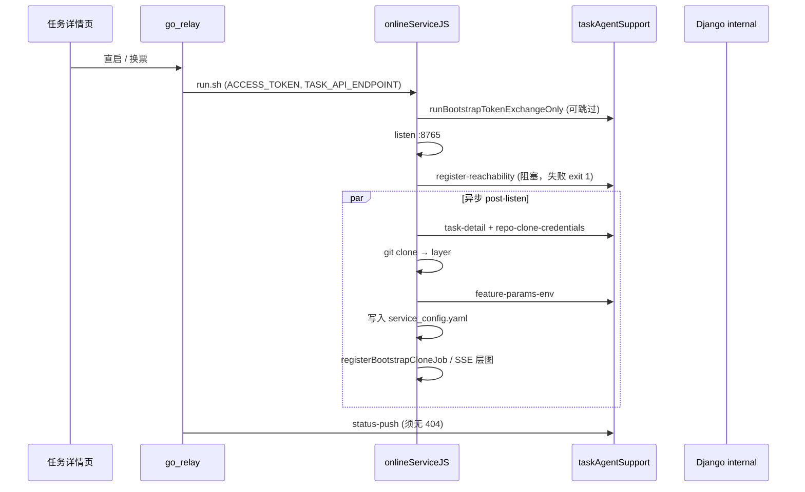

# relayToTrae 直启启动可靠性（统一版）

**日期：** 2026-05-31  
**状态：** 已审批（0-auto-flow）  
**取代：** `docs/superpowers/specs/2026-05-29-relay-to-trae-startup-reliability-design.md`（合并换票/可达性/post-listen 引导）  
**关联：** `2026-05-29-startup-storm-mitigation.md`、`2026-05-27-relay-bootstrap-gitlab-clone-auth-design.md`

## 背景

任务详情页 `?relayToTrae=true` 直启链路横跨 **go_relay**、**onlineServiceJS**、**taskAgentSupport :8011** 与 Django internal API。用户点击「启动」后，任一阶段失败都会导致「容器看似已起、但无法跑 Trae 任务」的割裂体验。

### 统一启动时序



### 已知故障面（合并）

| 阶段 | 现象 | 典型日志 / 根因 |
|------|------|-----------------|
| 换票 | 首轮 500 后重试 | `exchange-refresh` / SQLite busy；见 startup-storm |
| 可达性 | 进程 exit 1 | `register-reachability … internal error`；dispatch 吞异常 |
| status-push | SSE 不收敛 | `status push HTTP 404`；URL 与 Django 路由漂移 |
| **post-listen 引导** | **API 200 但无法跑 agent** | `bootstrap (post-listen) error: ReferenceError: configFilePath is not defined`（**已热修 import，缺回归**） |
| post-listen 克隆 | 克隆失败 | GitLab HTTP Basic 用户名策略；见 2026-05-27 设计（已实现） |
| 前端日志 | 清理后回填 / 失败无日志 | `mergeRelayToTraeLogLines`（部分已修，需测试锁定） |

**2026-05-30 现场：** 克隆与 `feature-params-env` 已成功，在写入 `service_config.yaml` 时因未从 `paths.mjs` 导入 `configFilePath` 抛出 `ReferenceError`。默认非 strict 时进程不退出，用户看到层图 API 正常，但后续 `trae` job 会因 `Config missing` 失败。

## 目标

1. **端到端可用：** relay 直启后 8765 持续监听，且 post-listen 结束存在有效 `service_config.yaml`（当任务需要 agent 时）。
2. **可诊断：** `exchange-refresh`、`register-reachability`、`feature-params-env`、引导克隆失败返回结构化 `error_code` + `detail`，避免裸 `internal error`。
3. **可恢复：** 对瞬时下游 busy（如 SQLite locked）有限重试；不扩大「reachability 失败回退 127.0.0.1」安全面。
4. **状态收敛：** `go_relay` status-push 无 404，SSE 与 relay 日志一致。
5. **回归锁定：** 前端启动日志行为 + bootstrap 配置写入路径单测/烟雾。

## 非目标

- Phase 2 合并 bootstrap batch internal API（`online-service-two-phase-bootstrap` 仍为 planned）。
- 默认将 post-listen 失败改为非 strict 继续跑 agent（本迭代仅改善可观测性与测试，不改变默认 exit 语义）。
- Grafana 日志级别调整。

## 价值流影响

| 流 | 步骤 | 影响 |
|----|------|------|
| `task-detail-runtime-relay` | `relay-status-convergence` | status-push 404 修复 |
| `relay-token-audit-full-chain-eventization` | `relay-register-start-audit` | 换票/register 错误审计 |
| `relay-status-push-timeout-go-relay` | `relay-status-push-no-proxy-thin-slice` | 路由对齐 |
| `task-detail-relay-debug-agent-observability` | outbound visibility | register / bootstrap 出站可追踪 |
| `online-service-two-phase-bootstrap` | `online-service-two-phase-bootstrap` | post-listen 与凭证解耦的长期形态；本迭代不激活步骤 |
| **新增关注** | `decoupling-regression-guard` | post-listen 失败应能映射 `cloud_container_token_audit_event.error_code`（follow-up，可与 TAS 审计对齐） |

**字段：** `cloud_cloudserverconfig.server_url`、`business_api_endpoint`、`container_access_token`；`cloud_container_token_audit_event.error_code` / `error_detail` / `trace_id`。

## 领域概念清单（供 /5-ddd）

| 概念 | 边界上下文 | 说明 |
|------|------------|------|
| `RelayStartupSession` | relay 编排 | 从 UI 直启到子进程就绪 |
| `ContainerTokenBootstrap` | 容器运行时 | exchange-refresh / refresh-access |
| `ContainerReachabilityRegistration` | 云平台 | register-reachability |
| `PostListenWorkspaceBootstrap` | onlineServiceJS | 详情 → 克隆 → feature-params → 写配置 |
| `AgentRuntimeConfigArtifact` | onlineServiceJS | `runtimeDir()/service_config.yaml` |
| 领域事件 | 跨上下文 | `ContainerEndpointRegistered`、`WorkspaceCloned`、`AgentConfigMaterialized`、`RelayStatusPushed` |

## 方案对比

### 文档组织

| 方案 | 做法 | 取舍 |
|------|------|------|
| **A — 单一取代 spec（推荐）** | 本文取代 2026-05-29，按阶段分节 | 一处真相；旧文标记 superseded |
| B — 附录追加 | 仅在 2026-05-29 末尾加 post-listen 章 | 读者易漏读新故障面 |
| C — 按阶段拆三份 spec | token / reachability / bootstrap 各一份 | 适合超大团队，维护成本高 |

### 技术路线（与 2026-05-29 一致，扩展 post-listen）

| 方案 | 摘要 | 推荐 |
|------|------|------|
| **A — 诊断优先 + 有限重试 + 引导回归** | dispatch 503、reachability 重试、status-push 路由修复、**bootstrap 配置写入单测** | **是** |
| B — post-listen 移出关键路径 | listen 后始终起服务，配置后台重试 | 与「无配置不跑 trae」冲突 |
| C — Phase 2 batch API | 一次 internal 完成换票+可达性+引导 | 后续迭代 |

## 详细设计（方案 A）

### 1. Django `internal_dispatch`（沿用 2026-05-29）

- `OperationalError`（SQLite locked）→ **503** + `RELAY_DOWNSTREAM_BUSY`
- 其它异常 → 500 + `INTERNAL_DISPATCH_ERROR`，日志含 `action` / `trace_id`
- 测试：`tests/test_task_agent_support_internal_dispatch.py`

### 2. onlineServiceJS 可达性（沿用）

- `registerReachabilityAfterBootstrap`：对 503/502 指数退避 ≤3 次
- 最终失败仍 `process.exit(1)`（listen 前关键路径）
- 测试：`reachability.test.mjs`

### 3. go_relay status-push（沿用）

- 对齐 `push.go` URL 与 Django / taskAgentSupport 实际路由
- 测试：`push_test.go`、`test_relay_to_trae_status.py`

### 4. post-listen 引导（新增 / 扩展）

**模块：** `bootstrap.mjs` → `runBootstrapAfterListen`

| 步骤 | 失败语义 | 默认 strict 行为 |
|------|----------|------------------|
| `fetchBootstrapRepoInputs` | 可映射 `REPO_CLONE_CREDENTIALS_INCOMPLETE` | `TASK_API_BOOTSTRAP_STRICT_STARTUP` 控制 exit |
| `cloneReposIntoSharedLayer` | git exit / 认证 | 同上 |
| `feature-params-env` | 缺 `env` / `TASK_AGENT_MAX_STEPS` | 同上 |
| **写 `service_config.yaml`** | YAML 解析 / IO / **符号未定义** | 同上 |

**4.1 热修（已完成，须锁定）**

- `bootstrap.mjs` 从 `paths.mjs` 导入 `configFilePath`（与 `server.mjs`、`jobsRuntime.mjs` 一致）。

**4.2 回归（本迭代必做）**

提取纯函数（建议）：

```javascript
// bootstrap.mjs 或 featureParamsEnvToYaml.mjs
export function materializeAgentConfigFile(env, { configFilePath, fs, yaml }) {
  const yamlText = resolveAgentConfigFromEnv(env);
  yaml.parse(yamlText);
  const dest = configFilePath();
  fs.mkdirSync(path.dirname(dest), { recursive: true });
  fs.writeFileSync(dest, yamlText, 'utf8');
  return dest;
}
```

- 单测：`bootstrap.agentConfig.test.mjs` — mock `fs` + 固定 `env`，断言写入路径与内容；**不依赖网络**。
- 可选烟雾：`node --check` / 静态 import 图：禁止在 `runBootstrapAfterListen` 使用未导入的 `paths.mjs` 导出。

**4.3 可观测性（本迭代建议）**

- post-listen 成功日志保留：`bootstrap: wrote <dest>`、`任务引导完成…`
- 失败日志增加阶段标签：`bootstrap_stage=write_agent_config`（便于 Loki 过滤）
- follow-up：经 taskAgentSupport 写 `cloud_container_token_audit_event`（对齐 `decoupling-regression-guard`）

**4.4 strict 语义（文档化，不改默认）**

- `TASK_API_BOOTSTRAP_STRICT_STARTUP` 未设置时，post-listen 失败**不** exit，但 `jobsRuntime` 在 `command_kind === 'trae'` 时检查 `configFilePath()` 存在性 → 用户侧为「启动后点运行才报错」。UI 应依赖 relay 日志中的 `bootstrap (post-listen) error`（已有）。

### 5. 前端启动日志（沿用）

- 锁定 `mergeRelayToTraeLogLines`、`awaitingFirstStatusAfterStart`
- Vitest 全绿；可选 Playwright「清理 → 刷新仍空」

## 验收标准

1. 任务 `848546827193511936`（或等价夹具）relay 直启：无 `configFilePath is not defined`；日志含 `任务引导完成` 或 `bootstrap: wrote …/service_config.yaml`。
2. `register-reachability` 在 busy 场景可重试成功或输出 `RELAY_DOWNSTREAM_BUSY`。
3. go_relay 无 `status push HTTP 404`。
4. 新建 `bootstrap.agentConfig.test.mjs` 通过；`npm run test:unit` 全绿。
5. 前端：启动失败可刷新见日志；清理后刷新不回填。
6. `pytest` / `relayToTraeUtils` Vitest 相关用例全绿。

## 测试计划

| 层 | 文件 | 覆盖 |
|----|------|------|
| Django internal | `tests/test_task_agent_support_internal_dispatch.py` | 503 busy |
| 容器 token | `tests/test_container_runtime_tokens.py` | reachability |
| go_relay | `push_test.go` | status-push URL |
| onlineServiceJS | `reachability.test.mjs` | 重试 |
| onlineServiceJS | **`bootstrap.agentConfig.test.mjs`（新建）** | 写配置路径 |
| onlineServiceJS | `bootstrap.cloneCredentials.test.mjs`（已有） | 克隆凭证 |
| 前端 | `relayToTraeUtils.test.js` | 日志合并 |

## 风险与回滚

- 提取 `materializeAgentConfigFile` 为小幅重构 — 行为等价，回滚即还原内联。
- reachability 重试延长启动 1～2s — 可接受。
- status-push URL 变更需与 nginx 一致 — 仅 internal 路径时风险低。

## 实施切片（供 /6-plans）

| 切片 | 内容 | 依赖 |
|------|------|------|
| S0 | 确认 `configFilePath` import 已合入 | 无 |
| S1 | `materializeAgentConfigFile` + 单测 | S0 |
| S2 | internal_dispatch 503 + 测试 | 无 |
| S3 | reachability 重试 | S2 可选 |
| S4 | status-push 路由 | 无 |
| S5 | 前端回归锁定 / Playwright 可选 | 无 |
| S6 | post-listen 阶段日志标签（可选） | S1 |

---

**审批后下一步：** `/6-plans` 生成可勾选实施计划；或 `/2-worktrees` 隔离开发。
