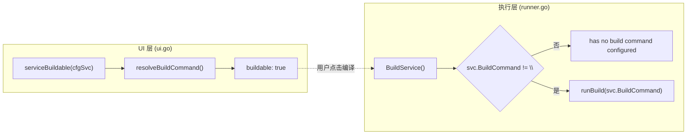

# runAll Go 服务「编译」按钮失效 — 设计文档

Date: 2026-05-31  
Status: approved

## 问题陈述

在 `http://localhost:9999/` runAll Web UI 中，多个 **Go 服务** 行显示「编译」按钮为**可点击**（`buildable: true`），但点击后 API 返回错误，无法完成编译。

### 复现（已在本地验证）

| 服务 | UI `buildable` | `POST /api/build` 结果 |
|------|----------------|------------------------|
| `task-auth` | `true` | `{"error":"service \"task-auth\" has no build command configured"}` |
| `task-bill` | `true` | 同上 |
| `task-events-accounts` | `true` | 同上 |
| `go-relay` | `true` | `{"status":"ok"}` ✓ |
| `task-agent-support` | `true` | `{"status":"ok"}` ✓ |
| `value-stream` | `true` | `{"status":"ok"}` ✓ |

规律：**YAML 中显式配置了 `build_command` 的 Go 服务可编译**；依赖 `run.sh` 推断的 Go 服务 UI 显示可编译但 API 拒绝。

## 根因分析

### 1. UI 与 Runner 使用两套 build 判定逻辑（主因）

2026-05-20 引入「编译 / 重启 / 日志」按钮后，后续又增加了 `service_build.go` 中的 **build 命令推断**（`resolveBuildCommand`），但只接入了 UI 展示层，未接入执行层。



| 位置 | 判定方式 | 能否识别 `run.sh` 中的 `go build` |
|------|----------|-----------------------------------|
| `ui.go` → `serviceBuildable` | `resolveBuildCommand()` | ✓ |
| `runner.go` → `BuildService` | 仅 `svc.BuildCommand` 非空 | ✗ |
| `runner.go` → `restartService` | 同上（重启前 build） | ✗ |

`task-auth/run.sh` 含 `go build -o taskAuth ./src`，UI 正确推断为可编译；`BuildService` 因 YAML 无 `build_command` 字段直接拒绝。

这与 2026-05-27 `taskFE` 问题的**表象相同**（点击编译报 *has no build command configured*），但**根因不同**：

- `taskFE`：推断逻辑不存在，需补 YAML `build_command`（已修复）
- Go 服务（task-auth 等）：推断逻辑**已有**但未接到 Runner

### 2. `task-events-*` 推断结果不可执行（次因）

`resolveBuildCommand` 从 `taskEvents/run.sh` 提取的第一行 `go build` 位于 shell 函数体内：

```bash
go build -o "bin/task-events-${name}" "./cmd/${name}"
```

推断出的命令含未展开的 `${name}`，即使 Runner 接入推断，直接 `sh -c` 执行也会失败。

正确 build 命令应为：`bash run.sh build accounts`（与 `command: bash run.sh start accounts` 对称）。

### 3. `runAll/config.yaml` 与 `runAll.yaml` 漂移（附带）

| 服务 | `runAll.yaml`（生产编排） | `runAll/config.yaml`（默认 --config） |
|------|---------------------------|--------------------------------------|
| `go-run-container` | `build_command: ./build.sh` | 无；command 内联 `go build ...` |
| `go-relay` | `build_command: ./build.sh` | 无；command 内联 `go build ...` |
| `task-auth` / `task-bill` | 无 `build_command` | 无 `build_command` |

当前运行实例使用 `runAll.yaml`，故 go-relay 等可编译；若有人用 `config.yaml` 启动，go 容器栈行为不一致。

## 方案

### 推荐：统一 Runner 使用 `resolveBuildCommand` + 补齐 task-events 配置

#### A. Runner 执行层对齐推断逻辑（核心）

修改 `runAll/src/runner.go`：

1. **`BuildService`**：用 `resolveBuildCommand(*svc)` 替代 `svc.BuildCommand == ""` 检查；空则报错。
2. **`restartService`**：重启前 build 同样使用 resolved command。
3. **`runBuild`**：接受 resolved command 字符串（或从 Service 解析），不再硬读 `svc.BuildCommand`。

新增/扩展测试：

- `BuildService` 对无显式 `build_command`、但 `run.sh` 可推断的 mock 服务成功 build
- `BuildService` 对完全不可推断的服务仍返回 *has no build command configured*
- `restartService` 在 inferred build 存在时重启前先 build

**预期效果**：`task-auth`、`task-bill` 等简单 Go 服务无需改 YAML 即可编译。

#### B. 为 `task-events-*` 显式配置 `build_command`（必要补充）

在 `runAll.yaml`（及同步 `runAll/config.yaml` 若仍维护）为 5 个 domain-events 服务增加：

```yaml
- name: task-events-accounts
  build_command: "bash run.sh build accounts"
  command: "bash run.sh start accounts"
  working_dir: taskEvents
  # ...
```

`projects` / `cloud` / `realtime` / `billing` 同理。

同时收紧 `extractGoBuildFromRunScript`：**跳过含 `$` 的行**（shell 变量/参数展开），避免 task-events 被误标为 buildable 却推断出无效命令。收紧后 UI 对 task-events 在未配 `build_command` 时显示禁用编译按钮；配齐后与 Runner 一致。

#### C. 同步 `runAll/config.yaml`（低优先级、可同 PR）

将 `go-run-container`、`go-relay` 等与 `runAll.yaml` 对齐：使用 `build_command: ./build.sh` + 独立 start command，避免双份编排语义分叉。

### 不在范围内

- 为纯 Python / Node dev server（如 `git-oauth`、`ai-provider`）添加 build
- SSE / WebSocket 日志流
- 修改各 Go 服务自身的 `build.sh` / `run.sh` 结构（task-events 仅补 YAML）

## 域概念（轻量清单，供 `/5-ddd`）

| 概念 | 说明 |
|------|------|
| **Bounded Context: ServiceOperations** | runAll 对编排服务的 build / restart / log 操作 |
| **Entity: OrchestratedService** | YAML 定义的 `name`, `command`, `build_command`, `working_dir` |
| **Value Object: ResolvedBuildCommand** | 显式 `build_command` 或推断结果；Runner 与 UI 必须共用 |
| **Domain Service: BuildService** | 仅编译、不启停；状态 `building` → 恢复原状态 |
| **Domain Event: ServiceBuildFinished** | build 成功/失败写入 log buffer 与 status |

## 价值流影响

读取 `value-stream.yaml` 后，本次变更影响以下现有流：

| 流 / 步骤 | 影响 |
|-----------|------|
| `runall-cascade-lifecycle` | 间接：Go 平台服务（task-auth 等）若用户通过 UI「编译」后再启停，行为从不一致变为一致；不改变 lifecycle 状态机本身 |
| `runall-log-copy-and-recovery` 域下日志相关步骤 | 编译失败/成功的日志现可正确写入 buffer（此前 task-auth build 在 Runner 层直接拒绝，无 build 日志） |
| `task-events-*` health 相关步骤 | 仅当用户主动点「编译」时触发 rebuild；不影响 Kafka 消费运行时 |

**无需新增 value stream 条目**。完整切片与 YAML 字段映射由 `/3-value-stream-价值流` 负责。

**测试影响**：

- 现有：`runAll/src/service_build_test.go`、`runner_test.go`、`ui_test.go`
- 新增：inferred build 端到端 API 测试；task-events build_command 生产配置断言（类似 `TestProductionConfig_VueFrontendHasBuildCommand`）

## 验证计划

1. 重启 runAll（加载新二进制 + 配置）
2. UI 对 `task-auth` 点「编译」→ `{"status":"ok"}`，日志面板可见 `go build` 输出
3. 对 `task-events-accounts` 点「编译」→ 成功，产物 `taskEvents/bin/task-events-accounts` 更新
4. 对 `git-oauth`（Python）→ 编译按钮仍禁用
5. `cd runAll && go test ./...` 全绿
6. `task-auth` 点「重启」→ 重启前先 inferred build（行为与显式 `build_command` 服务一致）

## 风险与回滚

| 风险 | 缓解 |
|------|------|
| 推断出的 `go build` 与 run.sh 实际 build 不一致 | 仅匹配 `run.sh` 首行顶层 `go build`；复杂脚本仍要求显式 `build_command` |
| task-events 误推断 | B 方案显式 YAML + 跳过含 `$` 的行 |
| 回滚 | 还原 runner.go；YAML 新增字段向后兼容，可保留 |

## 与历史设计的关系

- [2026-05-20 runall-build-restart-log-buttons](../specs/2026-05-20-runall-build-restart-log-buttons-design.md)：定义 BuildService 语义 — 本次补齐执行层与 UI 一致性
- [2026-05-27 taskFE-build-command](../specs/2026-05-27-taskFE-build-command-design.md)：同类症状、不同根因 — vue 无推断能力需补 YAML；Go 服务应优先统一 Runner
