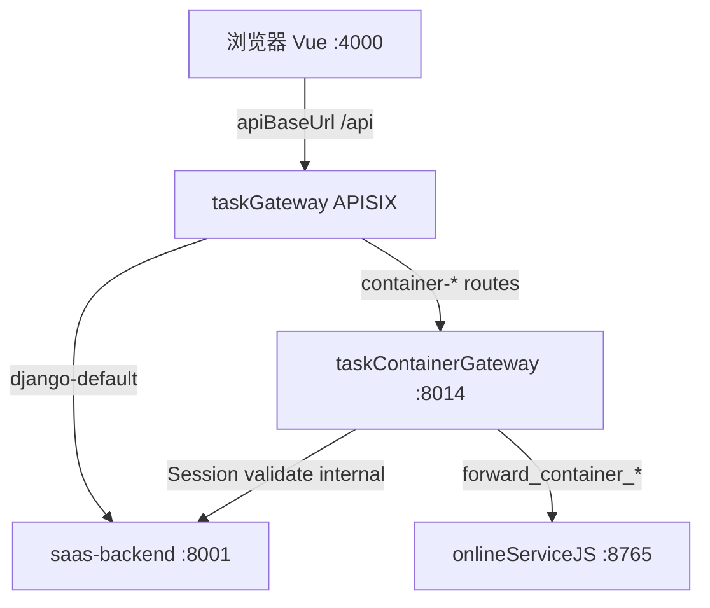

# taskContainerGateway — 独立网关 + Session 鉴权（Go vs nginx）

**日期：** 2026-05-31  
**状态：** 已审批（0-auto-flow；路由范围 **A** — 仅 container-* + inbound）  
**路由真源（2026-07-05 修订）：** **taskGateway** `routes/routes.yaml`，非 Vite dev proxy  
**延续/扩展：** `2026-05-31-task-container-gateway-go-design.md`  
**新诉求：** 网关服务独立部署；**Session 鉴权前移到网关**；评估 **nginx** 还是 **Go** 实现。

---

## 结论（先行）

| 问题 | 建议 |
|------|------|
| 网关用 nginx 还是 Go？ | **Go 写应用网关**（与 taskAuth / taskAgentSupport / taskAIEndPoint 一致）；**nginx 仅作可选边缘层**（TLS、限流、静态资源） |
| Session 鉴权放网关是否 OK？ | **OK**，通过 **Django internal「会话校验」API** 真源验证 `sessionid` / `Authorization: Token`；网关不直接读 `django_session` 表 |
| 能否纯 nginx 完成？ | **不适合** 作为唯一网关：缺 job-stream goroutine、OAuth 编排回调、结构化 trace 日志、action 路由映射 |

---

## 现状：鉴权与流量



- **认证：** DRF `SessionAuthenticationWithoutCSRF` + `CustomTokenAuthentication`（`CloudComputeViewSet` 等同理）。
- **凭证：** 浏览器 `credentials: include` 带 `sessionid`；部分客户端带 `Authorization: Token …`。
- **CSRF：** API 域关闭 Session CSRF（跨域 SPA 无法可靠带 `X-CSRFToken`）；**网关层不应重新引入 CSRF 校验**。
- **鉴权后业务：** 租户/任务权限、OAuth 换票、ORM 仍在 Django。

---

## 目标网关职责

| 职责 | 归属 | 说明 |
|------|------|------|
| **TLS / 限流 / 压缩** | nginx（可选，生产） | 边缘层 |
| **Session/Token 认证** | **Go 网关** | 调 Django internal validate |
| **路径路由** | **Go 网关** | `/api/tenant/.../cloud/compute/container-*` |
| **容器 HTTP 转发** | **Go 网关** | 线程安全 client → :8765 |
| **job-stream 轮询** | **Go 网关** | goroutine，替代 Python daemon |
| **租户/任务授权** | Django internal | validate 返回 `user_id` + scope 检查结果 |
| **OAuth / PR 编排** | Django internal | git-push 等 L3 逻辑 |
| **容器 inbound** | 同 Go binary inbound 路由组 | 延续 taskAgentSupport |

---

## nginx vs Go vs 组合

### 方案 1：纯 nginx 网关

```
Browser → nginx
            auth_request → Django GET /api/internal/session/validate/
            proxy_pass → onlineServiceJS 或 Django
```

| 优点 | 缺点 |
|------|------|
| 高性能反向代理、成熟 `auth_request` | **无法**运行 job-stream 后台轮询 |
| 配置即可做超时、upstream | 30+ container action 映射维护在 conf，易漂移 |
| | git-push 等多步编排需多次 subrequest，**难表达** |
| | runAll 本地又多一层 nginx 配置；Promtail 日志不如 Go JSON 统一 |
| | `auth_request` 仅适合「放行/拒绝」，难注入复杂 forward body 变换 |

** verdict：** 仅适合 **静态路由 + 单次 proxy**；**不能**作为 taskContainerGateway 唯一实现。

### 方案 2：纯 Go 应用网关（推荐）

```
Browser → taskContainerGateway :8014
            1. validateSession(cookie, token) → Django internal
            2. authorizeTaskScope(tenant, workspace, task) → Django internal
            3. resolveContainerTarget → Django internal
            4. forward HTTP → onlineServiceJS
            5. structured log → Loki
```

| 优点 | 缺点 |
|------|------|
| 与 monorepo 现有 Go 侧车一致 | 需编写/维护 Go 代码 |
| 认证 + 转发 + 后台轮询 **同一进程** | 比 nginx 多占少量内存 |
| `taskAIEndPoint` 已有 **Django validate token** 先例 | |
| trace_id、timeout、no_proxy 已 patterns 化 | |
| runAll 一条 service 条目 | |

**verdict：** **推荐** 作为 container/OSJS 路径的**主网关**。

### 方案 3：nginx 边缘 + Go 应用网关（生产可选）

```
Browser → nginx:443 (TLS, rate limit)
            → taskContainerGateway:8014
                 → onlineServiceJS / Django internal
```

| 优点 | 缺点 |
|------|------|
| 生产安全/运维最佳实践 | 本地 runAll 可省略 nginx，直接 Go |
| Go 专注业务 | 多一跳（内网可忽略） |

**verdict：** **生产推荐组合**；**开发环境 Go 直连**即可。

---

## Session 鉴权设计（Go 网关内）

### 原则

1. **不在 Go 内解析 Django session 序列化格式** — 避免与 `SECRET_KEY`、session backend 耦合。
2. **Django 仍是认证真源** — 新建 internal API，复用现有 `SessionAuthentication` / `CustomTokenAuthentication` 逻辑。
3. **网关缓存短 TTL（可选 P2）** — validate 结果 30s 内存缓存（key=sessionid hash），降低 Django 压力；**P1 不缓存**以保证正确性。

### Django internal：`POST /api/internal/gateway/validate-session/`

**Request（Go 转发原始头）：**

```json
{
  "cookie": "sessionid=…; …",
  "authorization": "Token abc…",
  "method": "POST",
  "path": "/api/tenant/…/cloud/compute/container-layer-git-commit/",
  "tenant_id": "…",
  "workspace_id": "…",
  "task_id": "…"
}
```

**Response 200：**

```json
{
  "user_id": "123",
  "auth_method": "session|token",
  "scope_ok": true
}
```

**Response 401/403：** 网关直接返回 JSON，**不**转发容器。

实现：包装 DRF `authenticate` + 现有租户成员校验（从 URL scope 查 company/task 权限）。

### Go 网关 handler 伪代码

```go
func handleContainerForward(w http.ResponseWriter, r *http.Request) {
    traceID := r.Header.Get("X-Trace-Id")
    v, status := djangoValidateSession(r, parseScope(r.URL))
    if status != 200 {
        writeJSON(w, status, v)
        return
    }
    // forward to OSJS …
}
```

### 与现有前端兼容

- 浏览器 API 请求经 **`apiBaseUrl` → taskGateway**（`conf/frontend/vue/config.yaml`：`apiBaseUrl: ${subdomains.gateway}`）。
- taskGateway 将 `…/cloud/compute/container-*`（及扩展的 clone-log、container-job-* 等）转发至 **Go :8014**；其余 `/api` 走 `django-default` 或专用路由（git-oauth、taskAuth、SSE 等）。
- **Vite dev server 不再代理 `/api`**（`vite.config.js`：`server.proxy: {}`）；Vite 仅负责页面与 HMR。

**CSRF：** 网关 **不校验** csrftoken（与 `SessionAuthenticationWithoutCSRF` 一致）。

---

## 路由与部署

### 服务：`taskContainerGateway`

| 监听 | 路由 | 认证 |
|------|------|------|
| :8014 | `POST/GET …/cloud/compute/container-*` | Session validate |
| :8014 | `POST …/cloud/server-container-token/*` | access_token（容器 inbound，已有） |
| :8014 | `POST …/relay-to-trae/status-push` | 容器 token（已有） |

**非目标（首期仍 Django :8001）：** projects、accounts、budget、非 container 的 cloud API。

### runAll 变更（示意）

```yaml
- name: task-container-gateway
  command: "./bin/taskContainerGateway"
  working_dir: taskContainerGateway  # 或由 taskAgentSupport 重命名扩展
  depends_on: [saas-backend]
  env:
    OTEL_SERVICE_NAME: task-container-gateway
```

### taskGateway 路由（示意）

`taskGateway/routes/routes.yaml`：

```yaml
  - id: container-outbound-l0
    priority: 890
    uris:
      - /api/tenant/*/workspace/*/task/*/cloud/compute/container-layer-*
      - /api/tenant/*/workspace/*/task/*/cloud/compute/container-layer-*/*
      # … clone-log、container-job-* 等见 l0-job-stream 设计
    upstream: taskContainerGateway
    auth_mode: token
```

变更后执行：`cd taskGateway && bash run.sh routes-apply`

> **历史：** Inc 1 曾写 `Vite proxy: container- → :8014`；已废弃，见 `2026-06-02-taskgateway-apisix-design.md`。

---

## 分阶段交付

| Phase | 内容 |
|-------|------|
| **P0** | Django internal `validate-session` + Go 健康检查 / echo |
| **P1** | Go 网关 + Session 鉴权 + L0 forward（git-commit 等）→ 解决 pending |
| **P2** | job-stream 迁 Go；**taskGateway** 扩展 container-outbound 路由 |
| **P3** | git-push 编排仍 Django internal，最后一跳 Go |
| **P4** | 合并 taskAgentSupport inbound；生产 optional nginx 边缘 |

---

## 价值流影响

| 流 | 影响 |
|----|------|
| `task-detail-runtime-relay` | 出站经网关；鉴权前移 |
| `task-agent-support-phase2-internal-scoped` | 新增 `gateway-validate-session` internal action |
| `platform-centralized-logging` | 新 service label `task-container-gateway` |
| `user-auth` | 间接：session 校验集中 internal API（行为等价） |

**字段：** `saas-backend.accounts_user.id`（validate 输出）；`cloud_cloudserverconfig.container_access_token`（不变）

---

## 领域概念清单（供 /5-ddd）

| 概念 | 说明 |
|------|------|
| `GatewaySessionValidation` | 网关边界：Cookie/Token → user_id |
| `TaskScopeAuthorization` | tenant/workspace/task 访问判定 |
| `ContainerForwardAction` | 映射到 OSJS HTTP |
| `ContainerGateway` | Go 聚合根（inbound + outbound） |

---

## 风险

| 风险 | 缓解 |
|------|------|
| 双处鉴权（网关 + Django delegate） | P1 后 Django forward 视图可删除，仅 internal 编排 |
| taskGateway/Django 路由分裂 | `routes.yaml` + `scripts/ci/check_routes.sh`；文档与 value-stream 同步 |
| validate 性能 | P2 短 TTL 缓存；validate 逻辑轻量 |

---

**路由范围（已确认）：** **A** — 仅 `…/cloud/compute/container-*`（+ 容器 inbound token 路由，P4 合并）。

---

**与 nginx 的关系总结：** nginx **合适**作边缘反向代理；**不合适**单独承担「Session 鉴权 + 容器 forward + job-stream」应用网关。请用 **Go** 实现应用网关，nginx 生产可选前置。
