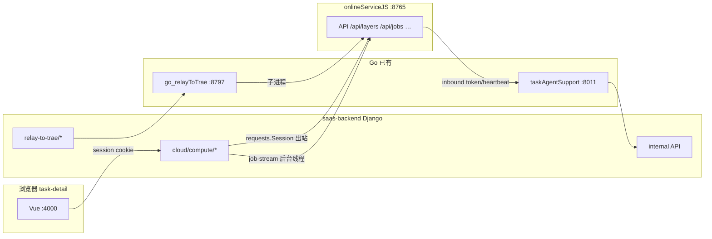

# taskContainerGateway — task2app ↔ onlineServiceJS 交互 Go 化

**日期：** 2026-05-31  
**状态：** 待批准  
**取代（长期方案）：** `2026-05-31-relay-git-commit-pending-trace-observability-design.md` 中的 thread-local Session 作为**终态**；其中 Phase 0 热修仍可作为应急切片  
**延续：** `2026-05-28-task-agent-support-split-design.md` Phase 1（inbound 已落地 :8011）  
**动机：** zTree「提交」无限 pending 暴露 Django 出站转发与后台 job-stream 轮询共用 `requests.Session`；用户希望 **task2app 与 onlineServiceJS 的 HTTP 交互完全独立为 Go 服务**，从架构上消除 runserver 长连接/线程安全问题。

---

## 用户诉求

> 把 task2app 中和 trae-agent/onlineServiceJS 打交道的完全独立出来，用 Go 写一个服务来处理。

**结论：OK，推荐做，但必须分阶段，且 Django 仍保留「会话鉴权 + 领域编排真源」。**  
不宜一次性把 OAuth 换票、GitHub PR、CloudServerConfig ORM 全部重写进 Go。

---

## 现状：双向流量



| 方向 | 现状 | 文件规模（约） |
|------|------|----------------|
| **容器 → SaaS** | ✅ 已迁 taskAgentSupport → Django internal | `taskAgentSupport/` + internal dispatch |
| **浏览器 → 容器** | ❌ 仍在 Django `forward_container_*` | **~20 个 service 模块**，`cloud_compute_views` 30+ action |
| **浏览器 → relay** | ❌ Django `relay_to_trae_proxy` → go_relay | ~1000 行，**不经过 onlineServiceJS HTTP** |

### 出站复杂度分层

| 层级 | 示例 | 是否「纯 HTTP 转发」 |
|------|------|----------------------|
| L0 纯代理 | layer-graph、clone-log、files、git/add/commit | ✅ |
| L1 解析目标 | 所有 forward（`resolve_container_target` + `CloudServerConfig`） | 需 Django 提供 target |
| L2 后台轮询 | `container_job_stream_sse` daemon 线程（**现状 2026-07-09：已删；轮询仅 Go Gateway**） | ✅ 适合 Go goroutine |
| L3 领域编排 | git-push（OAuth 换票、多 provider、GitHub PR） | ❌ 暂留 Django internal |
| L4 relay 生命周期 | relay-to-trae start/stop/token-init | 对话 **go_relay**，非 OSJS API |

---

## 根因（为何值得 Go 化）

1. **并发模型：** Django `runserver` + `requests.Session` 单例 + daemon 线程 → 已观测 **无限 pending**（容器 200，Django 永不返回）。
2. **职责混杂：** 用户 session 请求与长耗时容器 I/O 同进程。
3. **可观测性：** 出站无 Loki 阶段日志；pending 时 Grafana 只见 onlineServiceJS 一条。
4. **已有先例：** taskAgentSupport 已验证「Go 薄网关 + Django internal」模式。

---

## 目标

1. **所有 onlineServiceJS HTTP 出站**（browser 触发链）改经 **Go 网关**，Django 不再直接 `requests` 到 `:8765`。
2. **job-stream 轮询**迁入 Go（goroutine + 独立 HTTP client），消除 Python 线程 + Session 竞态。
3. **容器 inbound** 继续走 taskAgentSupport（可合并为同一 binary 不同路由组）。
4. **浏览器 URL 不变**（仍 `/api/tenant/.../cloud/compute/...`），由 Django 薄委托或 nginx 分流。
5. **trace_id** 全链路：Django delegate → Go access log → onlineServiceJS log。

## 非目标（本史诗首期）

- 将 **relay-to-trae → go_relay** 并入同一服务（可 Phase 4 另议）。
- Go 内重写 git OAuth / GitHub PR / `CloudServerConfig` ORM。
- 修改 onlineServiceJS API 契约。
- 云 VM `start_vm` 等非 Trae 容器路径。

---

## 价值流影响

| 流 | 影响 |
|----|------|
| `task-detail-runtime-relay` | 出站转发可靠性、pending 消除 |
| `task-agent-support-phase2-internal-scoped` | 扩展 internal API：`resolve-container-target`、`layer-git-push-orchestrate` |
| `platform-centralized-logging` | Go 网关统一 `forward_stage` 日志 |
| `task-detail-relay-debug-agent-observability` | inbound + outbound 均可按 service 过滤 |

**字段：** `saas-backend.cloud_cloudserverconfig.business_api_endpoint`、`container_access_token`（仍 Django 真源）

---

## 领域概念清单（供 /5-ddd）

| 概念 | 边界 |
|------|------|
| `ContainerGateway` | 新 bounded context（Go 进程） |
| `ContainerForwardSession` | 单次 browser→容器转发上下文（trace、target、timeout） |
| `ContainerTargetResolution` | Django 领域：base URL + token |
| `ContainerJobStreamRelay` | Go：job events 轮询 → taskSSE |
| `LayerGitPushOrchestration` | Django 领域：OAuth + PR（internal API） |
| 领域事件 | `ContainerForwardCompleted`、`ContainerForwardFailed`（可选审计） |

---

## 方案对比

### 方案 A（推荐）：扩展 taskAgentSupport → **taskContainerGateway** 双工

同一 Go module（或重命名），两套路由：

```
POST /api/tenant/.../cloud/server-container-token/*     → Django internal（已有）
POST /api/internal/container-gateway/forward            → Go 直连 onlineServiceJS（新）
GET  /api/internal/container-gateway/forward            → 同上
```

浏览器路径保持：

```
POST /api/.../cloud/compute/container-layer-git-commit/
  → Django：鉴权 + 调 internal forward
  → Go：解析 body → GET target from Django → HTTP to OSJS → 返回
```

| 优点 | 缺点 |
|------|------|
| 与 taskAuth/taskAgentSupport 模式一致 | 需新增 ~15 internal + forward action 映射 |
| Go 处理并发/超时/连接池 | Django 仍多一跳（内网可忽略） |
| 领域逻辑复用 Django pytest | 初期 Go 集成测试需补 |

### 方案 B：Go 全量重写 forward + OAuth

| 优点 | 缺点 |
|------|------|
| Django 最瘦 | git-push 400+ 行业务、GitHub PR、多 provider — **工作量 10x+**，重复测试 |

### 方案 C：仅 Python 热修（thread-local Session）

| 优点 | 缺点 |
|------|------|
| 1 天可交付 | **不解决** runserver 长 I/O 占线程、架构债仍在 |

**推荐：A；C 作为 Phase 0 应急（可选并行）；B 不采纳。**

---

## 详细设计（方案 A）

### 1. 组件命名与部署

| 组件 | 端口 | 职责 |
|------|------|------|
| **taskContainerGateway** | :8014（新，runAll + port_config） | OSJS 双向 HTTP 代理 + job-stream |
| saas-backend | :8001 | Session 鉴权、target 解析、OAuth/PR 编排 |
| taskAgentSupport | :8011 | 可 **合并进** taskContainerGateway 或保持独立 |

**合并 vs 独立：**

- **合并（推荐）：** 一个 binary `taskContainerGateway`，路由组 `/inbound/*` + internal forward API；runAll 少一个服务。
- **独立：** Outbound 新 binary，inbound 不动 — 运维两个 Go 服务。

### 2. Django 薄视图

`cloud_compute_views` 中 L0/L1 forward 改为：

```python
def post_container_layer_git_commit(request, tenant_id, workspace_id, task_id):
    return delegate_container_forward(
        request, tenant_id, workspace_id, task_id,
        action="layer_git_commit",
    )
```

`delegate_container_forward`：

1. 校验用户权限（现有逻辑）
2. `POST /api/internal/container-gateway/forward/` body: `{ action, payload, trace_id, user_id }`
3. 原样返回 Go 响应

**L3 git-push：** Django 仍执行 OAuth/PR，仅最后一步 `oauth-access-push` 走 Go forward（或保留 Django 调 Go 一次 forward）。

### 3. Go forward 核心

```go
type ForwardRequest struct {
    Action      string          // layer_git_commit, layer_graph, ...
    TenantID    string
    WorkspaceID string
    TaskID      string
    Payload     json.RawMessage
    TraceID     string
}

// 1. POST django internal resolve-target → { base, token }
// 2. Map action → method, path, body
// 3. http.Client{ Transport: noProxy }  // 每 goroutine 独立 client 或 sync.Pool
// 4. Structured log: forward_stage, upstream_status, duration_ms
// 5. Return upstream body + status
```

**job-stream：** Go `startJobStreamSSE(taskID, base, token, jobID, traceID)` — goroutine 轮询 `/events`，POST Django internal `publish-container-job-stream`（或复用 taskSSE publish internal API）。

### 4. Internal API 新增（Django）

| action | 方法 | 职责 |
|--------|------|------|
| `resolve-container-target` | POST | 读 CloudServerConfig + override URL → base + token |
| `publish-container-job-stream` | POST | 包装现有 SSE publish |
| `layer-git-push-orchestrate` | POST | 换票 + 组装 oauth body（返回给 Go 再 forward） |

### 5. 分阶段交付

| Phase | 内容 | 解决 pending？ | 工期粗估 |
|-------|------|----------------|----------|
| **P0** | thread-local Session 热修（可选） | ✅ 立即 | 0.5d |
| **P1** | Go forward 框架 + L0 纯代理（commit/add/graph/logs） | ✅ | 3–5d |
| **P2** | job-stream 迁 Go | ✅ 彻底消除 Session 线程竞态 | 2d |
| **P3** | git-push 编排 internal 化 + Go 最后一跳 | 推送 pending | 3d |
| **P4** | 合并 taskAgentSupport inbound；考虑 relay 边界 | 架构统一 | 2d |

### 6. 验收标准

- [ ] zTree「提交」在 job 轮询活跃时 **≤5s** 返回，不无限 pending。
- [ ] Loki 同一 trace_id：`saas-backend` delegate + `taskContainerGateway` forward + `onlineServiceJS` http_request。
- [ ] 24h 内 saas-backend `git-commit` 完成日志 > 0。
- [ ] 现有 `test_ai_task_comment.py` forward 用例迁移/等价 Go + Django 集成测试全绿。

---

## 风险

| 风险 | 缓解 |
|------|------|
| 范围膨胀（git-push/relay） | 严格 Phase；L3 仍 Django internal |
| 双跳 latency | localhost；可后续 nginx 直连 Go |
| 测试 duplicated | forward 契约 golden tests；Django internal pytest 保留 |

---

## 与前一设计的取舍

| 文档 | 关系 |
|------|------|
| `2026-05-31-relay-git-commit-pending-trace-observability-design.md` | P0 热修仍有效；终态由本文 Go 网关取代 |
| `2026-05-28-task-agent-support-split-design.md` | inbound 已完成；本文补 **outbound** 缺口 |

---

**待确认边界（见头脑风暴澄清问题）：** `relay-to-trae/*` 是否纳入同一 Go 服务，或仅 onlineServiceJS HTTP。
