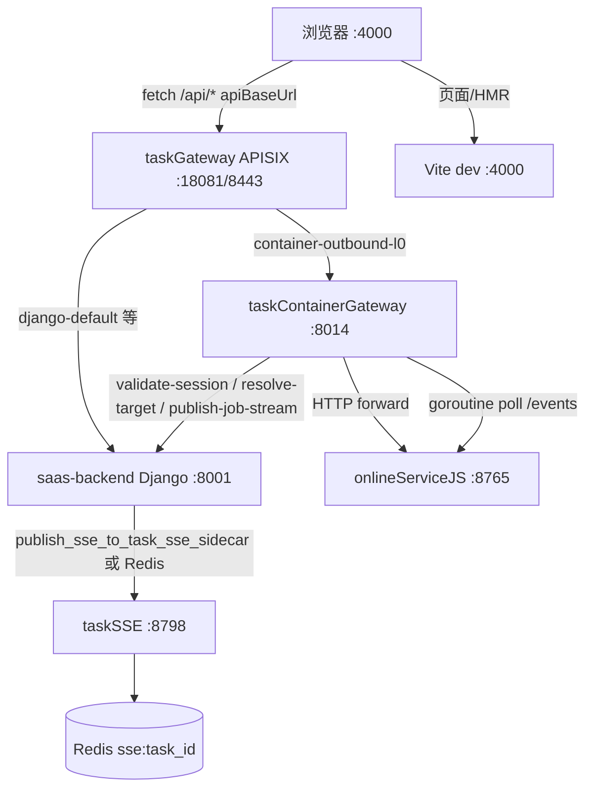

# taskContainerGateway Increment 2+3 — L0 出站全集 + job-stream 迁 Go

**现状（2026-07-09）：** Python daemon 已删除；轮询仅 Go Gateway；本文件历史段落保留作沿革。

**日期：** 2026-05-31  
**状态：** 部分交付（S1–S2 L0 registry ✅；S3 job-stream ✅；S4 observability ✅；L3 git-push 迁 Gateway ✅ 2026-07-09）  
**触发故障：** 任务 `848546827193511936`（`?relayToTrae=true`）`POST container-layer-delete` pending → 同页 `container-task-ui-context` / `clone-log` / `layer-graph` 级联 pending → Django runserver 假死  
**前置：** Increment 1 已落地（`:8014` + `container-layer-git-commit` + Django internal validate/resolve）  
**延续：** `2026-05-31-task-container-gateway-go-design.md`、`2026-05-31-relay-git-commit-pending-trace-observability-design.md`

---

## 现象与根因

### 现象

1. 浏览器 `POST …/cloud/compute/container-layer-delete/` **长时间 pending**（非快速 502）。
2. 同页并发 `GET container-task-ui-context`（**纯 DB**）、`clone-log`、`layer-graph` **一并 pending**。
3. 用户感知为「Django 整个服务崩溃/假死」。

### 根因（高置信）

| 层级 | 说明 |
|------|------|
| **架构** | 浏览器 → 容器 outbound 仍经 **Django runserver** 同步 `requests`（除 git-commit 外 ~20 个 action） |
| **长 I/O** | `layer-delete` read timeout **120s**；`clone-log` 120s；`layer-graph` 2×60s |
| **同进程竞争** | `container_job_stream_sse` 在 Django **daemon 线程**每秒轮询容器 `/events`，与 forward 共享进程 |
| **已缓解未根治** | `threading.local()` Session 缓解 git-commit Session 死锁，**不消除** runserver 线程被 outbound 占满 |

**结论：** 故障链上的 4 个 API 中，3 个应迁 **taskContainerGateway**；`container-task-ui-context` 应留 Django，其 pending 是 **Django 整体不可服务** 的连带症状。

---

## 目标

1. **所有 L0 纯 HTTP 转发**（browser → onlineServiceJS）改经 **taskContainerGateway**，Django 不再对这些 action 做同步 `requests` 出站。
2. **`container_job_stream_sse` 轮询迁 Go**（goroutine + 独立 HTTP client），发指令后的 job events 不再占用 Django 线程/Session。
3. **浏览器 URL 不变**；**taskGateway**（`taskGateway/routes/routes.yaml`）将对应 `container-*` / `container-job-*` / `container-clone-log` 等路由转发至 `:8014`（**不再**使用 Vite dev proxy）。
4. **trace 链完整：** 浏览器 → taskGateway → Go `http_request` + `forward_stage` → onlineServiceJS →（job-stream）Django/taskSSE publish。
5. **回归：** 现有 `test_ai_task_comment.py` forward 用例等价覆盖（Django internal + Go handler + 可选集成）。

## 非目标（本迭代）

- **L3 仍留 Django 浏览器直连：** `github-credential-*`（用户 OAuth 状态/批准）。
- **`container-layer-git-push` / `auth-context`：** 已迁 taskContainerGateway（2026-07-09）；Django 仅保留 internal prepare / PR complete / auth-context。
- **`repo-reclone/`**、**`server-userdata-verify/`**（沿用既有边界）；`relay-to-trae/*` 已另案迁 Gateway。
- **`container-task-ui-context`**：读 ORM + 领域服务，**不迁 Go**（Go 仅通过 internal `resolve-container-target` 读 URL/token）。
- 合并 taskAgentSupport inbound（Increment 4）。
- 修改 onlineServiceJS API 契约。

---

## 价值流影响

| 现有流 | 影响 |
|--------|------|
| **`task-detail-runtime-relay`** | `container-runtime-context` 步骤：outbound 可靠性；`server_url` / `container_access_token` 仍 Django 真源 |
| **`task-container-gateway`** | 新增 steps：`gateway-l0-forward-*`、`gateway-job-stream-relay`；Increment 1 git-commit 保持 active |
| **`platform-centralized-logging`** | taskGateway access log + `task-container-gateway` forward_stage；Loki `service=task-container-gateway` |
| **`task-agent-support-phase2-internal-scoped`** | 无直接变更（inbound 方向相反） |
| **`2026-05-31-relay-git-commit-pending-trace-observability`** | thread-local 热修降为应急；本设计为终态 |

**字段（不变）：** `saas-backend.cloud_cloudserverconfig.server_url`、`business_api_endpoint`、`container_access_token`

**测试影响：**

| 层 | 文件 |
|----|------|
| Go 单元 | `taskContainerGateway/src/handlers_test.go`、`handlers_l0_test.go`（新建）、`job_stream_test.go`（新建） |
| Django | `tests/test_gateway_validate_session.py`（扩 publish internal）、`tests/test_ai_task_comment.py`（forward 路径调整或 mock Go） |
| 前端 | `apiBaseUrl` 指向 taskGateway（`vite.config.js` 中 `proxy: {}`）；可选 Playwright 断言 pending 回归 |
| 价值流 YAML | `task-container-gateway` 域新增 planned→active steps（实施时由 `/3-value-stream` 登记） |

---

## 领域概念清单（供 /5-ddd）

| 概念 | 边界 | 说明 |
|------|------|------|
| `ContainerGateway` | 云平台 outbound | Go 进程 `:8014` |
| `ContainerForwardAction` | 网关 | action 名 → method/path/body 映射表 |
| `ContainerTargetResolution` | Django 领域 | `resolve-container-target` internal |
| `ContainerJobStreamRelay` | 网关 | goroutine 轮询 `/events` → publish SSE |
| `ContainerJobStreamPublish` | Django/taskSSE | internal API 包装 Redis/taskSSE ingest |
| `TaskContainerUiContext` | Django 领域 | 纯 DB，不属网关 |

**领域事件（可选，本迭代不持久化）：** `ContainerForwardCompleted`、`ContainerJobStreamPhasePublished`

---

## 方案对比

| 方案 | 摘要 | 优点 | 缺点 |  verdict |
|------|------|------|------|----------|
| **A — Go 网关 L0 + job-stream（推荐）** | 扩展现有 taskContainerGateway；**taskGateway 增路由**；Django 新增 publish internal | 与 Inc 1 一致；彻底移 outbound 长 I/O；goroutine 隔离 job-stream；dev/prod 同一路径 | 需映射 ~18 action + GET 支持；双跳 localhost | **采纳** |
| **B — 仅 Django 热修** | thread-local + job-stream 独立 Session + 降 timeout | 1 天内可交付 | **不解决** runserver 线程占满；架构债仍在 | 否（P0 已部分做） |
| **C — nginx 反代替代 Go** | nginx → onlineServiceJS | 配置简单 | 无 session 鉴权、无 target 解析、无 trace 阶段日志 | 否 |

---

## 推荐架构（方案 A）



### 与三服务边界

| 服务 | 本迭代职责 |
|------|-----------|
| **taskAgentSupport** | 不变 — 容器 **入站** token/heartbeat |
| **taskAIEndPoint** | 不变 — LLM 预算网关 |
| **taskContainerGateway** | **浏览器 outbound L0 + job-stream 轮询** |

---

## L0 action 迁移清单

Go 侧以 **declarative action registry** 实现（避免 `switch` 爆炸），每个 entry：`action`、`methods[]`、`buildUpstream(target, request) → (method, url, body)`、`readQueryParams`、`mergeResponses`（仅 layer-graph）。

### 迁入 Go（Increment 2）

| Browser action | HTTP | Upstream | 备注 |
|----------------|------|----------|------|
| `container-layer-graph` | GET | `GET /api/layers` + `GET /api/jobs` 合并 | 与 Django 现有 JSON 形状一致 |
| `container-clone-log` | GET | `GET /api/repos/clone-log/{layer_id}` | query: `layer_id` |
| `container-bootstrap-clone-log` | GET | `GET /api/repos/bootstrap-clone-log` | |
| `container-layers-empty-root` | GET | `GET /api/layers/empty-root` | |
| `container-job-execution-log` | GET | `GET /api/jobs/{id}` + `/steps` | query: `job_id` |
| `container-layer-file-content` | GET | `GET /api/layers/{id}/files/{path}` | |
| `container-layer-files` | GET | `GET /api/layers/{id}/files` | |
| `container-layer-git-log` | GET | `GET /api/layers/{id}/git/log` | |
| `container-layer-git-repo-identities` | GET | `GET …/git/repo-identities` | |
| `container-layer-delete` | POST | `DELETE /api/layers/{layer_id}` | JSON body |
| `container-layer-create` | POST | `POST /api/layers` | |
| `container-layer-git-add` | POST | `POST …/git/add` | |
| `container-layer-git-unstage` | POST | `POST …/git/unstage` | |
| `container-layer-git-diff-log` | POST | `POST …/git/diff-log` | |
| `container-layer-git-commit` | POST | 已有 | Inc 1 |
| `container-layer-git-repo-identities-sync` | POST | `POST …/git/repo-identities/sync` | **须先** cloud `POST /api/internal/layer-git-repo-identities/prepare`（`repo_url`+`identity_id` → `repo_match_key`+姓名邮箱），禁止透传浏览器体 |
| `container-layer-command` | POST | `POST /api/jobs` | **Inc 3：成功后 start job-stream** |
| `container-job-redo` | POST | `POST /api/jobs/{id}/redo` | 可选 start stream |
| `container-job-interrupt` | POST | `POST /api/jobs/{id}/interrupt` | |
| `container-job-continue` | POST | `POST /api/jobs/{id}/continue` | start stream |
| `container-job-edit-run` | POST | 复合：delete descendants + create job（**已迁 Gateway**，2026-07-10） | create 成功后进程内 `startJobStream` |
| `container-job-delete` | POST | `DELETE /api/jobs/{id}` | |

### 留 Django（浏览器直连 / 非 Gateway）

| Action | 原因 |
|--------|------|
| `container-task-ui-context` | 纯 ORM/领域，无容器 HTTP |
| `github-credential-status` / `approve` | 用户 OAuth 状态 |
| `repo-reclone` | 产品边界（2026-05-28 非目标） |
| `git-identity-sync` 等非 zTree 主链 | 可 Inc 4 follow-up |

### L3 git-push（已迁 Gateway，2026-07-09）

| Browser action | Gateway 流程 | Django internal |
|----------------|--------------|-----------------|
| `container-layer-git-push` | validate → resolve → prepare → 容器 push（长 I/O）→ async complete PR | `prepare-layer-git-push/`、`complete-layer-git-push-pr/` |
| `container-layer-git-push-auth-context` | validate → GET auth-context | `layer-git-push-auth-context/` |

---

## Go 网关设计要点

### 1. Handler 泛化（替换仅 POST git-commit）

```go
// handleContainerCompute: 支持 GET + POST
// 1. parseContainerComputePath → action + scope
// 2. djangoValidateSession
// 3. djangoResolveTarget（POST body 可含 container_page_url override）
// 4. registry[action].Forward(ctx, target, r) → status, body
// 5. 若 action 配置 JobStreamOnSuccess && response 含 job_id → startJobStream(...)
// 6. writeRawJSON
```

- **GET：** 从 `r.URL.Query()` 取参数；无 body。
- **Timeout：** 沿用 `port_config.taskContainerGateway.forwardConnectSec/forwardReadSec`；**per-action override**（layer-delete/clone-log 120s，layer-graph 60s）写入 registry。
- **HTTP Client：** 每次 forward 独立 `http.Client`（或 `sync.Pool`），`Transport.Proxy = nil`（已实现）。
- **CORS：** `Access-Control-Allow-Methods` 增加 `GET`, `DELETE`（网关内部用 DELETE 打 upstream，browser 仍 POST 到 SaaS 路径）。

### 2. layer-graph 合并逻辑

从 Django `forward_container_layer_graph.py` **移植**合并规则到 Go（字段对齐 `build_layer_graph_snapshot_for_saas` / SSE push），保证 zTree 无感知。

### 3. 错误形状

保持与 Django `build_upstream_network_error` / `build_upstream_http_error` 一致：`502` + `{detail, upstream_method, upstream_url, ...}`，便于前端现有 alert 逻辑。

---

## Increment 3：job-stream 迁 Go

### 行为 parity（对齐 `container_job_stream_sse.py`）

1. 触发点：Go forward 成功且响应 JSON 含 `job_id`（或 `id`）且 action 在 `JobStreamTriggers` 集合内。
2. `startJobStream(ctx, scope, target, jobID, traceID)`：
   - 启动 **detached goroutine**（带 cancel context；同一 `task_id+job_id` 去重，避免重复轮询）。
   - 循环：`GET {base}/api/jobs/{id}/events?offset=&limit=500` + 周期性 `GET …/jobs/{id}` 查终态。
   - 间隔/超时/ deadline：环境变量或 `port_config` 映射 Django 现有 `CONTAINER_JOB_STREAM_*`。
3. 每个 event：`POST Django internal publish-container-job-stream`（见下）。

### Django 新增 internal API

```
POST /api/internal/task-container-gateway/publish-container-job-stream/
Body: {
  "tenant_id", "workspace_id", "task_id",
  "job_id", "phase", "message", "event": {...}, "job_status": "...",
  "trace_id"
}
```

实现：

1. 校验 `X-TaskContainerGateway-Internal-Secret`。
2. 组装与 `_publish()` 相同 SSE payload：`status=container_job_stream`, `event_name=server_status_update`。
3. 调用现有 `sse_connection_manager.send_message` + `publish_sse_to_task_sse_sidecar`（与 `TASK_SSE_ENABLED` 分支一致）。

**不在 Go 直调 taskSSE：** 保持 Django 为 SSE  payload 真源，避免双份 publish 逻辑。

### Django 侧删除/降级

- `forward_container_layer_command` 等：**移除** `start_container_job_stream_sse(...)` 调用（迁 Go 后由网关触发）。
- `forward_container_job_edit_run`：编排已迁 `taskContainerGateway`（`handlers_job_edit_run.go`）；Django edit-run fallback 已删，仅 `@require_django_forward` / 空 stub 返回 410。create 成功后 Gateway **进程内** `startJobStream`（不再 HTTP 打 `/api/internal/start-job-stream/`）。
- `container_job_stream_sse.py`：已删除 `start_container_job_stream_sse`；仅保留 `publish_container_job_stream_event` 供 Gateway → Django publish。

---

## taskGateway 路由变更

> **真源：** `taskGateway/routes/routes.yaml` → `bash run.sh routes-apply` → `apisix/apisix.yaml`  
> **前端：** `conf/frontend/vue/config.yaml` 的 `apiBaseUrl: ${subdomains.gateway}`；`vite.config.js` 中 **`server.proxy: {}`**（API 不经 Vite 代理）。

将 Inc 1 单条 `container-layer` 路由 **扩展** 为 `container-outbound-l0`（示例）：

```yaml
  - id: container-outbound-l0
    priority: 890
    uris:
      - /api/tenant/*/workspace/*/task/*/cloud/compute/container-layer-*
      - /api/tenant/*/workspace/*/task/*/cloud/compute/container-layer-*/*
      - /api/tenant/*/workspace/*/task/*/cloud/compute/container-clone-log*
      - /api/tenant/*/workspace/*/task/*/cloud/compute/container-bootstrap-clone-log*
      - /api/tenant/*/workspace/*/task/*/cloud/compute/container-layers-empty-root*
      - /api/tenant/*/workspace/*/task/*/cloud/compute/container-job-execution-log*
      - /api/tenant/*/workspace/*/task/*/cloud/compute/container-job-redo*
      - /api/tenant/*/workspace/*/task/*/cloud/compute/container-job-interrupt*
      - /api/tenant/*/workspace/*/task/*/cloud/compute/container-job-continue*
      - /api/tenant/*/workspace/*/task/*/cloud/compute/container-job-edit-run*
      - /api/tenant/*/workspace/*/task/*/cloud/compute/container-job-delete*
    upstream: taskContainerGateway
    auth_mode: token
```

**仍走 Django（`django-default` 或更高优先级专用路由）：**

- `github-credential-*`
- `container-task-ui-context`（路径在 `cloud/compute/` 下但无 task 段时由 django-default 处理）

**已由 `container-outbound-l0` 通配打到 Gateway（含 git-push / edit-run）：** `container-layer-git-push`、`container-layer-git-push-auth-context`、`container-job-edit-run`（L1 复合编排 + 进程内 startJobStream）。

**历史说明：** Inc 1 曾建议在 `vite.config.js` 用 regex 将 `container-*` proxy 到 `:8014`；自 **taskGateway APISIX 落地**（`2026-06-02-taskgateway-apisix-design.md`）后，**Vite 不再承担 API 路由**，避免 dev/prod 双套路由漂移。

Dev observability：优先 **taskGateway access log** + `task-container-gateway` JSON forward_stage（见 `2026-05-31-task-container-gateway-vite-proxy-grafana-observability-design.md` 修订）。

---

## Django 薄视图策略

**推荐：** taskGateway 已路由至 `:8014` 时，Django `cloud_compute_views` 中已迁 action **保留 stub** 一版（返回 `410 Gone` + 提示「请经 taskContainerGateway」）便于集成测试直连 Django `:8001` 时发现配置错误；**或** 保留原 forward 作 fallback（`TASK_CONTAINER_GATEWAY_ENABLED=false`）。  

**默认 dev/prod（runAll）：** `port_config.taskContainerGateway.enabled=true`，浏览器经 **taskGateway** 访问，不 hit Django forward。

---

## 分阶段实施（单次 epic 内切片）

| 切片 | 内容 | 验收 |
|------|------|------|
| **S1** | Go registry + GET 支持 + 故障 4 端点（delete/graph/clone-log）+ **taskGateway 路由** | 删除层不再拖死 ui-context |
| **S2** | 其余 L0 POST/GET + layer-graph 合并测试 | `test_ai_task_comment` 等价绿 |
| **S3** | publish internal + Go job-stream + 移除 Django `start_container_job_stream_sse` | ✅ 2026-07-05 |
| **S4** | Observability：taskGateway + gateway forward_stage + job_stream_publish | ✅ 2026-07-05 |

---

## 测试策略

| 类型 | 覆盖 |
|------|------|
| Go table-driven | 每个 action 的 URL 构建、query/body 解析、layer-graph merge |
| Go httptest | mock Django internal + mock upstream，断言 `forward_stage` JSON |
| Django pytest | `publish-container-job-stream` auth + SSE payload 形状 |
| 回归 | `test_post_container_layer_delete_forwards_to_container` → 改为 gateway 集成或 mock Go |
| 手工 | 任务 `848546827193511936`：发 job 后 delete layer + 并发 refresh graph |

---

## 验收标准

- [ ] `POST container-layer-delete` 在容器 200 时 **≤5s** 返回浏览器（容器 hang 时 **≤read timeout** 返回 502，**不**无限 pending）。
- [ ] 上述 pending 期间 `GET container-task-ui-context` **≤500ms**（证明 Django 未被 outbound 拖死）。
- [ ] job 轮询活跃时并发 `layer-graph` / `clone-log` / `layer-delete` 互不阻塞。
- [ ] Loki 同一 `trace_id`：`task-gateway` access + `task-container-gateway` forward_stage + `onlineServiceJS` http_request。
- [ ] `cd taskContainerGateway && go test ./...` 与相关 Django pytest 全绿。

---

## 风险与回滚

| 风险 | 缓解 |
|------|------|
| 映射遗漏/URL 形状漂移 | registry 单测 + 从 Django forward 模块 golden copy |
| layer-graph 合并行为不一致 | 对比 Django/OSJS fixture JSON snapshot |
| job-stream 双 publish | 仅 Go 触发；Django 删旧 `start_*` 调用 |
| taskGateway 通配已含 git-push | Gateway 必须实现 handler；Django guard 410 防直连 |
| 回滚 | `port_config.taskContainerGateway.enabled=false` + taskGateway 移除 container-outbound-l0 路由；Django forward 仍保留至 Inc 4 |

---

## 与既有文档关系

| 文档 | 关系 |
|------|------|
| `2026-05-31-task-container-gateway-go-design.md` | 本文落实其 P1+P2 |
| `2026-05-31-relay-git-commit-pending-trace-observability-design.md` | P0 热修；终态由本文取代 |
| `2026-05-28-task-agent-support-split-design.md` | inbound 已完成；outbound 由本文补齐 |

---

## 文档修订（2026-07-05）

- **路由真源**由 Vite dev proxy 改为 **taskGateway**（`routes/routes.yaml`），与 `vite.config.js`（`proxy: {}`、`apiBaseUrl` → gateway）及 `2026-06-02-taskgateway-apisix-design.md` 一致。
- 可观测性 hop 由「Vite proxy log」改为 **taskGateway access log + taskContainerGateway forward_stage**。
- **S3 job-stream（2026-07-05）**：`publish-container-job-stream` internal + `taskContainerGateway/src/job_stream.go`；`container-layer-command` / `container-job-redo` / `container-job-continue` 不再在 Django 启 Python 线程轮询（当时 `container-job-edit-run` 仍留 Django daemon）。
- **S4 + 后续（2026-07-05）**：Django `@require_django_forward` 410 stub；Go `job_stream_publish` forward_stage 日志。
- **edit-run job-stream（2026-07-09）**：`container-job-edit-run` 编排仍走 Django（taskCloudService 排除），但 create job 成功后改为 best-effort `POST taskContainerGateway /api/internal/start-job-stream/`（body 含 `base_url`/`access_token`，直接 `startJobStream`，不再 Django resolve / Python daemon）。
- **edit-run 全量迁 Gateway（2026-07-10）**：编排迁入 `handlers_job_edit_run.go`；taskCloudService 取消 exclude；Django 410 stub；taskGateway `container-outbound-l0` 增加 `container-job-edit-run*`；create 后进程内 `startJobStream`。
- **edit-run fallback 已删（2026-07-10）**：移除 Django `forward_container_job_edit_run`；直连 Django 无论网关开关均 410。

---

**审批后下一步：** `/2-worktrees-工作隔离` 或 `/3-value-stream-价值流` → `/6-plans` 生成实施计划。
