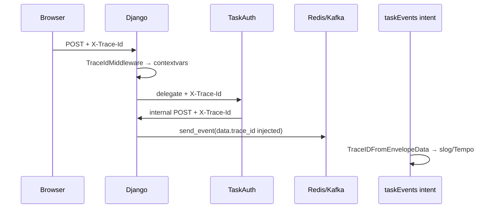

# 领域事件 traceId 传播 — 设计文档

> 日期：2026-06-01  
> 状态：已实施（2026-06-01）  
> 触发：密码重置 `EMAIL_SENT` 在 Grafana trace-log-explore 中无法与 HTTP 请求 trace 关联（消费者侧已支持读 `data.trace_id`，发布侧未写入）

---

## 1. 问题陈述

### 1.1 现象

用户在浏览器发起 `POST /api/accounts/users/send_password_reset_link/`（带 `X-Trace-Id`），HTTP 链路返回 200，但：

- 异步邮件投递日志（`task-events-email-sent-1-send-email`）无法在同一 `trace_id` 下检索；
- Redis Stream 中 `EMAIL_SENT` 事件 payload **不含** `trace_id`。

### 1.2 根因（传播断点）

| 层级 | 现状 | 缺口 |
|------|------|------|
| 前端 | `apiFetch` 自动附加 `X-Trace-Id` | ✓ |
| Django HTTP | `TraceIdMiddleware` → `request.trace_id` + `contextvars` | ✓ |
| Django → taskAuth delegate | 仅转发 `Cookie` | ✗ 未转发 `X-Trace-Id` |
| taskAuth → Django internal | `djangoPost()` 无 trace header | ✗ |
| Django `send_event()` | 写入 Redis/Kafka，**不注入** `trace_id` | ✗ |
| Go consumer | `TraceIDFromEnvelopeData` 读 `data.trace_id` / `data.traceId` | ✓（已就绪） |

结论：**消费者已具备关联能力，元规则与发布侧实现缺失，导致「HTTP trace 与领域事件 trace 断裂」。**

---

## 2. 目标与非目标

### 2.1 目标

1. **项目元规则**：领域事件经消息中间件（Redis Streams / Kafka）传递时，**必须**携带合法 `trace_id`（**不允许省略**）。
2. **默认自动**：HTTP 请求上下文内发布的事件，发布层自动注入，避免 40+ 调用点手工遗漏。
3. **跨服务一致**：Django ↔ taskAuth ↔ taskEvents（consumer 二次发布）↔ Go consumer 使用同一字段名与格式。
4. **可观测性**：Grafana trace-log-explore 可按同一 `trace_id` 串联「API 请求 → 消费者 dispatch → 出站 SMTP/SSE」日志。
5. **Go 发布侧对齐**：taskAuth 作为 HTTP 入口直接发布领域事件时，Go publish helper **必须**注入 trace（与用户确认 §10.1）。
6. **离线任务 trace**：Cron / Django management command 发布事件时，**强制**生成新 trace（与用户确认 §10.2）。

### 2.2 非目标（本增量不做）

- 改造 Loki label 提取规则（Promtail 已支持 `trace_id` label，沿用现有 pipeline）。
- 为每个 event_type 定义独立 trace 语义（同一 HTTP 请求触发的多事件共享根 trace；离线任务一次 invocation 共享一个 cron trace）。
- 在 envelope 顶层新增与 `data` 平行的 `trace_id` 字段（避免双写；统一放 `data`）。

---

## 3. 领域概念清单（供 `/5-ddd` 引用）

| 类型 | 名称 | 说明 |
|------|------|------|
| 限界上下文 | **request-tracing** | HTTP `X-Trace-Id` 解析与 context 传播（已有） |
| 限界上下文 | **domain-events** | 领域事件发布/消费（Django Producer + taskEvents Consumer） |
| 值对象 | **TraceId** | 格式 `^[A-Za-z0-9._:-]{8,256}$`（与 runAll / taskEvents tracelog 一致） |
| 领域事件 | 全部 `KAFKA_TOPICS` 映射事件 | 如 `EMAIL_SENT`、`USER_CREATED`、`SSE_MESSAGE` 等 |
| 端口 | **IEventPublisher.send_event**（Python） | Django 侧注入 trace 的 enforcement 点 |
| 端口 | **domainevents.PublishEvent**（Go，taskAuth） | taskAuth 直发 MQ 时的 enforcement 点 |
| 端口 | **publish.EventPublisher.PublishEvent**（Go，taskEvents） | consumer 二次发布时的 enforcement 点 |
| 领域服务 | **TraceCorrelation**（概念） | 发布时将 request / job trace 写入 event data |
| 值对象 | **OfflineTracePrefix** | `cron-`（management command / cron）、`bg-`（兜底） |

---

## 4. 技术契约

### 4.1 字段位置与命名

```json
{
  "event_type": "EMAIL_SENT",
  "data": {
    "trace_id": "eKGh5Lm3EgEn-QLRp71TllYW5SJjBq61",
    "subject": "密码重置 - SaaS平台",
    "template_name": "password_reset",
    "context": { "reset_url": "..." },
    "recipient_list": ["user@example.com"]
  }
}
```

| 规则 | 说明 |
|------|------|
| **Canonical key** | `trace_id`（snake_case） |
| **兼容读取** | Go consumer 同时接受 `traceId`（只写 `trace_id`） |
| **写入位置** | 始终在 `data` 对象内，与业务字段同级 |
| **禁止覆盖** | 若 `data` 已含合法 `trace_id`，发布层**不得**覆盖（显式优先） |
| **必填** | 经 publish helper 发出的新事件，`data.trace_id` **必须存在**；禁止省略 |
| **注入优先级** | 见 §4.4 |

### 4.2 传播链（目标态）



### 4.3 HTTP 跨服务头

| 调用方 | 被调方 | 必须携带 |
|--------|--------|----------|
| 浏览器 / 前端 | Django API | `X-Trace-Id`（已有） |
| Django `taskauth_bridge` | taskAuth | `X-Trace-Id: request.trace_id` |
| taskAuth `djangoPost()` | Django internal API | `X-Trace-Id`（从入站请求 context 读取） |
| Go commandhttp（若有） | 下游 HTTP | 同 header 名 |

Internal API **不要求**业务 payload 重复传 `trace_id`；以 HTTP header + 发布层注入为准。

### 4.4 trace_id 注入优先级（三端统一语义）

所有 publish helper（Python `send_event`、taskAuth Go、taskEvents Go）采用同一决策链：

```
1. data 中已有合法 trace_id     → 保留（显式优先）
2. 当前上下文有 trace           → 写入 data.trace_id
   - Python: core.logging.trace_context.get_trace_id()
   - Go:     tracelog.TraceIDFromContext(ctx)
3. 离线/无上下文               → 生成新 trace（必填，不可省略）
   - management command / cron: cron-{new_trace_id()}
   - 其他兜底:                  bg-{new_trace_id()}
```

**management command / cron 约定：**

- 命令入口（`handle()` 或等效）在**第一次** `send_event` 前，调用 `set_trace_id(f"cron-{new_trace_id()}")`（或共用 `BaseTraceCommand` 基类），使同一 invocation 内多条事件共享同一 trace。
- 禁止在 command 内手写多个互不关联的 trace（除非业务明确要求子 span，本增量不做）。

**格式约束：** 前缀 + 随机段整体须满足 `^[A-Za-z0-9._:-]{8,256}$`（`cron-` / `bg-` 共 5 字符，随机段用 `secrets.token_urlsafe(24)` 或 Go 等价物）。

### 4.5 Go 发布 helper 契约（taskAuth + taskEvents）

| 组件 | 包路径（拟） | 职责 |
|------|-------------|------|
| **taskAuth** | `taskAuth/src/domainevents` | HTTP 入口直发 MQ（未来/增量）；读 ctx trace 注入 |
| **taskEvents** | `taskEvents/internal/publish`（增强现有） | consumer 处理中二次 `PublishEvent`（如 COMPANY_CREATED → WORKSPACE_CREATED） |

```go
// 伪代码 — 三端语义一致
func EnsureTraceInData(ctx context.Context, data map[string]interface{}) map[string]interface{} {
    if hasValidTraceID(data) { return data }
    if tid := tracelog.TraceIDFromContext(ctx); tid != "" {
        data["trace_id"] = tid
        return data
    }
    data["trace_id"] = "bg-" + tracelog.NewTraceID()
    return data
}
```

**taskAuth 现状说明：** 当前 password reset 等路径经 Django internal `send_event`，不直发 MQ。元规则仍要求 **预先实现** Go publish helper，避免 taskAuth 增量直发时再次遗漏；直发与经 Django 发布**二选一**，不可双发。

**taskEvents 二次发布：** consumer 从入站事件取出 `trace_id` 写入 `ctx`（已有 `TraceIDFromEnvelopeData` + `ContextWithTraceID`），`PublishEvent` 时自动带入下游事件。

---

## 5. 元规则调整（文档落点）

| 文件 | 变更 |
|------|------|
| `.ai/03_technical_implementation/09_domain_driven_design.md` | 新增 **「领域事件 trace 传播」** 强制规则 |
| `Saas_project/docs/integration/DOMAIN_EVENTS.md` | 新增 **Trace correlation** 章节（契约 + 示意图） |
| `.ai/03_technical_implementation/05_best_practices.md` | 补充：`send_event` 前无需手写 `trace_id`（由 publisher 注入）；跨服务 HTTP 必须转发 `X-Trace-Id` |
| `task2app/.cursor/rules/backend-technical.mdc` | 增加对 `09_domain_driven_design.md` trace 章节的引用 |
| `taskEvents/bin/README.md` | 注明 consumer 从 `data.trace_id` 关联（只读，不生产） |

### 5.1 规则正文（拟写入 09_domain_driven_design.md）

> **领域事件 trace 传播（强制）**  
> 通过 `core.kafka.send_event` / `IEventPublisher`（Python）或 Go `PublishEvent` helper 发布的领域事件，在经 Redis Streams 或 Kafka 传递时，`data` 中**必须**包含合法 `trace_id`，**不得省略**。  
> - 禁止在 40+ 业务调用点分散手写；**统一在 Publisher 实现层**按 §4.4 优先级注入。  
> - 跨进程 HTTP 调用**必须**转发 `X-Trace-Id`（Django ↔ taskAuth ↔ internal API）。  
> - **taskAuth** 作为 HTTP 入口直发 MQ 时，**必须**使用 Go domainevents publish helper 注入。  
> - **management command / cron** 须在 invocation 入口生成 `cron-{id}` 并写入 context，再发布事件。  
> - 格式：`^[A-Za-z0-9._:-]{8,256}$`；与消费者 `taskEvents/tracelog` 一致。

---

## 6. 实现方案（批准后执行）

### 6.1 推荐：Publisher 层自动注入（单点 enforcement）

**修改点：**

1. **`core/kafka/producer.py`** — `send_event()` 在调用 publisher 前 `_ensure_trace_in_data()`（§4.4 完整链，含 `bg-` 兜底）。

2. **`core/logging/trace_context.py`** + **`core/http_trace.py`** — 导出 `ensure_trace_in_event_data(data)`；复用 `new_trace_id()`。

3. **Management command 基类（可选）** — `core/management/trace_command.py`：
   ```python
   class TraceContextCommand(BaseCommand):
       def execute(self, *args, **options):
           token = set_trace_id(f"cron-{new_trace_id()}")
           try:
               return super().execute(*args, **options)
           finally:
               reset_trace_id(token)
   ```
   现有含 `send_event` 的 command 逐步继承或于 `handle()` 首行 set trace。

4. **HTTP 跨服务** — `taskauth_bridge/client.py` 转发 `X-Trace-Id`；`taskAuth/django_client.go` 出站带 header。

5. **taskAuth Go** — 新增 `src/domainevents/publish.go`（Redis Stream，复用 envelope 格式）+ `EnsureTraceInData`；单测覆盖 ctx 注入与 `bg-` 兜底。

6. **taskEvents Go** — 增强 `internal/publish/redis.go` 的 `PublishEvent` 调用 `tracelog` + `EnsureTraceInData`（consumer 二次发布链不断）。

7. **测试**：
   - `tests/test_domain_events_trace_propagation.py`：HTTP trace 传播 + 无 context 时 `bg-` 兜底
   - `tests/test_management_command_trace.py`：`cron-` 前缀 + 同 invocation 多事件同 trace
   - `tests/test_taskauth_password_reset_bridge.py`：delegate header
   - `taskAuth/src/domainevents/publish_test.go`
   - `taskEvents/internal/publish/redis_test.go`：二次发布继承 trace

### 6.2 备选：仅文档、调用点手工补

- **不采用**：违反「单点 enforcement」原则，已证明会遗漏（password reset 即例）。

### 6.3 向后兼容

- **历史积压事件**（无 `trace_id`）：消费者只读兼容，跳过 OTel span（不 backfill）。
- **新发布事件**：publish helper 强制写入 `trace_id`（§4.4）。
- 双写 `traceId`：不鼓励；消费者可读但不生产。

---

## 7. 价值流影响分析

| 价值流 | 影响 |
|--------|------|
| **user-auth** / `reset-password` | 直接受益：`EMAIL_SENT` 可关联 HTTP trace |
| **user-auth** / `resend-activation`、`verification-code` | 同类 `EMAIL_SENT` 出站事件 |
| **domain-events-consumer-split** | 新增 trace 关联步骤；消费者无代码变更（已支持读） |
| **centralized-logs-grafana-traceid** | 闭环 HTTP → 异步 consumer 日志；与 increment2 trace-log-explore 互补 |
| **message-queue-kafka-to-redis** | transport 无关；规则适用于 kafka 与 redis |
| **cloud-container / SSE_MESSAGE** | 部分 call site 已手写 `trace_id`（如 `start_vm.py`）；注入逻辑「不覆盖」与之兼容 |

### 7.1 建议新增 value-stream 步骤（step 3 细化）

在 `domain-events-consumer-split` 或 `centralized-logs-grafana-traceid` 下增加：

```yaml
- name: domain-events-trace-propagation
  status: planned
  test_file: tests/test_domain_events_trace_propagation.py
  fields:
    - name: saas-backend.config.domain_events_trace_id_in_payload
      description: send_event 自动注入 data.trace_id（含 cron-/bg- 兜底）
    - name: task-auth.domainevents.trace_id_in_payload
      description: Go publish helper 注入 data.trace_id
    - name: task-events.stdout_json.trace_id
      description: consumer dispatch 日志与 HTTP trace 同 id
```

### 7.2 测试影响

| 文件 | 变更 |
|------|------|
| `tests/test_domain_events_trace_propagation.py` | 新建（HTTP + bg 兜底） |
| `tests/test_management_command_trace.py` | 新建（cron- 前缀） |
| `tests/test_task_events_redis_transport.py` | 断言 stream payload 含 trace |
| `tests/test_taskauth_password_reset_bridge.py` | delegate header 断言 |
| `taskAuth/src/domainevents/publish_test.go` | Go publish helper |
| `taskEvents/internal/publish/*_test.go` | 二次发布 trace 继承 |
| `AiMonitor/scripts/test_trace_log_explore_dashboard.py` | 无变更 |

---

## 8. 风险与边界

| 风险 | 缓解 |
|------|------|
| 异步线程丢失 contextvars | `copy_context` 或显式传 trace；兜底 `bg-` 仍保证有 id |
| PII 入 trace | `trace_id` 为 correlation id，不含用户数据 |
| 事件 payload 体积 | 单字段 +256 字符，可忽略 |
| taskAuth 无 contextvars | Go middleware context + domainevents helper |
| cron 命令忘记继承基类 | `send_event` 层 `bg-` 兜底 + lint 逐步迁移到 `TraceContextCommand` |
| taskAuth 直发 vs Django 双路径 | 元规则：同一业务只选一条发布路径，文档标明 |

---

## 9. 验收标准

1. 带 `X-Trace-Id` 的 API 请求触发 `send_event` 后，Redis `domain-events:all` 最新条目 `data.trace_id` 与请求一致。
2. taskAuth delegate + internal 链路 header 不断。
3. Go consumer 处理该事件时，stdout JSON 日志 `trace_id` 与 HTTP 一致（Grafana 可按同一 id 过滤）。
4. **management command** 发布的事件含 `cron-` 前缀 trace；同 invocation 内多事件 trace 相同。
5. **无 HTTP/cron context** 时，`send_event` 仍写入 `bg-` 前缀 trace（永不为空）。
6. **taskAuth Go publish helper** 单测通过；**taskEvents 二次发布**继承入站 trace。
7. 元规则文档已更新，CI/人工 review 可引用。
8. 已有手写 `trace_id` 的 SSE 事件不被覆盖。

---

## 10. 已确认决策（2026-06-01）

### 10.1 taskAuth 作为 HTTP 入口直发 MQ

**决策：是 — Go 侧 publish helper 必须注入 trace。**

- 实现 `taskAuth/src/domainevents` 包，与 Python `send_event` / taskEvents `PublishEvent` 同 envelope 格式。
- 从 `tracelog.TraceIDFromContext(ctx)` 注入；无 ctx 时 `bg-{NewTraceID()}`。
- 当前经 Django internal 的路径不变；helper 为 taskAuth 未来直发或迁移做准备。

### 10.2 Cron / management command

**决策：强制生成新 trace — 不允许省略。**

- invocation 级：`cron-{new_trace_id()}` 写入 Python contextvars（推荐 `TraceContextCommand` 基类）。
- 未设 context 的兜底：publish 层 `bg-{new_trace_id()}`（保证必填，但应逐步消除对兜底的依赖）。

---

## 11. 决策摘要

| 决策 | 选择 |
|------|------|
| trace 存放位置 | `data.trace_id` |
| Python enforcement | `send_event` / `IEventPublisher` + §4.4 优先级 |
| Go enforcement（taskAuth） | `domainevents.PublishEvent` + EnsureTraceInData |
| Go enforcement（taskEvents） | `internal/publish` 增强，二次发布继承 ctx |
| 跨服务传播 | HTTP `X-Trace-Id` 全链转发 |
| Cron / management command | 强制 `cron-` trace（invocation 级） |
| 无上下文兜底 | `bg-` 前缀（必填，非省略） |
| 消费者改动 | 无（已支持读 `data.trace_id`） |
| 文档 | 09_ddd + DOMAIN_EVENTS + best_practices |
