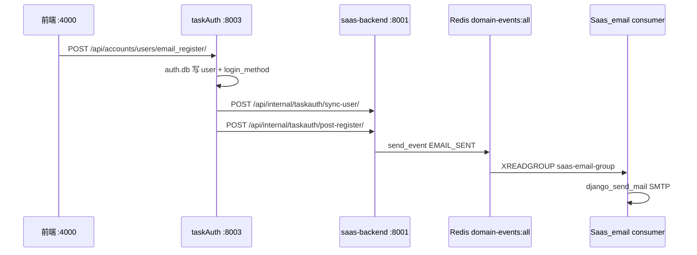

# 邮箱注册激活邮件端到端设计

> 日期：2026-06-01  
> 状态：待确认  
> 触发：注册页 `http://localhost:4000/auth/register/?accessCode=u824976301710503936` 邮箱注册后激活邮件未送达（`contact@daydaymoney.com`）

---

## 1. 问题陈述

### 1.1 现象

用户在带 `accessCode` 的注册页提交邮箱注册后，前端提示「激活邮件已发送」，但目标邮箱未收到邮件。

### 1.2 注册链路（As-Is）



**结论**：注册 API 与事件发布正常；失败点在 **Saas_email 消费 EMAIL_SENT 后 SMTP 发送**。

### 1.3 根因（Playwright + 日志核验）

| 层级 | 发现 |
|------|------|
| 注册 API | taskAuth 返回 201，`post-register` 侧效应正常 |
| 事件发布 | `EMAIL_SENT` 已写入 Redis stream `domain-events:all` |
| Saas_email 消费 | 消费者收到 `EMAIL_SENT`，解析模板与收件人正确 |
| **SMTP 发送** | `django_send_mail` 在 `open()` 时调用 `DNS_NAME.get_fqdn()` → `socket.getfqdn()` 因本机 hostname 为 `.` 触发 `UnicodeError: label empty or too long` |

日志摘录（`task2app/Saas_email/logs/saas-email-consumer.log`）：

```
Received EMAIL_SENT from stream id=...
准备发送邮件: subject=账号激活 - SaaS平台, recipients=['contact@daydaymoney.com']
ERROR - encoding with 'idna' codec failed (UnicodeError: label empty or too long)
```

### 1.4 附带缺陷

| 问题 | 影响 |
|------|------|
| `email_consumer/backends/safe_smtp.py` 源文件缺失 | settings 引用 `SafeHostnameEmailBackend` 但无法 import |
| `redis_stream_consumer.py` 源文件缺失 | 仅 `.pyc` 残留，重启后消费者无法启动 |
| `conf_loader` 路径错误 | 查找 `config/conf.yaml` 而非 `conf/conf.yaml`，SMTP 未从 `port_config.json` 对齐加载 |

---

## 2. Saas_email 是否应迁入 taskEvents（Go）？

### 2.1 当前边界

`DOMAIN_EVENTS.md` 明确：**邮件仍走 `email_queue` + `Saas_email`，不在 taskEvents 消费组内**。

taskEvents accounts 域仅订阅：`USER_CREATED`、`COMPANY_CREATED`、`USER_ACTIVATED`。

### 2.2 方案对比

| 方案 | 描述 | 优点 | 缺点 |
|------|------|------|------|
| **A — 保持 Saas_email，修复 SMTP（推荐短期）** | 修复 SafeHostname + 配置加载 + E2E | 改动最小，立刻恢复发信 | 仍多一个 Django 进程 |
| **B — taskEvents 新增 notifications 域（Go 路由 + Django dispatch）** | Go 订阅 `EMAIL_SENT`/`INVITATION_CREATED`/`USER_ACTIVATED`，HTTP 回调 Django internal dispatch，复用现有模板与 SMTP | 与 taskEvents 架构一致；统一 health/idempotency/otel | 需新增 dispatch 端点；迁移 handlers |
| **C — Go 内直接 SMTP + 模板** | 全量在 Go 发信 | 无 Django 依赖 | 模板重复、维护成本高；与现有 Django 模板体系冲突 |

### 2.3 推荐路径

1. **本增量（P0）**：方案 A — 修复 Saas_email，恢复注册激活邮件。
2. **后续（P1，可选）**：方案 B — 新增 `task-events-notifications` Go 消费者，将 Saas_email handlers 迁入 Django `/api/internal/notifications/dispatch/`，逐步下线独立 Saas_email 进程。

**不建议**方案 C 一次性重写模板层。

### 2.4 若采用方案 B 的领域概念（→ Step 5 DDD）

| 类型 | 候选 |
|------|------|
| **Bounded Context** | Notifications（邮件/短信出站） |
| **Domain Event** | `EMAIL_SENT`、`INVITATION_CREATED`、`USER_ACTIVATED`（已有） |
| **Aggregate** | `OutboundMessage`（幂等键：event_type + key + recipient） |
| **Domain Service** | `SmtpDeliveryService`、`TemplateRenderService`（仍可在 Django） |

---

## 3. 修复设计（方案 A）

### 3.1 代码变更

| 文件 | 变更 |
|------|------|
| `Saas_email/email_consumer/backends/safe_smtp.py` | 新增 `SafeHostnameEmailBackend`，`open()` 前注入 `EMAIL_LOCAL_HOSTNAME=localhost` |
| `Saas_email/email_consumer/consumers/redis_stream_consumer.py` | 恢复 Redis Stream 消费者（仅处理 `EMAIL_SENT`） |
| `Saas_email/config/conf_loader.py` | 修正 `conf.yaml` 路径；SMTP 优先 `port_config.json` → `django.email` |
| `Saas_email/email_service/settings.py` | 增加 `EMAIL_LOCAL_HOSTNAME` |
| `playwright/.../AuthRegister.activation-email.playwright.test.js` | E2E：注册 + 断言 Redis 中 `EMAIL_SENT` |
| `Saas_email/email_consumer/tests/test_safe_smtp_backend.py` | 单元测试：broken FQDN 下 backend 可 open |

### 3.2 验收标准

1. Playwright：`AuthRegister.activation-email` 通过（注册 2xx + stream 含 `EMAIL_SENT`）。
2. 重启 `saas-email` 后，日志出现「邮件发送成功」而非 IDNA 错误。
3. `SafeHostnameEmailBackend` pytest 通过。
4. `python manage.py start_email_consumer` 在无 `.pyc` 环境下可启动。

---

## 4. 价值流影响（value-stream.yaml）

### 4.1 受影响 stream

| Stream | Step | 影响 |
|--------|------|------|
| **user-auth** | `email-register` | 注册后 `EMAIL_SENT` 须被 Saas_email 实际投递 |
| **user-auth** | `resend-activation` | 同上 |
| **message-queue-kafka-to-redis** | `increment1-redis-transport-e2e` | EMAIL_SENT 经 Redis stream 投递 |

### 4.2 建议新增 step

```yaml
- name: email-register-activation-delivered
  status: planned
  test_file: ../playwright/front_project/tests/AuthRegister.activation-email.playwright.test.js
  fields:
    - name: saas-backend.config.domain_events_redis_stream_key_prefix
      description: EMAIL_SENT 写入 domain-events stream
    - name: saas-email.delivery.activation_email
      description: Saas_email 消费 EMAIL_SENT 并成功 SMTP 发送
```

---

## 5. 非目标

- 本增量不迁移 Saas_email 至 taskEvents Go（留 P1）。
- 不修改 taskAuth 注册写库逻辑。
- 不更改 QQ SMTP 凭据（沿用 `port_config.json` → `django.email`）。

---

## 6. 决策摘要

| 问题 | 决策 |
|------|------|
| 邮件为何未发送？ | SMTP `getfqdn()` IDNA 失败 + SafeHostname 后端源文件缺失 |
| 是否立即迁入 taskEvents Go？ | **否**；先修复 Saas_email，后续可选 notifications 域 |
| 如何防回归？ | Playwright E2E + SafeHostname 单元测试 + value-stream step |

---

## 7. 待确认

1. 认可 **方案 A（修复 Saas_email）** 作为本增量交付？
2. **方案 B（taskEvents notifications 域）** 是否纳入下一迭代 backlog？
3. Playwright 断言粒度：当前仅验证 Redis `EMAIL_SENT`；是否需增加「真实 SMTP 收件」探测（如 Mailpit）？
