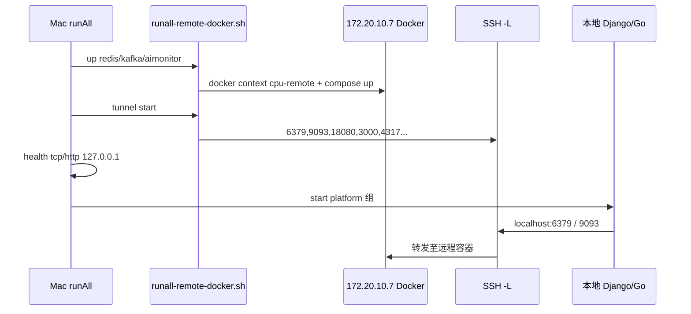

# runAll 远程 Docker 单点编排 — 去除本机 Docker Desktop

> 日期：2026-06-01  
> 状态：**已实施**（2026-06-01）  
> 触发：Mac 本机 Docker Desktop 资源占用高；已有 `scripts/docker-*.sh` + `runAll-apps-local.yaml` 隧道方案，需合并进 runAll 并去掉本机 Docker 依赖

---

## 1. 问题陈述

### 1.1 现状

| 层级 | 现状 | 问题 |
|------|------|------|
| **编排** | `runAll.yaml`（本地 Docker）与 `runAll-apps-local.yaml`（探活 + 隧道）双配置 | 维护两套 YAML，语义分裂 |
| **脚本** | `docker-infra-remote.sh`、`docker-tunnel-remote.sh`、`docker-dev-remote.sh` 等 11 个文件 | 开发者需先手动 `ddev` 再 `runAll` |
| **本机 Docker** | `docker-use-local.sh`、`docker-desktop-helper.sh` 尝试启动 Desktop | 与「远程 infra」目标冲突，端口常冲突 |
| **远程 AiMonitor** | bind mount 需远程有仓库 | 用户已确认：**远程 CPU 机 clone 同仓库** |

### 1.2 用户诉求

1. **去除本机 Docker Desktop**（Mac 仅保留 `docker` CLI + SSH context，不运行本地 daemon）。
2. **远程 Docker 启停与 SSH 隧道合并进 runAll**，一条命令拉起 infra + 应用。
3. **AiMonitor 也在远程运行**，经隧道映射到 `127.0.0.1:3000/4317` 等。

---

## 2. 目标与非目标

### 2.1 目标

1. **单一编排入口**：仅 `runAll.yaml`（删除 `runAll-apps-local.yaml` 或将其合并后废弃）。
2. **infra 生命周期由 runAll 管理**：远程 compose up/down、SSH 隧道 start/stop、本机探活均在 `infrastructure` 组内完成。
3. **应用层 `depends_on` 不变**：platform / domain-events 仍依赖 `docker-redis` 等逻辑名，无需改端口或 `port_config.json`。
4. **远程仓库一次性就绪**：文档 + 可选 `remote-docker-preflight` 服务检查远程 clone 路径。
5. **本机不再依赖 Docker Desktop**：移除 Desktop 自动启动与 `desktop-linux` 默认 context。

### 2.2 非目标

- 不改变 `port_config.json`（仍 `localhost:6379`、`localhost:9093`）。
- 不在 runAll Go 代码内实现完整 SSH/隧道协议（仍用 shell 脚本，runAll 只编排）。
- 不迁移 `gitService/` GitLab 栈（不在 runAll.yaml 中；若未来需要另开设计）。
- 不做多远程主机 / 多开发者共享 infra 的 prod 级 HA。
- **CI 不维护本地 Docker profile**（CI 不通过 runAll 拉起 docker infra；见 §11）。

---

## 3. 价值流影响

本变更为 **开发基础设施 / 编排层**，不触及 `value-stream.yaml` 中业务步骤、字段或测试文件。

| 问题 | 结论 |
|------|------|
| 影响哪些 stream？ | 无 |
| 新 stream？ | 无 |
| 测试影响？ | 仅 runAll 集成测试 / 文档；业务 pytest 不变 |
| CI 影响？ | CI 若仍用本地 Docker，需单独 profile（见 §8） |

---

## 4. 领域概念清单（供 `/5-ddd`，轻量）

| 概念 | 说明 |
|------|------|
| 限界上下文 **dev-infrastructure** | 远程 Docker、SSH 隧道、本机探活 |
| 实体 **RemoteDockerHost** | SSH 目标（`cpu` / `172.20.10.7`） |
| 实体 **InfraStack** | redis / kafka / ai-monitor compose 项目 |
| 值对象 **TunnelPortMap** | 远程 `127.0.0.1:PORT` → 本机 `127.0.0.1:PORT` |
| 领域服务 **InfraBootstrap** | context 切换、远程 up、隧道建立、探活 |
| 编排 SSOT | **runAll.yaml `infrastructure` 组**（与 taskEvents enabled 移除同理） |

---

## 5. 方案对比

### 方案 A — YAML 编排 + 统一 shell 库（推荐）

- 新增 `scripts/runall-remote-docker.sh`（吸收 `docker-env.sh`、`docker-infra-remote.sh`、`docker-tunnel-remote.sh` 逻辑）。
- `runAll.yaml` infrastructure 组声明 5～6 个服务（见 §6）。
- Go runner **不改**或仅增加可选 `remote_docker` 配置校验。

**优点**：改动小、与现有 `run.sh managed` 模式一致、易调试。  
**缺点**：隧道/SSH 仍在 shell 层。

### 方案 B — Go runner 内建 TunnelManager

- runAll 进程内 goroutine 管理 SSH 隧道，infra 服务只调 remote up。

**优点**：stop/restart 更干净，PID 由 runAll 持有。  
**缺点**：实现量大、跨平台 SSH 边缘情况多，与「YAGNI」冲突。

### 方案 C — 保留外部 `ddev`，runAll 只探活

- 即当前 `runAll-apps-local.yaml` 延续。

**优点**：零 runAll 改动。  
**缺点**：未满足「合并进 runAll」诉求，**否决**。

**推荐：方案 A**，后续若隧道稳定性不足再局部引入 B（仅 tunnel 生命周期）。

---

## 6. 目标架构

### 6.1 数据流



### 6.2 `runAll.yaml` 新增顶层配置（可选）

```yaml
remote_docker:
  ssh_host: cpu                    # ~/.ssh/config Host
  context: cpu-remote
  workspace: ~/gitClone/ramDisk/ram-mount   # 远程工作区根（与子仓库 layout 一致，非单一 mega-clone）
  tunnel:
    mode: full                     # full | core（core 仅 Redis/Kafka，调试用）
  # 子仓库按需克隆：preflight / stack up 时检查路径，缺失则 git clone（见 §6.4）
```

脚本优先读 YAML（通过 `runAll` 传入 env 或 `scripts/runall-read-remote-docker-config.sh` 解析）；缺省回退 `scripts/docker-env.sh` 现有常量。

### 6.3 infrastructure 组服务定义（合并后）

| 顺序 | service 名 | 作用 | start | stop | depends_on |
|------|------------|------|-------|------|------------|
| 1 | `remote-docker-preflight` | SSH 检查 context；**按需**确保各 stack 所需子仓库目录存在 | `runall-remote-docker.sh preflight` | `true` | — |
| 2 | `docker-redis` | 远程启动 Redis | `... up redis` | `... down redis` | preflight |
| 3 | `docker-kafka` | 远程启动 Kafka 栈 | `... up kafka` | `... down kafka` | preflight |
| 4 | `ai-monitor` | 远程启动 AiMonitor（远程 repo 路径） | `... up aimonitor` | `... down aimonitor` | preflight |
| 5 | `ssh-tunnel` | 本机端口转发 | `... tunnel start` | `... tunnel stop` | redis, kafka, ai-monitor |
| 6 | `infra-readiness` | 探活本机隧道端口（供 DAG 汇总） | `true` | `true` | ssh-tunnel |

**platform 组**现有 `depends_on: [docker-redis, ...]` 保持不变。  
`docker-redis` / `docker-kafka` / `ai-monitor` 在 remote up 成功后标记 healthy（远程 health 经 `docker compose ps` 或 ssh curl）；**platform 启动前**额外依赖 `ssh-tunnel` + `infra-readiness`：

- 在 `docker-redis` 等增加 `readiness_after: ssh-tunnel` 的等价机制：**platform 服务 `depends_on` 增加 `infra-readiness`**（仅 saas-backend / task-sse 等需要 Redis 的服务）。

更简做法（推荐）：

- `docker-redis` start 命令 = `up redis && wait-remote-health redis`（远程探活，不依赖隧道）。
- `ssh-tunnel` depends_on 三个 stack。
- 新增 **`infra-local-gateway`**：`depends_on: [ssh-tunnel]`，`start_command: true`，`health_check: tcp 127.0.0.1:6379`。
- 将所有 `depends_on: [docker-redis]` **改为** `depends_on: [infra-local-gateway]` **或** 保留 `docker-redis` 名但让 `docker-redis` 的 health 在 tunnel 之后探测——

**最终简化（最少 depends 改动）**：

```yaml
- name: docker-redis
  start_command: "bash scripts/runall-remote-docker.sh stack up redis"
  stop_command: "bash scripts/runall-remote-docker.sh stack down redis"
  launch_mode: detach
  # 远程 compose 健康即可，health 用 ssh 执行 nc/curl 远程 127.0.0.1:6379
  health_check:
    tcp: "127.0.0.1:6379"   # 仅在 tunnel 子命令嵌入 stack up 之后执行 wait-local
```

**采用组合 start_command**（单服务内顺序执行，避免大规模改 depends_on）：

```bash
# scripts/runall-remote-docker.sh stack up redis
# 1. context remote + compose up (远程)
# 2. tunnel start --if-needed
# 3. wait-local-port 6379
```

则 **`docker-redis` / `docker-kafka` / `ai-monitor` 三个服务各自 start 时幂等启动隧道**，`ssh-tunnel` 独立服务 **可省略**（隧道由第一个 infra 服务拉起，脚本内 flock 防重复）。

**stop 顺序**：runAll DAG 反序 stop → 最后 `tunnel stop` 由 `ai-monitor` 或专用 `ssh-tunnel` stop_command 负责。

**定稿 infrastructure 组（4 服务）**：

| service | start_command | health_check | on_failure |
|---------|---------------|--------------|------------|
| `docker-redis` | `runall-remote-docker.sh up redis` | tcp `127.0.0.1:6379` | **`exit`** |
| `docker-kafka` | `runall-remote-docker.sh up kafka` | url `http://127.0.0.1:18080` | **`exit`** |
| `ai-monitor` | `runall-remote-docker.sh up aimonitor` | url `http://127.0.0.1:3000/api/health` | **`skip`** |
| `ssh-tunnel` | `runall-remote-docker.sh tunnel start` | tcp `127.0.0.1:6379`（冗余探活） | **`exit`** |

**`on_failure` 策略（已确认）**：`docker-redis` / `docker-kafka` / `ssh-tunnel` 失败 **阻塞 platform**；`ai-monitor` 失败 **`skip`，不阻塞 platform**（可观测性降级，应用照常启动）。

`docker-redis` start **不**内嵌 tunnel；**platform depends_on docker-redis** 时 runAll 会先等 redis health——因此 **必须** 调整 DAG：

```
remote stacks (parallel) → ssh-tunnel → docker-redis-probe (true + tcp local)
```

为 **零 platform 改动**，保留服务名 `docker-redis` 但拆成两阶段：

1. **`docker-redis-remote`** — 仅 remote up，health 用 **ssh 远程探活**（runAll 需支持 `health_check.remote_tcp: ...` **或** start_command 阻塞至 remote healthy 后 exit 0 + detach）。

**决策**：不扩展 runAll health_check schema。  
**`docker-redis-remote`** 使用 `launch_mode: detach` + start 脚本内 **阻塞 wait 远程端口**（ssh `nc -z 127.0.0.1 6379`），成功则 exit 0。  
**`docker-redis`**（逻辑名保留给 depends_on）：`depends_on: [docker-redis-remote, ssh-tunnel]`，`start_command: true`，health tcp local 6379。

同理 kafka、ai-monitor：

- `docker-kafka-remote` / `docker-kafka`（local probe）
- `ai-monitor-remote` / `ai-monitor`（local probe）— 但 platform 不依赖 ai-monitor，仅 observability URL。

**platform 仅依赖 `docker-redis`** → 改为依赖 **`docker-redis`**（local probe 服务），其 depends_on `[docker-redis-remote, ssh-tunnel]`。

### 6.4 远程工作区与子仓库（按需 clone）

远程 layout 与 Mac 一致，根目录为 **`~/gitClone/ramDisk/ram-mount`**。该路径是**工作区根**，不是要求一次性 clone 整个 monorepo；各 **独立 git 子仓库** 在需要时 clone 到对应子目录。

| stack | 远程执行方式 | 所需子路径 / 子仓库 | clone 时机 |
|-------|--------------|---------------------|------------|
| **redis** | docker context + compose（无 bind mount） | 无（compose 由 Mac CLI 推送到远程 daemon） | — |
| **kafka** | 同上 | 无 | — |
| **aimonitor** | **ssh 远程 shell** + compose（有 bind mount） | `AiMonitor/`、`DaydaymoneyGrafana/`（独立 git 仓库） | `up aimonitor` 前 `ensure-subrepo` |

**`ensure-subrepo` 行为**（`runall-remote-docker.sh` 内）：

1. `ssh cpu "test -d $WORKSPACE/AiMonitor/.git"` — 已存在则跳过。
2. 缺失则 `git clone <与 Mac 同 remote URL>` → `$WORKSPACE/AiMonitor`（URL 从本机 `git -C AiMonitor remote get-url origin` 读取）。
3. 对 `DaydaymoneyGrafana` 重复（AiMonitor compose bind mount `../DaydaymoneyGrafana/dist`）。

**不**预先 clone 全量子仓库（task2app、runAll 等应用代码仅在 Mac 运行）。

Redis/Kafka 无 bind mount，可继续 **docker context + Mac 侧 compose**（当前已验证可行）。

AiMonitor 在远程：

```bash
ssh cpu "cd $WORKSPACE/AiMonitor && ./run.sh managed"
```

---

## 7. 本机 Docker 移除范围

| 项 | 动作 |
|----|------|
| Docker Desktop | 文档声明不再要求；不自动 `open -a Docker` |
| `scripts/docker-use-local.sh` | 删除或改为 noop 提示 |
| `scripts/docker-desktop-helper.sh` | 移除 `docker_helper_try_start_desktop` 调用链 |
| `scripts/docker-dev-remote.sh` | 删除（由 runAll 替代） |
| `scripts/docker-infra-remote.sh` | 逻辑并入 `runall-remote-docker.sh` |
| `runAll-apps-local.yaml` | 合并后删除 |
| `~/.zshrc` docker-shell | 保留 `dr`/`dt` 调试 alias，文档标注 optional |
| Mac 本机 | `brew install docker docker-compose`，context 默认 `cpu-remote` |

---

## 8. 错误处理

| 场景 | 行为 |
|------|------|
| 远程 docker 不可达 | `preflight` 失败，`on_failure: exit`（阻塞） |
| 镜像 pull 超时/EOF | start 脚本重试 1 次；日志提示手动 `ssh` 检查 |
| 本机端口被占用 | tunnel start 失败，`on_failure: exit`；列出冲突端口 |
| 远程缺少 AiMonitor 子仓库 | `ensure-subrepo` 自动 clone；clone 失败则 **ai-monitor `skip`**，不阻塞 platform |
| **ai-monitor 健康检查失败** | **`on_failure: skip`**，platform 继续启动；OTEL/Grafana 不可用 |
| runAll stop | 反序 stop remote stacks + `tunnel stop` |

---

## 9. 测试计划

1. **脚本单元**：`runall-remote-docker.sh preflight|up|tunnel` 参数解析、幂等 tunnel（flock/pidfile）。
2. **runAll config 测试**：LoadConfig 对新 `remote_docker` 段 optional 校验。
3. **集成（人工）**：
   - 本机关闭 Docker Desktop
   - `cd runAll && ./bin/runAll --config ../runAll.yaml`
   - 验证 Redis/Kafka/Grafana 经 `127.0.0.1` 可达
   - `runAll stop` 后隧道 PID 清理

---

## 10. 实施任务摘要（供 `/6-plans`）

1. ✅ 新增 `scripts/runall-remote-docker.sh` + 吸收 `docker-env.sh` 常量。
2. ✅ 重写 `runAll.yaml` infrastructure 组（`infra up` + 本机探活）。
3. ✅ 删除 `runAll-apps-local.yaml`、`docker-infra-remote.sh`、`docker-dev-remote.sh`。
4. ✅ 清理 Desktop helper 自动启动；更新 `runAll.yaml.ai.md`。
5. ✅ 远程 `ensure-subrepo`（AiMonitor + DaydaymoneyGrafana）。
6. ✅ `docker-setup.sh` 默认 remote-only。
7. ✅ 不添加 CI 本地 Docker profile。

---

## 11. 已决事项（2026-06-01）

| # | 问题 | 决定 |
|---|------|------|
| 1 | **远程仓库** | 工作区根 `~/gitClone/ramDisk/ram-mount`；各 **独立 git 子仓库按需 clone**（AiMonitor 栈至少需要 `AiMonitor/` + `DaydaymoneyGrafana/`）；Redis/Kafka 无需远程源码 |
| 2 | **CI** | **不需要**本地 Docker profile；CI 不依赖 runAll 拉起 docker infra |
| 3 | **`on_failure`** | `docker-redis` / `docker-kafka` / `ssh-tunnel` → **`exit`**；**`ai-monitor` → `skip`，不阻塞 platform** |

---

## 12. 批准记录

| 角色 | 决定 | 日期 |
|------|------|------|
| 用户 | AiMonitor → 远程 clone 方案 | 2026-06-01 |
| 用户 | 设计全文批准 | 2026-06-01 |
| 用户 | 开放问题 §11 三项确认 | 2026-06-01 |
